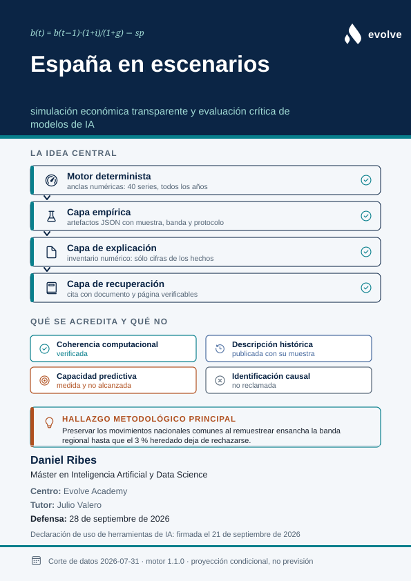

# España en escenarios

<p align="center">
  <a href="docs/MEMORIA_TFM.md">
    
  </a>
</p>

**Análisis macrofiscal condicional para España, con evaluación empírica y explicaciones trazables.**

TFM de Inteligencia Artificial y Data Science · motor **1.1.0** · referencia del escenario **2026-07-31**.

El proyecto permite explorar qué implica un conjunto de supuestos sobre tipos,
crecimiento, saldo primario y demografía para la deuda, la vivienda y doce
perfiles ciudadanos. Combina un motor semiestructural, simulación Monte Carlo,
contrastes empíricos, modelos de aprendizaje automático y recuperación de
información económica. Las proyecciones son condicionales; los experimentos
publican también resultados negativos y límites de identificación.

## Probar la aplicación

**→ <https://danribes.github.io/tfm-data-science/>**

No hace falta instalar nada ni ninguna credencial. La API responde en
<https://danribes-evo-espana-api.hf.space> (contrato en
[`/docs`](https://danribes-evo-espana-api.hf.space/docs)) y el Space está en
[huggingface.co/spaces/danribes/evo-espana-api](https://huggingface.co/spaces/danribes/evo-espana-api).

Por dónde entrar:

| | |
|---|---|
| [Perfiles](https://danribes.github.io/tfm-data-science/persona/03) | Doce perfiles ciudadanos; se pregunta en lenguaje corriente y responde el motor |
| [Laboratorio](https://danribes.github.io/tfm-data-science/laboratorio) | Las diez palancas y los ocho escenarios ilustrativos |
| [Consulta](https://danribes.github.io/tfm-data-science/consulta) | Pregunta libre sobre el corpus, con citas |
| [Biblioteca](https://danribes.github.io/tfm-data-science/biblioteca) | El corpus documental, por colecciones |
| [Evidencia](https://danribes.github.io/tfm-data-science/evidencia) | Parámetros estimados, bandas y resultados negativos |

El Space es gratuito y se duerme: la primera petición tras un rato de
inactividad tarda entre 30 y 90 segundos en despertarlo. El motor corre además
en el navegador, así que los escenarios funcionan aunque la API esté fría.

Las rutas profundas devuelven HTTP 404 de GitHub Pages y **aun así cargan la
aplicación**: el despliegue copia `index.html` en `404.html` y el enrutado es
de cliente. Es el comportamiento normal de una SPA ahí alojada, no un enlace
roto.

## Material académico

- [Borrador de memoria](docs/MEMORIA_TFM.md): preguntas, métodos, resultados,
  discusión y bibliografía. Requiere revisión del autor y tutor; no se presenta
  como una memoria ya aprobada.
- [Matriz de evidencia](docs/RESULTS.md): modelos, baselines, particiones,
  métricas y conclusiones permitidas.
- [Guía de defensa](docs/DEFENSA_TFM.md) y [presentación](docs/deck/deck.marp.md).
- [Guion de demostración](docs/DEMO_DEFENSA.md): recorrido de seis minutos por
  la aplicación en directo, con los valores que debe mostrar cada paso y qué
  hacer cuando no los muestre.
- [Reproducción](docs/REPRODUCIBILITY.md): entorno, datos, comandos y pasos
  todavía ausentes para reconstruir el pipeline legado completo.
- [Cambios metodológicos](docs/METHODOLOGY_CHANGES.md): correcciones del motor,
  significado de las métricas y revisión del contrato API.
- [Verificación local](docs/VERIFICATION.md): resultados de pruebas, build y
  revisión de los artefactos de presentación.
- [Comprobación funcional del modelo](docs/MODEL_CHECK.md): auditoría contable,
  límites numéricos, navegador, recuperación documental y versión desplegada.
- [Evaluación RAG](docs/eval/README_RAG.md): resultados de desarrollo y protocolo
  para un test independiente aún pendiente.

## Qué aporta y qué se ha medido

| Componente | Evidencia y límite |
|---|---|
| Motor Python y TypeScript | Identidades, invariantes y anclas numéricas compartidas. La paridad comprueba la implementación, no la verdad de los supuestos. |
| Vivienda regional | Media y persistencia estimadas en 17 CCAA + Ceuta y Melilla; se excluye el agregado nacional. La sensibilidad con bloques temporales muestra incertidumbre mucho mayor que la banda regional. |
| Transferencia de una red de vivienda | Entrenamiento extranjero anterior a los orígenes de evaluación; resultado conservado: 5/17 victorias y MASE 0,400 frente a drift 0,395. No supera el baseline principal. |
| Distress | AUC agrupada por país 0,674. Puntuación exploratoria sin calibración temporal o específica para España. |
| RAG bilingüe | 34/35 aciertos de documento en preguntas usadas durante el ajuste; 10/12 afirmaciones muestreadas respaldadas según un juez LLM. No es evaluación independiente ni exactitud de respuestas completas. |
| Monte Carlo | Bandas condicionales y sensibilidad a persistencia, escala de choques, número de trayectorias y semilla. Cobertura predictiva real no evaluada. |
| Análogos | Distancia de Mahalanobis sobre cinco variables comparables y completas. Sin veredicto de sostenibilidad ni pretensión causal/predictiva. |

## Arquitectura

```text
data/gold + data/external → research/ → docs/eval/
          │
          └→ engine/ → api/ → frontend/
                │               └→ motor TypeScript (anclas compartidas)
                └→ explain/ ← rag/ (corpus e índice privados)
```

`engine/` contiene el motor, las palancas, umbrales, Monte Carlo y analogías;
`research/` contiene estimación y experimentos; `explain/` separa hechos
calculados de narración; `rag/` implementa recuperación y generación;
`frontend/` presenta resultados, fuentes y limitaciones.

## Ejecutar

Entorno comprobado: Python 3.12 y Node 22. Las versiones Python están
restringidas por `requirements-lock.txt`; npm utiliza `package-lock.json`.
Para detalles sobre instalación limpia, PyTorch y dependencias opcionales,
consultar [REPRODUCIBILITY.md](docs/REPRODUCIBILITY.md).

```bash
python3.12 -m venv .venv
.venv/bin/python -m pip install -r requirements.txt
.venv/bin/python -m uvicorn api.main:app --port 8000
```

En otro terminal:

```bash
cd frontend
npm ci
npm run dev
```

La API publica su contrato en `http://localhost:8000/docs`. El panel usa
`http://localhost:8000` salvo que se configure `VITE_API_BASE`. Para una demo con
respuestas simuladas: `npm run build:mock` y `npm run preview` desde `frontend/`.
Esas respuestas son fixtures de interfaz, no resultados de investigación.

El corpus privado y su índice se localizan mediante `EVO_RAG_DATA` y
`EVO_RAG_DB`. El modo local predeterminado es híbrido: E5 y búsqueda léxica.
Los documentos se almacenan localmente; la generación remota envía los pasajes
seleccionados al proveedor configurado.

## Aplicación pública y biblioteca

El despliegue utiliza [GitHub Pages](https://danribes.github.io/tfm-data-science/)
para el panel y [Hugging Face Spaces](https://huggingface.co/spaces/danribes/evo-espana-api)
para la API y la biblioteca pública. Los workflows `deploy-pages` y
`deploy-hf-space` publican ambos servicios desde este repositorio; el paquete
de la API se prepara con las herramientas de `deploy/hf/`.

El Space arranca por defecto en modo `public_lexical`: busca con SQLite FTS5 en
seis documentos propios del proyecto, enumerados en
[`rag/public_sources.json`](rag/public_sources.json). Expone las colecciones
`metodo` y `defensa_tfm`, con atribución `propio`. El ensamblado genera su índice
desde esos archivos, sin acceder al corpus privado ni cargar embeddings.
Los resultados históricos del RAG híbrido no evalúan este corpus público.

El despliegue actual sustituye ese modo por `remote_hybrid` y sirve el corpus
completo —manuales incluidos— sin credencial; se describe en «Corpus completo,
servido abierto» más abajo.

La búsqueda y consulta de fragmentos públicos funcionan sin claves de IA.
La redacción de respuestas requiere una clave de proveedor en los secretos
del Space; si no está disponible, se muestran los pasajes y el motivo.
La conexión RAG se configura por separado de la API del motor, desde Biblioteca
o Consulta; un servicio RAG caído no impide utilizar los escenarios.

### Corpus completo, servido abierto

Por decisión explícita del autor (20-09-2026) el despliegue sirve el corpus
entero sin credencial. Las cuatro colecciones responden a cualquier consulta:

| Colección | Documentos | Fragmentos | Autoría |
|---|---:|---:|---|
| `libros` | 58 | 17.402 | terceros, con derechos de autor |
| `crack23` | 421 | 3.684 | terceros, divulgación |
| `metodo` | 14 | 286 | propia |
| `defensa_tfm` | 1 | 3 | propia |

`corpus_scope` vale `full_open`. La colección por defecto es `mixto`, que no es
una fuente sino una vista: funde `libros`, `metodo` y `defensa_tfm` en una sola
respuesta, de modo que una pregunta se contesta a la vez con los manuales y con
la documentación del propio proyecto.

La mezcla se hace con RRF sobre los rangos de cada colección —nunca sobre sus
puntuaciones, que no son comparables— y cada pasaje conserva su colección y su
autoridad, así que la cita sigue diciendo de dónde sale. `crack23` queda fuera
de la mezcla: la regla del recuperador no es «una colección cada vez» sino «no
enfrentar autoridades distintas», y la divulgación de opinión no se ordena
contra un manual. Sigue consultable por separado.

**Qué significa.** `libros` son manuales de terceros con derechos de autor.
Servirlos abiertos convierte `/rag/search` en un recuperador público de texto
literal de esas obras. No es una consecuencia lateral de facilitar el acceso a
quien evalúa: es una decisión tomada a sabiendas, y se deja escrita aquí para
que se lea como tal.

**Riesgo asumido.** La política de contenidos de Hugging Face prohíbe alojar
material infractor. Una denuncia puede retirar el Space, y con él el acceso a
todo — también a las colecciones propias y a la API del motor. El procedimiento
de retirada de abajo es, por tanto, además de una cortesía con los titulares de
derechos, el plan de contingencia del propio trabajo.

**Cómo se cierra otra vez.** La maquinaria de la verja sigue completa en
`rag/config.py` y bajo prueba. Reponer los nombres en `RESTRICTED_COLLECTIONS`
y fijar `EVO_RAG_TOKEN` en el Space devuelve el 401 sin tocar la API:

```python
RESTRICTED_COLLECTIONS = frozenset({"libros", "crack23"})
```

`THIRD_PARTY_COLLECTIONS`, en cambio, no se toca: describe qué material hay,
no quién puede leerlo. La distinción no es cosmética. Al abrir el corpus se
vació `RESTRICTED_COLLECTIONS`, y como `corpus_scope` se calculaba sobre ese
mismo conjunto, el despliegue pasó a anunciarse como `private_local` mientras
servía los manuales al mundo. Ahora el ámbito se decide por el material
presente, y hay pruebas que fallan si vuelve a mentir.

**Cómo se construye y se retira el índice.** Se sube desde una máquina con el
corpus privado, porque CI no lo tiene ni lo tendrá:

```bash
PYTHONPATH=. python tools/build_reviewer_index.py --out /tmp/reviewer.db
PYTHONPATH=. python tools/upload_reviewer_index.py --file /tmp/reviewer.db
# para dejar de servirlo
PYTHONPATH=. python tools/upload_reviewer_index.py --remove
```

En los ajustes del Space: `EVO_RAG_MODE=remote_hybrid`,
`EVO_RAG_DB=/app/data/rag/reviewer.db` y `HF_TOKEN` para el codificador.

`--lexical-only` construye la variante sin vectores: 113 MB y BM25 solo. Es más
pequeña y es otro recuperador; si se usa, hay que decirlo al interpretar
cualquier resultado que salga de ahí.

**El mismo recuperador que se evaluó.** Crear los vectores necesita el modelo;
consultarlos necesita un vector y `sqlite-vec`, que ocupa 0,2 MB. Por eso el
despliegue lleva el índice completo (201 MB) y pide a una copia alojada del
mismo modelo —`intfloat/multilingual-e5-large`— que codifique cada pregunta.
Importa porque la alternativa era servir BM25 solo, y el hit@8 publicado se
midió con fusión híbrida: quien evaluara la recuperación estaría juzgando un
sistema distinto del que se describe.

**Estado desplegado.** Falta `HF_TOKEN`, deliberadamente: el único token
disponible tiene permiso de escritura sobre la cuenta entera y el Space sólo
necesita inferencia. Hasta que se configure uno de sólo lectura, la mitad densa
no puede codificar la pregunta y la recuperación degrada a BM25 — el índice
lleva los vectores, pero no se están usando. **Cualquier resultado leído hoy
del corpus es BM25, no la fusión híbrida con la que se midió el hit@8.** Es
exactamente la degradación que `dense_or_lexical` existe para hacer visible en
lugar de silenciosa.

Preparar estos cambios no actualiza el sitio publicado. El procedimiento y
las comprobaciones previas a publicar están en
[`deploy/hf/README.md`](deploy/hf/README.md); el estado observado se registra en
[MODEL_CHECK.md](docs/MODEL_CHECK.md).

## Verificar y regenerar

```bash
.venv/bin/python scripts/check_data_integrity.py
OMP_NUM_THREADS=1 OPENBLAS_NUM_THREADS=1 HF_HUB_OFFLINE=1 TRANSFORMERS_OFFLINE=1 .venv/bin/python -m pytest
```

Desde `frontend/`: `npm test` y `npm run build`. Los tests ordinarios no requieren
el corpus privado ni inferencia remota. Las pruebas opcionales de integración
se seleccionan con `pytest -m integration`. Playwright requiere su navegador.

Para regenerar resultados y figuras, instalar primero las dependencias opcionales
con `.venv/bin/python -m pip install -r requirements-regenerate.txt`.
Después de revisar cambios intencionados del motor o sus parámetros, desde la raíz:

```bash
.venv/bin/python -m tools.gen_estimated_params
node frontend/scripts/gen-constants.mjs
.venv/bin/python scripts/generate_anchor_fixture.py
.venv/bin/python -m research.housing_robustness
.venv/bin/python -m research.uncertainty
.venv/bin/python -m tools.evaluate_analogs
.venv/bin/python docs/deck/build_deck.py
.venv/bin/python scripts/check_data_integrity.py --update
```

El generador TypeScript importa el motor Python local: no necesita levantar la
API. `EVO_PYTHON` permite seleccionar otro intérprete. La actualización de
checksums debe acompañarse de la revisión del diff de resultados.

## Cómo está construido el modelo

El sistema tiene cuatro capas y una regla que las separa: **cada capa sólo
puede hacer aquello que la siguiente puede comprobar**.

### 1. Motor semiestructural — la única fuente de cifras

Un motor determinista sobre un corte de datos congelado. Diez palancas
independientes mueven una economía calibrada y producen cuarenta series
anuales de 2026 a 2050. No aprende de los datos: impone relaciones
—Okun, Phillips, la curva de salarios, la identidad de la deuda— y calcula
qué implicarían unos supuestos.

La identidad que gobierna el resultado principal es `b(t+1) = b(t)·(1+r−g) − sp`:
la deuda crece con el tipo efectivo, baja con el crecimiento nominal y baja con
el superávit primario. Todo lo demás del sistema consume esta salida; nada la
reescribe.

El mismo cálculo existe en Python y en TypeScript, fijado a anclas numéricas
compartidas, para que el navegador y el servidor no puedan divergir en silencio.

### 2. Estimación en panel — qué dicen los datos sobre los parámetros

De los ocho parámetros que el corte congelado podría informar, **dos se
estiman y seis no se identifican**, y cada caso está declarado con su motivo
econométrico en `research/panel.py`:

| Parámetro | Estado | Motivo |
|---|---|---|
| `IPV_LR` | estimado: 1,2151 % [0,9008; 1,5295] | media regional, 1.387 observaciones, 19 unidades |
| `IPV_REV` | estimado: 0,2039 [0,1811; 0,2268] | AR(1) sobre la desviación, 1.311 pares |
| `PB_PERSIST` | estimado: 0,8720 [0,8085; 0,9354] | panel de 18 países desde 1960 |
| `E_IPV_R` | no identificado | el Euríbor es nacional y el panel regional: sin variación transversal en el tipo |
| `OKUN` | no identificado | el corte no trae paro regional ni brecha del producto |
| `KAPPA` | no identificado | no hay serie de expectativas de inflación |
| `MULT` | no identificado | exigiría un shock fiscal identificado; gasto e ingreso son endógenos al ciclo |
| `E_R` | no identificado | sin serie de PIB por país, sólo gasto e ingreso |

El núcleo fiscal, por tanto, sigue calibrado. Es una limitación declarada, no
una omisión: «los datos no identifican esto» es una afirmación más fuerte que
un coeficiente obtenido de una regresión que no lo sostiene.

### 3. Aprendizaje profundo — un resultado negativo conservado

Una red pequeña entrenada con 1.760 series extranjeras y 113.649 ventanas, sin
ver ningún dato español, evaluada sobre las CCAA con orígenes móviles.

**Pierde contra la deriva** —prolongar la recta de los últimos años—: MASE 0,400
frente a 0,3953, y gana en 5 de 17 comunidades cuando la regla de desarrollo
exigía 12. Está en la aplicación por eso, no a pesar de eso: es el único lugar
donde el lector ve contra qué se mide una previsión, y por qué este sistema no
ofrece una.

### 4. LLM — escribe, nunca calcula

Dos usos, ambos con la misma restricción.

**Resolución de preguntas** (`/ask`). Traduce texto libre a una consulta
ejecutable: serie, año y valores de palanca. El modelo elige de un vocabulario
cerrado de 25 series; una serie desconocida se convierte en rechazo, una
palanca desconocida se descarta y un valor fuera del rango publicado se recorta
a él. El modelo elige; los límites del motor deciden qué es admisible.

**Redacción** (`/explain`). Los hechos llegan calculados y el modelo sólo pone
palabras. Una comprobación posterior rechaza cualquier cifra que no esté
literalmente en los hechos, admitiendo redondeos pero no truncamientos.

Esa comprobación **descarta en torno a una de cada cinco redacciones**:
conversiones a puntos básicos, restas, un porcentaje derivado de una
proporción, un año histórico citado de memoria. Todas eran violaciones reales
de «escribe, no calcules». Por eso la redacción por defecto la hacen plantillas
deterministas y el modelo es opcional (`EVO_EXPLAIN_NARRATE=1`): una caída al
texto de plantilla no se distingue desde fuera, y se prefiere la vía que
siempre funciona. Cada respuesta declara cuál la ha escrito.

**Recuperación con citas** (RAG). El despliegue sirve por defecto un índice
construido desde una lista explícita de documentos propios del proyecto, y las
colecciones con derechos de autor no forman parte de él.

El despliegue actual va más allá, por decisión explícita del autor: sirve
también los manuales, y sin credencial. Se describe en «Corpus completo,
servido abierto», junto con la línea que lo cierra otra vez.

## Cómo se construyó

1. **Portar antes que inventar.** El motor v16 existía como prototipo en
   JavaScript. Se extrajo a una referencia de 1.720 líneas y se portó con anclas
   numéricas que fijan el resultado; cualquier mejora posterior tuvo que
   demostrar que era una mejora, no una deriva.
2. **Congelar el corte de datos.** Una fecha de referencia única hace que un
   cálculo se pueda repetir. El coste es que faltan datos que existen; se acepta
   a cambio de reproducibilidad.
3. **Estimar sólo lo identificable.** Antes de estimar se escribió qué podía
   estimarse y qué no. La lista de imposibles es parte del resultado.
4. **Publicar los experimentos que fallan.** El modelo neuronal no supera su
   baseline y se conserva con su protocolo.
5. **Medir la incertidumbre de las propias estimaciones.** El bootstrap por
   bloques mostró que la banda regional primaria subestima la incertidumbre
   cuando las regiones comparten ciclo; ambas bandas se publican.
6. **Separar hechos de prosa.** La capa de explicación calcula primero y
   redacta después, con una comprobación entre las dos.

## Preguntas de defensa previstas

Las dos preguntas más difíciles que el propio material invita, con la respuesta
que se sostiene.

### ¿Por qué cambiar el valor por defecto si el rechazo del 3 % no es robusto?

El 3 % nunca fue una estimación: era una calibración heredada, documentada como
valor por defecto sin derivación. La sustitución no rechaza una estimación
previa, sino que reemplaza un supuesto sin origen por un estimador con muestra,
banda y protocolo declarados.

Sobre la robustez, la matriz de evidencia dice dos cosas y se mantienen las dos.
La banda primaria, agrupada por región, excluye el 3 %. Las tres bandas de
bootstrap por bloques, que permiten dependencia temporal común entre regiones,
lo incluyen. No es una contradicción: al remuestrear todas las regiones a la vez
la muestra efectiva deja de ser diecinueve series y pasa a ser esencialmente un
ciclo inmobiliario nacional de dieciocho años, así que la banda se ensancha
porque la información real es menor.

La conclusión defendible es la estrecha: 1,2151 % es el mejor estimador puntual
con estos datos y la diferencia frente al 3 % no está resuelta. El motor usa el
estimador y conserva la senda anterior accesible por argumento:
`run_scenario(ipv_lr=3.0, ipv_rev=0.4)` la reproduce: precio mediano de
400.982 € en 2050, frente a 353.640 € con los valores por defecto actuales.

Cuidado con ese `0,4`. La constante se llama `IPV_REV_V16` y vale 0,60, pero
guarda una **persistencia**, mientras que el parámetro actual es una **tasa de
reversión**: reversión = 1 − persistencia = 0,40. Decir «0,60» en voz alta
invita a una línea de preguntas sobre si se entiende la propia
reparametrización. Las anclas numéricas, por su parte, ya no fijan la senda
v16: se regeneraron con los valores por defecto actuales.

Conviene añadir lo que la propia ficha de `IPV_LR` declara: la estimación es una
media muestral regional, no una tendencia estructural identificada. Se sustituye
un número no documentado por otro mejor documentado, no una conjetura por una
certeza.

### ¿No es cosmético llamar «estimado» a un motor cuyo núcleo fiscal no lo está?

Sí, el núcleo fiscal sigue calibrado, y es una limitación real. Los seis
parámetros no identificados están declarados uno a uno con su motivo, resumidos
en la tabla de la sección 2.

Los dos que sí se estiman son los del bloque de vivienda, que es donde la
aplicación hace sus afirmaciones más directas al lector: el esfuerzo hipotecario
de los perfiles ciudadanos. El resultado de deuda descansa sobre parámetros
calibrados, y así consta en la matriz de evidencia.

La pregunta de seguimiento previsible es por qué no incorporar paro regional, que
el INE publica. La respuesta es el compromiso del corte congelado: añadir una
serie fuera de la referencia rompería la propiedad que hace repetible cualquier
cálculo del sistema. Es una elección de reproducibilidad sobre completitud, y se
puede discutir; no es un descuido.

### ¿Por qué está la red neuronal en la aplicación si pierde contra una recta?

Porque es el único sitio donde el lector ve contra qué se mide una previsión. El
panel no afirma que la red prediga: muestra su error, el de la deriva
—prolongar la recta de los últimos años— y cuál gana en cada horizonte. Pierde
en tres de cada cuatro, y esa tabla es la que justifica que el resto de la
aplicación ofrezca escenarios condicionales y no pronósticos.

La regla de éxito —ganar en 12 de 17 comunidades— se fijó en el repositorio
antes de conocer el resultado, el corpus de entrenamiento excluye España por
construcción y excluye cualquier objetivo posterior a 2019T3. Se cumplió el
protocolo y el resultado fue negativo: MASE 0,4000 frente a 0,3953 de la
deriva, 5 victorias de 17.

Conviene decir exactamente qué respalda eso y qué no. La regla es anterior al
resultado y su historia es comprobable en el control de versiones, de modo que
no es un umbral elegido después de ver los datos. Pero no se depositó en un
registro externo independiente, así que es más débil que una preinscripción
formal y más fuerte que un criterio *post hoc*. Esa es la afirmación que
sostiene el resultado negativo, ni más ni menos.

### ¿Para qué mostrar la puntuación de España si advierten de que no se interprete?

La puntuación existe porque el clasificador se entrena sobre 154 países y España
queda fuera del conjunto etiquetado; aplicarlo a España es la única forma de
enseñar qué hace el modelo ante un caso que no ha visto. La cobertura de esa
fila es de 8 de 12 características, y también consta.

Lo que no puede hacerse es leerla como probabilidad. No hay validación temporal
ni calibración, y la población etiquetada es selectiva: los países que aparecen
con impago no son una muestra aleatoria. Un AUC de 0,6736 ordena razonablemente
entre países y no dice nada sobre si un 0,017409 equivale a un 1,7 % de riesgo.

Queda abierta una cuestión de diseño que el proyecto no zanja: si el valor
pedagógico de enseñar la salida de un modelo sobre un caso no etiquetado
compensa el riesgo de que alguien lea como probabilidad una cifra que no lo es.
Retirarla de la interfaz y dejarla sólo en la matriz de evidencia sería
defendible.

### ¿Qué autoriza un horizonte de 44 años sin cobertura empírica de las bandas?

Nada lo autoriza como previsión, y no se presenta como tal: el artefacto de
Monte Carlo declara `empirical_coverage_validated: false`.

La banda es la distribución condicional que implica la identidad de deuda bajo
unos choques AR(1) calibrados. No es un intervalo predictivo con cobertura
demostrada. El propio artefacto enumera por qué: los choques se extraen de forma
independiente entre tipo, crecimiento y saldo primario, y ni la incertidumbre
paramétrica, ni los cambios estructurales, ni la adaptación de la política
entran en el cálculo.

El horizonte largo sirve para una cosa concreta, y es un argumento en contra de
sí mismo. Con escala de choques 1, la anchura p5–p95 de 2050 pasa de 21,53
puntos con persistencia 0,50 a 127,40 con 0,96; en 2070, de 41,53 a 347,57. Una
banda que se sextuplica al mover un solo supuesto demuestra que las cifras
lejanas no son informativas, y hace falta el horizonte largo para que eso se vea.

### ¿Por qué reportar hit@8 sobre el mismo conjunto con el que se ajustó?

Porque ocultarlo sería peor y sustituirlo, imposible por ahora. La matriz lo
etiqueta como resultado de desarrollo: 34 de 35 sobre preguntas usadas durante
el ajuste. Mide que el sistema recupera lo que se le enseñó a recuperar, no que
responda bien. Es una cota superior, no una estimación.

Lo que falta está especificado, no prometido: preguntas externas, corpus fijado
por hash, etiquetas de pasaje y de respuesta, revisión humana y comparación
entre recuperación léxica, densa e híbrida. El protocolo está escrito y es
ejecutable; una plantilla sin anotaciones no es un conjunto evaluado, y por eso
no figura como métrica.

## Datos y limitaciones

La fecha de referencia del escenario no equivale a la fecha de adquisición de
todas las fuentes. El manifiesto distingue adquisición, corte de observaciones
y construcción. Las tablas congeladas permiten repetir cálculos; todavía falta
incorporar parte del pipeline legado de transformación desde datos originales.

Los parámetros de comportamiento siguen siendo en gran parte calibraciones.
Los resúmenes regionales estimados no prueban causalidad ni identifican por sí
solos parámetros estructurales de largo plazo. Los umbrales son referencias de
presentación, no probabilidades de crisis. Las bandas Monte Carlo omiten partes
de la incertidumbre y el score de distress no es una probabilidad validada.
Las combinaciones extremas que producen deuda negativa se señalan como salidas
del dominio de deuda bruta; el modelo no incorpora activos ni la respuesta de
política al agotar la deuda.

Quedan pendientes la evaluación RAG independiente con revisión humana, el
holdout final de vivienda, la validación temporal y calibración de distress,
y la reconstrucción completa desde las fuentes originales. Sus protocolos y
límites se publican; no se presentan como experimentos ya realizados.

Trabajo académico. Los datos y documentos conservan las condiciones de uso de
sus fuentes respectivas.
