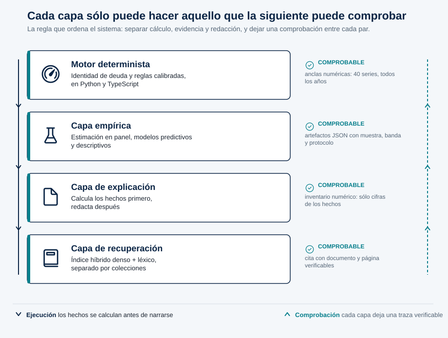

# España en escenarios: simulación económica transparente y evaluación crítica de modelos de IA


**Estado documental:** 20 de septiembre de 2026, motor 1.1.0, corte de datos `2026-07-31`.
Los resultados citados proceden de los artefactos indicados; las evaluaciones
pendientes se distinguen explícitamente de las realizadas. La portada, el índice
y esta sección preliminar se generan con `tools/build_frontmatter.py`; los
campos de universidad y tutor/a están deliberadamente vacíos y debe
cumplimentarlos el autor conforme a la normativa de su titulación.

## Índice

<!-- INDICE:INICIO -->

- [Normas de presentación aplicadas](#normas-de-presentación-aplicadas)
- [Declaración de uso de herramientas de inteligencia artificial](#declaración-de-uso-de-herramientas-de-inteligencia-artificial)
- [Resumen](#resumen)
- [Abstract](#abstract)
- [1. Introducción](#1-introducción)
  - [1.1 Problema](#11-problema)
  - [1.2 Preguntas y objetivos](#12-preguntas-y-objetivos)
  - [1.3 Estructura de la memoria](#13-estructura-de-la-memoria)
- [2. Estado del arte](#2-estado-del-arte)
  - [2.1 Sostenibilidad de la deuda y proyecciones estocásticas](#21-sostenibilidad-de-la-deuda-y-proyecciones-estocásticas)
  - [2.2 El diferencial r-g y la función de reacción fiscal](#22-el-diferencial-r-g-y-la-función-de-reacción-fiscal)
  - [2.3 Expectativas de inflación en la curva de Phillips](#23-expectativas-de-inflación-en-la-curva-de-phillips)
  - [2.4 Precios de vivienda, heterogeneidad regional y dependencia transversal](#24-precios-de-vivienda-heterogeneidad-regional-y-dependencia-transversal)
  - [2.5 Modelos globales y la dificultad de batir referencias simples](#25-modelos-globales-y-la-dificultad-de-batir-referencias-simples)
  - [2.6 Predicción de impago soberano y evaluación con clases desbalanceadas](#26-predicción-de-impago-soberano-y-evaluación-con-clases-desbalanceadas)
  - [2.7 Evaluación de recuperación aumentada y anclaje de modelos de lenguaje](#27-evaluación-de-recuperación-aumentada-y-anclaje-de-modelos-de-lenguaje)
  - [2.8 Posición de este trabajo](#28-posición-de-este-trabajo)
- [3. Datos y trazabilidad](#3-datos-y-trazabilidad)
  - [3.1 Régimen de corte y procedencia](#31-régimen-de-corte-y-procedencia)
  - [3.2 Inventario de fuentes](#32-inventario-de-fuentes)
  - [3.3 Correcciones de procedencia detectadas](#33-correcciones-de-procedencia-detectadas)
- [4. Arquitectura del sistema](#4-arquitectura-del-sistema)
  - [4.1 Cuatro capas con una regla](#41-cuatro-capas-con-una-regla)
  - [4.2 Entorno, despliegue y reproducción](#42-entorno-despliegue-y-reproducción)
- [5. Diseño metodológico](#5-diseño-metodológico)
  - [5.1 Simulación y coherencia computacional](#51-simulación-y-coherencia-computacional)
  - [5.2 Identificación de parámetros](#52-identificación-de-parámetros)
  - [5.3 Estimación regional e incertidumbre](#53-estimación-regional-e-incertidumbre)
  - [5.4 Modelos predictivos](#54-modelos-predictivos)
  - [5.5 Modelos descriptivos](#55-modelos-descriptivos)
  - [5.6 Recuperación documental y capa de lenguaje](#56-recuperación-documental-y-capa-de-lenguaje)
- [6. Resultados](#6-resultados)
  - [6.1 Vivienda regional: la precisión depende del esquema de inferencia](#61-vivienda-regional-la-precisión-depende-del-esquema-de-inferencia)
  - [6.2 Transferencia neuronal: resultado negativo conservado](#62-transferencia-neuronal-resultado-negativo-conservado)
  - [6.3 Impago soberano: discriminación moderada, sin calibración](#63-impago-soberano-discriminación-moderada-sin-calibración)
  - [6.4 Dependencia del estado: sin capacidad predictiva demostrada](#64-dependencia-del-estado-sin-capacidad-predictiva-demostrada)
  - [6.5 Incertidumbre Monte Carlo: los supuestos dominan](#65-incertidumbre-monte-carlo-los-supuestos-dominan)
  - [6.6 Recuperación y generación](#66-recuperación-y-generación)
  - [6.7 Coherencia de implementación](#67-coherencia-de-implementación)
- [7. Discusión](#7-discusión)
- [8. Limitaciones](#8-limitaciones)
- [9. Conclusiones y líneas futuras](#9-conclusiones-y-líneas-futuras)
- [Referencias](#referencias)
  - [Sostenibilidad de la deuda y política fiscal](#sostenibilidad-de-la-deuda-y-política-fiscal)
  - [Inflación y expectativas](#inflación-y-expectativas)
  - [Mercado de la vivienda](#mercado-de-la-vivienda)
  - [Inferencia en panel y remuestreo](#inferencia-en-panel-y-remuestreo)
  - [Predicción, competiciones y modelos globales](#predicción-competiciones-y-modelos-globales)
  - [Impago soberano y evaluación con clases desbalanceadas](#impago-soberano-y-evaluación-con-clases-desbalanceadas)
  - [Recuperación aumentada, atribución y evaluación de modelos de lenguaje](#recuperación-aumentada-atribución-y-evaluación-de-modelos-de-lenguaje)
- [Anexos](#anexos)
  - [Anexo A. Matriz de evidencia](#anexo-a-matriz-de-evidencia)
  - [Anexo B. Parámetros y cambios metodológicos](#anexo-b-parámetros-y-cambios-metodológicos)
  - [Anexo C. Reproducción](#anexo-c-reproducción)
  - [Anexo D. Corpus documental](#anexo-d-corpus-documental)

<!-- INDICE:FIN -->

## Normas de presentación aplicadas

Esta sección declara las convenciones que **este documento** sigue, para que sean
comprobables y uniformes. No sustituye a la normativa de presentación de la
titulación: donde ambas discrepen, prevalece la de la universidad, y los
elementos que dependen de ella —portada oficial, tipografía, márgenes,
interlineado, numeración de páginas y depósito— quedan pendientes de aplicar
sobre la plantilla institucional.

| Elemento | Convención aplicada |
|---|---|
| Idioma | Castellano, con resumen y palabras clave también en inglés |
| Cifras | Separador decimal coma y de millares punto (1.387 observaciones; 0,2039) |
| Precisión | La del artefacto que respalda cada cifra, sin redondeos intermedios |
| Fechas | ISO para cortes de datos (`2026-07-31`); trimestres como 2019T3 |
| Ecuaciones | LaTeX en línea `$…$` y en bloque `$$…$$` |
| Tablas | Encabezado obligatorio; unidades y tamaño muestral en la propia tabla |
| Figuras | SVG vectorial, generadas por código y regenerables |
| Citas | Autor-año en el texto; bibliografía por temas con DOI cuando existe |
| Verificación de citas | Crossref por DOI, API de arXiv por identificador, o servidor de la institución emisora |
| Enlaces internos | Rutas relativas al repositorio, comprobadas automáticamente |
| Numeración | Secciones 1–9; anexos A–D; resumen, índice y bibliografía sin numerar |

Los tres artefactos de portada, índice y diagrama se regeneran con:

```bash
PYTHONPATH=. python tools/build_frontmatter.py
```

## Declaración de uso de herramientas de inteligencia artificial

Se declara el uso de asistentes de IA generativa en la realización de este
trabajo. La declaración es detallada porque el trabajo trata precisamente sobre
los límites de estos sistemas, y una declaración vaga sería incoherente con su
tesis.

**Herramientas empleadas.** Asistentes de programación y redacción basados en
modelos de lenguaje de gran tamaño, empleados de forma conversacional sobre el
repositorio.

**En qué se han usado.**

| Ámbito | Uso | Verificación aplicada |
|---|---|---|
| Implementación | Escritura y refactorización de código del motor, la API, el frontend y los scripts de investigación | Suite de pruebas (523 en Python, 328 en TypeScript), anclas numéricas entre implementaciones e integración continua |
| Depuración | Diagnóstico de errores de contabilidad de intereses, unidades, etiquetado de series y despliegue | Cada corrección se acompaña de una prueba de regresión que falla sin ella |
| Análisis | Propuesta de contrastes de robustez y de esquemas de validación | Los resultados proceden de la ejecución del código, no del modelo |
| Redacción | Borrador y reescritura de esta memoria, del README y de la presentación | Toda cifra se ha comprobado contra el artefacto que la respalda |
| Bibliografía | Búsqueda de literatura pertinente y elaboración de las fichas | Los 65 DOI se han resuelto contra Crossref, arXiv o la institución emisora |
| Capa del producto | El sistema entregado incorpora un modelo de lenguaje como componente (secciones 5.6 y 6.6) | Comprobación numérica automática sobre la redacción generada |

**Qué no ha hecho la IA.** No ha generado datos ni resultados: todas las cifras
de la sección 6 proceden de ejecutar el código sobre los artefactos congelados.
No ha seleccionado los resultados que se publican —los negativos se conservan—
ni ha decidido las reglas de éxito, que se fijaron antes de conocer el
resultado. Ninguna referencia bibliográfica se ha aceptado sin resolverla contra
un registro autorizado, y las que no pudieron verificarse se descartaron o se
citan declarando la ausencia de identificador persistente.

**Responsabilidad.** El autor asume la autoría y la responsabilidad plena del
contenido, de las decisiones metodológicas y de los errores que puedan
subsistir. El uso de estas herramientas no delega ninguna de las dos.

> **Pendiente de firma del autor.** Esta declaración debe revisarse, ajustarse a
> la fórmula que exija la titulación y firmarse. Su contenido refleja el uso
> real observado en el historial del repositorio y no debe suavizarse.

## Resumen

Este trabajo desarrolla y examina una plataforma que integra simulación macroeconómica, análisis regional de vivienda, aprendizaje automático y consulta documental mediante generación aumentada por recuperación. Su finalidad es hacer explícitos los supuestos de escenarios económicos y evaluar qué respaldo empírico ofrece cada componente. Se implementan un motor semiestructural reproducible en Python y TypeScript, simulaciones Monte Carlo, estimadores de panel, un modelo neuronal de transferencia internacional, clasificación exploratoria de impago soberano y recuperación documental multilingüe con una capa de lenguaje sujeta a comprobación numérica.

Los resultados delimitan lo que el sistema puede sostener. La red neuronal no supera el criterio de comparación con una extrapolación de tendencia. La clasificación soberana presenta discriminación moderada y no está calibrada para España. La aparente precisión de la media regional de vivienda disminuye sustancialmente al preservar los movimientos nacionales comunes en el remuestreo: el 3 % de la calibración heredada deja de rechazarse. De ocho parámetros estructurales examinados, sólo tres resultan identificables con los datos disponibles, y los cinco restantes se declaran no identificados con su motivo econométrico.

La contribución es una infraestructura auditable y una evaluación que separa cuatro cosas que suelen confundirse: coherencia computacional, descripción histórica, capacidad predictiva e identificación causal. No se acredita una herramienta de previsión económica ni una mejora educativa medida experimentalmente.

**Palabras clave:** simulación macroeconómica, evaluación predictiva, mercado de la vivienda, cuantificación de la incertidumbre, datos de panel, generación aumentada por recuperación.

## Abstract

This work develops and examines a platform integrating macroeconomic simulation, regional housing analysis, machine learning and document retrieval through retrieval-augmented generation. Its purpose is to make the assumptions behind economic scenarios explicit and to assess what empirical support each component actually has. It implements a semi-structural engine reproduced in both Python and TypeScript, Monte Carlo simulation, panel estimators, a neural transfer model trained on foreign housing series, exploratory sovereign-default classification, and multilingual document retrieval with a language layer constrained by a numeric verification step.

The results bound what the system can claim. The neural network does not beat a trend extrapolation under a success rule fixed in advance. The sovereign classifier shows moderate discrimination and is not calibrated for Spain. The apparent precision of the regional housing mean falls substantially once common national movements are preserved in resampling: the inherited 3 % calibration is no longer rejected. Of eight structural parameters examined, only three are identifiable from the available data; the remaining five are declared unidentified, each with its econometric reason.

The contribution is an auditable infrastructure and an evaluation that separates four things commonly conflated: computational coherence, historical description, predictive capability and causal identification. No forecasting tool and no experimentally measured educational benefit are claimed.

**Keywords:** macroeconomic simulation, predictive evaluation, housing market, uncertainty quantification, panel data, retrieval-augmented generation.

## 1. Introducción

### 1.1 Problema

Una interfaz económica puede producir cifras precisas sin que sus supuestos estén identificados por los datos. Una explicación con citas puede parecer convincente aunque los pasajes no respalden todas sus afirmaciones. Y un sistema puede superar cientos de comprobaciones informáticas sin que ninguna de ellas hable de su validez económica. El problema abordado consiste en integrar cálculo y evidencia conservando estas distinciones, en lugar de dejar que la fluidez de la interfaz las borre.

El riesgo es concreto y asimétrico. Un modelo de escenarios mal comunicado no falla ruidosamente: produce un número plausible, con decimales, acompañado de un gráfico. Quien lo lee no dispone de ninguna señal que distinga una cifra estimada de una calibrada a mano, ni una proyección condicional de una previsión. El trabajo parte de la premisa de que esa señal debe construirse deliberadamente y de que construirla es una tarea de ingeniería tanto como de método.

### 1.2 Preguntas y objetivos

Se plantean tres preguntas de investigación:

- **P1.** ¿Qué propiedades del motor pueden contrastarse con los paneles disponibles y cuánto dependen de la muestra y del tratamiento de la incertidumbre?
- **P2.** ¿Aportan los modelos de aprendizaje automático mejoras observables frente a referencias explícitas, con qué particiones y para qué población?
- **P3.** ¿Puede la aplicación conservar la procedencia de datos y documentos, evitando presentar coherencia informática como validez científica?

De ellas se derivan cinco objetivos operativos:

1. **O1.** Portar un prototipo heredado a una implementación doble (servidor y navegador) cuya concordancia numérica sea verificable mediante anclas compartidas.
2. **O2.** Determinar cuáles de los parámetros estructurales del motor son identificables con los datos congelados y estimar únicamente esos, declarando el resto como no identificados con su motivo.
3. **O3.** Evaluar los componentes de aprendizaje automático contra referencias explícitas y reglas de éxito fijadas antes de conocer el resultado, publicando los resultados negativos.
4. **O4.** Cuantificar la sensibilidad de las conclusiones al esquema de inferencia, en particular al tratamiento de la dependencia temporal común entre regiones.
5. **O5.** Construir una capa de consulta documental y de lenguaje natural cuyas afirmaciones numéricas sean verificables contra los hechos calculados por el motor.

### 1.3 Estructura de la memoria

La sección 2 sitúa el trabajo en la literatura de sostenibilidad de la deuda, dinámica de precios de vivienda, predicción con modelos globales y evaluación de sistemas de recuperación. La sección 3 describe los datos y el régimen de trazabilidad. La sección 4 presenta la arquitectura. La sección 5 detalla el diseño metodológico de cada componente. La sección 6 reúne los resultados. Las secciones 7 y 8 discuten e inventarían los límites, y la 9 concluye. Los anexos recogen la matriz de evidencia, los parámetros estimados, los comandos de reproducción y el manifiesto del corpus.

## 2. Estado del arte

Este trabajo toca cuatro literaturas que rara vez se citan juntas: análisis de sostenibilidad de la deuda, dinámica regional de precios de vivienda, predicción con modelos globales y evaluación de sistemas de recuperación aumentada. La sección las recorre en ese orden y termina situando la contribución propia. El criterio de selección ha sido la pertinencia para una decisión concreta del diseño, no la exhaustividad.

### 2.1 Sostenibilidad de la deuda y proyecciones estocásticas

El análisis de sostenibilidad de la deuda (DSA) combina una identidad contable con supuestos sobre tipos, crecimiento y política fiscal. Escolano (2010) ofrece el tratamiento operativo de esa aritmética. La forma estocástica moderna se consolida con Celasun, Ostry y Debrun (2006), que estiman una función de reacción fiscal, simulan choques correlacionados y presentan el resultado como *fan chart*: el antecedente metodológico directo de las bandas Monte Carlo de esta memoria. Berti (2013) desarrolla la variante basada en la matriz histórica de varianzas y covarianzas para países de la UE.

Los marcos institucionales vigentes son el SRDSF del FMI (2022), que sustituye a la guía de 2013 y articula módulos de riesgo a corto y medio plazo junto al análisis estocástico, y el marco del BCE para soberanos del área euro de Bouabdallah et al. (2017), que hace explícita la sensibilidad al diferencial $r-g$. Zenios et al. (2021) formulan el problema como gestión de riesgo de la cartera de deuda.

Conviene fijar la distinción que gobierna toda la interpretación de la sección 6: estos marcos producen bandas cuyo propósito es asignar verosimilitud a trayectorias. El motor de esta memoria produce bandas condicionales a supuestos elegidos. La técnica se parece; el estatus inferencial no.

### 2.2 El diferencial $r-g$ y la función de reacción fiscal

Blanchard (2019) reabrió el debate al argumentar que con $r<g$ los costes fiscales y de bienestar de la deuda pública son menores de lo que supone la ortodoxia, tesis que desarrolla en Blanchard (2023). Jordà et al. (2019) aportan la base empírica de largo plazo sobre rendimientos y crecimiento en dieciséis economías avanzadas, útil para acotar qué valores de $r-g$ son históricamente plausibles.

La objeción relevante para un horizonte de veinticinco años la formulan Mauro y Zhou (2021): un diferencial negativo no garantiza sostenibilidad, porque los diferenciales se revierten de forma abrupta precisamente cuando el soberano es vulnerable. Es la razón por la que este trabajo trata $r-g$ como palanca explorable y no como tendencia extrapolable, y por la que el motor incorpora un diferencial soberano endógeno al nivel de deuda.

Sobre la respuesta fiscal, Bohn (1998) establece el contraste de sostenibilidad basado en la reacción positiva del superávit primario a la deuda rezagada; Mendoza y Ostry (2008) lo extienden a un panel internacional y documentan su debilitamiento con deuda alta; y Ghosh et al. (2013) formalizan la «fatiga fiscal» y derivan de ella el límite de deuda y el espacio fiscal. Esta literatura es el contexto del único parámetro fiscal que esta memoria consigue estimar, `PB_PERSIST` (sección 5.2); los demás quedan calibrados.

### 2.3 Expectativas de inflación en la curva de Phillips

El motor emplea una curva de Phillips neokeynesiana híbrida con un peso adaptativo. La forma procede de Galí y Gertler (1999), que introducen una fracción de fijadores de precios retrospectivos, y de Galí, Gertler y López-Salido (2005), que defienden la robustez de la estimación frente a las críticas econométricas —entre ellas Rudd y Whelan (2007)—.

El dato decisivo para este trabajo es negativo. Mavroeidis, Plagborg-Møller y Stock (2014) muestran en un survey extenso que la curva está débilmente identificada y que los datos disponibles no discriminan bien entre pesos retrospectivos y prospectivos. Coibion, Gorodnichenko y Kamdar (2018) llegan a una conclusión compatible desde la evidencia sobre formación de expectativas. Esto justifica que el peso adaptativo se exponga aquí como **supuesto de escenario ajustable por quien consulta**, y no como parámetro estimado: la literatura no respalda fijarlo con precisión, y presentarlo como estimación sería una falsa precisión.

### 2.4 Precios de vivienda, heterogeneidad regional y dependencia transversal

Para España, Martínez Pagés y Maza (2003) fijan el marco del banco central sobre determinantes del precio antes del ciclo; Ayuso y Restoy (2006) examinan la relación precio-alquiler; y Álvarez Román y García-Posada Gómez (2019) estiman la relación de largo plazo en un panel provincial 1985–2018 y concluyen que los agregados nacionales **ocultan heterogeneidad regional sustancial**, que es el argumento para trabajar con el panel regional.

En dinámica general, Case y Shiller (1989, 1990) documentan momentum y predictibilidad de rendimientos en exceso, y Capozza, Hendershott y Mack (2004) descomponen la dinámica local en un componente de momentum de corto plazo y otro de reversión hacia el equilibrio, estimando ambas velocidades: es el antecedente directo del parámetro $r=1-\phi$ de la sección 5.2. Glaeser y Nathanson (2017) muestran cómo un modelo extrapolativo genera ambos fenómenos a la vez.

La literatura de inferencia en panel es la que sostiene el hallazgo central de esta memoria. Agrupar errores por unidad admite dependencia dentro de cada región, pero no la dependencia *entre* regiones inducida por un factor temporal común. Driscoll y Kraay (1998) proponen el estimador robusto a ese caso; Pesaran (2021) aporta el contraste CD para diagnosticarlo; y Pesaran (2006) formaliza los efectos correlacionados comunes, mostrando que la inferencia que ignora un factor común es inválida. Abadie, Athey, Imbens y Wooldridge (2023) reformulan el problema: agrupar es una decisión sobre el diseño muestral, no un reflejo automático, y agrupar por la dimensión equivocada produce intervalos demasiado estrechos.

Que en España opere un factor común fuerte no es una conjetura de este trabajo. Ghirelli, Leiva-León y Urtasun (2023) miden la sincronización de los ciclos de precios entre ciudades españolas y encuentran convergencia con máximo en 2009; y Galesi et al. (2020) documentan que **un único factor común explica en torno al 60 % de la variación entre las 52 provincias**, incluidas Ceuta y Melilla. El remuestreo sincronizado de la sección 5.3 es, por tanto, un contraste motivado por evidencia publicada sobre el mismo mercado, no una elección conservadora arbitraria.

El instrumental de remuestreo procede de Künsch (1989), que introduce el bootstrap por bloques móviles, y de Politis y Romano (1994) para la variante estacionaria; Lahiri (1999) compara formalmente las variantes y es la fuente citable para justificar el esquema circular. Politis y Romano propusieron el procedimiento circular en 1992, en un capítulo cuya referencia bibliográfica completa no ha podido verificarse y que por ello se menciona como origen histórico sin paginación.

### 2.5 Modelos globales y la dificultad de batir referencias simples

La evidencia de las competiciones de predicción es directamente relevante para el resultado negativo de la sección 6.2. Makridakis, Spiliotis y Assimakopoulos (2018) documentan que los métodos de aprendizaje automático no superaron a los estadísticos simples en un conjunto amplio de series. En la M4 (Makridakis et al., 2020) sólo ganaron los enfoques híbridos y de combinación: el método vencedor fue el ES-RNN de Smyl (2020), que combina suavizado exponencial local con una red recurrente global, y FFORMA (Montero-Manso et al., 2020) quedó segundo mediante combinación ponderada.

La M5 (Makridakis et al., 2022) invirtió el resultado y los métodos de aprendizaje automático entrenados globalmente dominaron. La reconciliación teórica la ofrecen Montero-Manso e Hyndman (2021): un modelo global puede igualar a cualquier conjunto de modelos locales sin suponer que las series se parezcan, pero su ventaja depende de la complejidad del modelo en relación con el tamaño del conjunto. Semenoglou et al. (2021) cuantifican cuántas series hacen falta para que el aprendizaje cruzado rinda.

Leída con esta literatura, la configuración de la sección 5.4 —entrenamiento sobre 1.760 series extranjeras, evaluación sobre 17 series españolas, con transferencia de dominio y una referencia de tendencia fuerte en series persistentes— es precisamente aquella en la que no cabe esperar que un modelo global gane. El resultado negativo es el caso base previsto por la literatura, y su interés no está en la sorpresa sino en que la regla de decisión se fijó antes. MASE se emplea siguiendo a Hyndman y Koehler (2006).

### 2.6 Predicción de impago soberano y evaluación con clases desbalanceadas

Manasse y Roubini (2009) establecen el enfoque de árboles de clasificación para crisis de deuda soberana; Fioramanti (2008), Dawood, Horsewood y Strobel (2017) y Beutel, List y von Schweinitz (2019) recorren variantes de aprendizaje automático y sistemas de alerta temprana. Moreno Badia et al. (2022) aportan las cifras de referencia del campo: AUC de 0,81 en economías avanzadas y emergentes y 0,71 en países de renta baja, frente a un máximo de 0,69 y 0,68 en Cerovic et al. (2018).

Dos resultados metodológicos condicionan cómo debe leerse el AUC de 0,6736 de la sección 6.3. El primero: Bluwstein et al. (2023) muestran que, sobre los mismos datos y el mismo modelo, el esquema de validación cruzada mueve el AUC entre 0,91 sin restricciones y 0,77 con bloqueo estricto por año y episodio. Un AUC obtenido con particiones agrupadas por país no es comparable con cifras publicadas sin bloqueo. El segundo: Roberts et al. (2017) establecen que ignorar la estructura de dependencia al construir las particiones subestima gravemente el error de predicción, lo que convierte el agrupamiento por país en un requisito y no en una precaución opcional.

Sobre la métrica, Saito y Rehmsmeier (2015) y Davis y Goadrich (2006) establecen que con clases desbalanceadas la curva precisión-exhaustividad es más informativa que la ROC, porque su línea base es la prevalencia. King y Zeng (2001) tratan el sesgo de los modelos binarios con eventos raros. El propio Moreno Badia et al. (2022) reconoce las limitaciones del AUC bajo desbalanceo. De ahí que la sección 6.3 informe la precisión media junto a la frecuencia base, y que la magnitud interpretable sea su cociente.

### 2.7 Evaluación de recuperación aumentada y anclaje de modelos de lenguaje

Lewis et al. (2020) introducen la generación aumentada por recuperación. El componente denso sigue el paradigma bi-codificador de Karpukhin et al. (2020); el modelo concreto empleado se documenta en Wang, Yang et al. (2024) y se sitúa públicamente en MTEB (Muennighoff et al., 2023). La mitad léxica sigue el marco probabilístico de Robertson y Zaragoza (2009), y la combinación emplea la fusión recíproca de rangos de Cormack, Clarke y Buettcher (2009). Thakur et al. (2021) documentan con BEIR que un recuperador denso ajustado en un dominio se degrada fuera de él, que es el argumento para no prescindir de la mitad léxica.

Para la calidad de la respuesta, Es et al. (2024) proponen con RAGAs las métricas sin referencia hoy canónicas —fidelidad, relevancia de la respuesta y relevancia del contexto—, y Saad-Falcon et al. (2024) muestran con ARES cómo calibrar jueces automáticos contra una muestra pequeña de anotación humana. El marco formal de la atribución es el AIS de Rashkin et al. (2023), que es exactamente la pregunta planteada al juez automático en la sección 6.6. Liu, Zhang y Liang (2023) auditaron buscadores generativos y encontraron que sólo una fracción minoritaria de frases está plenamente respaldada por su cita: **la presencia de una cita no equivale a una afirmación verificada**. Ji et al. (2023) proporcionan la taxonomía que separa alucinación intrínseca de extrínseca.

El uso de un segundo modelo como juez está avalado y acotado a la vez. Zheng et al. (2023) cuantifican un acuerdo en torno al 80 % con anotadores humanos y enumeran sus sesgos; Wang, Li et al. (2024) demuestran que el veredicto puede invertirse permutando el orden de los candidatos; y Panickssery, Bowman y Feng (2024) muestran que un modelo reconoce y favorece su propio texto. La consecuencia para esta memoria es que el «10 de 12» de la sección 6.6 se presenta como indicio y no como medida.

Por último, la autocrítica central sobre el hit@8 tiene respaldo formal. Fuhr (2018) enumera los errores habituales en evaluación de recuperación —entre ellos reutilizar el mismo conjunto para ajustar y para informar—; Gorman y Bedrick (2019) demuestran que los rankings obtenidos sobre una partición fija y reutilizada no se reproducen bajo remuestreo; y Dwork et al. (2015) dan la base teórica del sobreajuste por reutilización adaptativa de un conjunto de validación. Por eso el 34/35 se presenta aquí como **cota superior y no como estimación**.

### 2.8 Posición de este trabajo

De lo anterior se desprende dónde encaja esta memoria y dónde no. No propone un algoritmo nuevo ni un marco DSA alternativo. Tres elecciones lo distinguen de la práctica habitual:

1. **Integra las cuatro literaturas en un mismo artefacto ejecutable**, de modo que la trazabilidad entre un número de la interfaz y el artefacto que lo respalda es comprobable, no declarativa.
2. **Trata la elección del esquema de inferencia como resultado y no como detalle técnico.** La literatura de dependencia transversal es conocida; lo que aquí se hace es medir cuánto cambia una conclusión sustantiva sobre España al aplicarla, y publicar ambas bandas.
3. **Somete la capa de lenguaje a una comprobación numérica automática**, en lugar de evaluarla sólo con métricas de fidelidad. La literatura de atribución mide si una afirmación está respaldada; aquí se impide además que el modelo introduzca aritmética propia, y se informa de con qué frecuencia lo intenta.

## 3. Datos y trazabilidad

### 3.1 Régimen de corte y procedencia

La capa española reúne series fiscales, vivienda por comunidad autónoma, demografía y otros indicadores procedentes de fuentes públicas. La fecha `2026-07-31` identifica la referencia del escenario; no demuestra que todos los artefactos añadidos posteriormente se descargaran ese día. Se distinguen fecha de adquisición, periodo observado y fecha de construcción. Los metadatos y las sumas de comprobación permiten identificar los archivos empleados, pero no prueban su autenticidad originaria ni reconstruyen transformaciones históricas ausentes. Véanse [metadatos](../data/ARTIFACT_METADATA.json) y [reproducibilidad](REPRODUCIBILITY.md).

Congelar el corte tiene un coste explícito: faltan datos que existen. El INE publica paro regional que el corte no incorpora, y añadirlo rompería la repetibilidad de todo cálculo anterior. Es una elección de reproducibilidad sobre completitud, y se declara como tal porque condiciona qué parámetros pueden estimarse (sección 5.2).

### 3.2 Inventario de fuentes

| Capa | Contenido | Cobertura | Tamaño |
|---|---|---|---|
| Panel regional de vivienda | Índice de precio de vivienda por CCAA | 2008T1–2026T1, 19 unidades | 1.387 variaciones interanuales |
| Reversión autorregresiva | Pares de crecimiento separados cuatro trimestres | mismo panel | 1.311 pares |
| Corpus inmobiliario extranjero | Series de EE. UU. y Reino Unido | objetivos ≤ 2019T3 | 1.760 series, 113.649 ventanas |
| Panel de impago soberano | Indicadores WDI + etiquetas BoC–BoE | — | 3.874 país-año, 154 países, 377 eventos |
| Panel de estado macroeconómico | Crecimiento compuesto a tres años | 1981–2021 | 2.816 país-año, 140 países |
| Análogos históricos | Cinco variables normalizadas | 1991–2020 | 4.091 observaciones, 173 países |
| Corpus documental | Manuales, metodología propia y opinión | — | 474 documentos, 17.848 fragmentos |

El panel regional contiene 17 CCAA, Ceuta y Melilla. Se excluye Nacional porque agrega información de las mismas regiones. La media conjunta otorga igual peso a cada observación regional; no equivale a ponderar por población o transacciones. Los periodos de ajuste y recuperación se presentan por separado. [Construcción del panel](../research/panel.py).

Para aprendizaje internacional se conservan 1.760 series inmobiliarias estadounidenses y británicas. Su documentación identifica un procesamiento heredado, por lo que reproducir el entrenamiento desde el archivo congelado y reconstruir la extracción original son objetivos distintos. La clasificación soberana combina indicadores WDI con etiquetas derivadas de la base BoC–BoE, cuya definición incluye distintas modalidades de incumplimiento y reestructuración. Las etiquetas transformadas deben distinguirse de las observaciones originales. [Corpus extranjero](../data/external/README.md), [fuentes de impago](../data/external/README_distress.md), [Beers, Ndukwe y Berry, 2025](https://www.bankofcanada.ca/2025/10/staff-analytical-note-2025-24/).

### 3.3 Correcciones de procedencia detectadas

Dos errores de etiquetado se detectaron y corrigieron durante el trabajo, y se documentan porque afectan a la interpretación de resultados anteriores. El primero: la serie *bank lending rate* del Banco Mundial se había empleado como rendimiento soberano y dentro de un diferencial nominal-real; es un tipo bancario, no soberano, y se retiró de ambos usos y del emparejamiento de análogos. El segundo: los valores ausentes se mostraban imputados como medias o ceros en algunos gráficos; ahora política, régimen cambiario y vencimiento se presentan como no disponibles en lugar de inferirse de aproximaciones estáticas. [Cambios metodológicos](METHODOLOGY_CHANGES.md).

## 4. Arquitectura del sistema

### 4.1 Cuatro capas con una regla

El sistema se organiza en cuatro capas gobernadas por una regla: *cada capa sólo puede hacer aquello que la siguiente puede comprobar*.



1. **Motor determinista.** Identidad de deuda y reglas calibradas, implementado en Python (servidor) y TypeScript (navegador). Su salida es reproducible byte a byte desde artefactos congelados.
2. **Capa empírica.** Estimadores de panel, modelos predictivos y descriptivos. Publica parámetros, métricas y resultados negativos como artefactos JSON versionados.
3. **Capa de explicación.** Calcula primero los hechos desde el motor y redacta después, con una comprobación numérica entre ambos pasos.
4. **Capa de recuperación.** Índice documental híbrido con separación por colecciones y verificación de citas.

La paridad numérica entre el motor de servidor y el de navegador se verifica con un conjunto común de anclas y se comprueba sobre las 40 series en todos los años del horizonte, no sólo sobre la deuda: la comprobación anterior sólo comparaba deuda y por eso no detectaba discrepancias en vivienda y saldo. Esta paridad acredita consistencia de implementación; la evaluación empírica responde a otras preguntas. [Motor](../engine/spain.py), [anclas](../tests/fixtures/engine_anchors.json).

### 4.2 Entorno, despliegue y reproducción

El entorno de referencia es Linux x86_64 con Python 3.12 y Node 22, con cierre de dependencias fijado en `requirements-lock.txt` y registrado en [`docs/environment.json`](environment.json). La aplicación se publica como sitio estático (GitHub Pages) y API contenedorizada (Hugging Face Spaces). El índice documental público se construye desde una lista explícita de documentos propios del proyecto; las colecciones con derechos de autor no forman parte de él.

El despliegue actual va más allá y sirve también los manuales, sin credencial, por decisión explícita del autor. Se documenta aquí porque es una decisión sobre licencias de datos, no un detalle de despliegue, y porque su reversión está a una línea de distancia. [Procedimiento](../README.md).

Las limitaciones de reproducción conocidas se declaran: la instalación limpia no está verificada en un entorno nuevo, la integración continua está definida pero no ejecutada en remoto, y algunas transformaciones del pipeline original no se han reconstruido. El anexo C recoge el mapa de comandos.

## 5. Diseño metodológico

Esta sección describe, para cada componente, qué se calcula, con qué supuestos y qué tipo de afirmación permite. El orden va de lo más determinista a lo más incierto.

### 5.1 Simulación y coherencia computacional

El motor combina una identidad de deuda con reglas calibradas para crecimiento, empleo, inflación, salarios y vivienda. La identidad fundamental es:

$$b_t = b_{t-1}\frac{1+i_t}{1+g_t} - sp_t,$$

donde los tipos se expresan en tanto por uno y el saldo primario en puntos de PIB. Mover una palanca produce una trayectoria condicional a estas relaciones; no constituye por sí mismo una intervención causal estimada. Buena parte de los coeficientes y la selección de rangos incorporan juicio del modelizador.

Los intereses sobre el PIB corriente son $b_{t-1}i_t/(1+g_t)$, y el saldo total resta estos intereses al saldo primario. Una versión anterior omitía el denominador al calcular intereses y saldo total, aunque lo aplicaba correctamente en la identidad de deuda; corregirlo sitúa los intereses base de 2026 en 2,73967 % del PIB y el saldo total en −4,08967 %, sin alterar la senda de deuda. Esta misma base contable se usa ahora en ambos motores.

En combinaciones extremas la recurrencia puede producir deuda negativa: se señala como salida del dominio de deuda bruta, pues no se modelan activos públicos ni una reacción de política al agotar la deuda.

La dinámica de precios de vivienda sigue una reversión hacia una media de largo plazo,

$$h_k = \mu + (h_0-\mu)(1-\kappa)^k + \text{canales de tipos y crecimiento},$$

donde $\kappa$ es la tasa anual de reversión y $h_0$ el crecimiento observado de partida.

La simulación Monte Carlo genera 4.000 trayectorias con perturbaciones AR(1) de tipos, crecimiento y saldo primario, con semilla 42. Los percentiles son bandas de simulación condicionadas a distribuciones y reglas calibradas. Una sensibilidad separada varía persistencia, escala, número de trayectorias y semilla, sin afirmar cobertura empírica del 90 %. [Método y resultados](eval/montecarlo-sensitivity.json).

Dos precisiones de unidades se corrigieron y conviene dejar escritas. `alpha_spread = 0,04` significa 4 puntos básicos por punto porcentual de deuda por encima del umbral: veinte puntos de exceso producen 80 pb, no 0,8. Y `omega = 0` elimina la persistencia de la desviación de inflación respecto a la referencia congelada; no impone un objetivo del 2 % del BCE.

### 5.2 Identificación de parámetros

Antes de estimar se escribió qué podía estimarse y qué no. La lista de imposibles es parte del resultado, y es la razón por la que el núcleo fiscal del motor sigue calibrado.

| Parámetro | Estado | Motivo |
|---|---|---|
| `IPV_LR` | estimado: 1,2151 % [0,9008; 1,5295] | media regional, 1.387 observaciones, 19 unidades |
| `IPV_REV` | estimado: 0,2039 [0,1811; 0,2268] | AR(1) sobre la desviación, 1.311 pares |
| `PB_PERSIST` | estimado: 0,8720 [0,8085; 0,9354] | panel de 18 países desde 1960 |
| `E_IPV_R` | no identificado | el Euríbor es nacional y el panel regional: sin variación transversal en el tipo |
| `OKUN` | no identificado | el corte no trae paro regional ni brecha del producto |
| `KAPPA` | no identificado | no hay serie de expectativas de inflación |
| `MULT` | no identificado | exigiría un choque fiscal identificado; gasto e ingreso son endógenos al ciclo |
| `E_R` | no identificado | sin serie de PIB por país, sólo gasto e ingreso |

Declarar un parámetro no identificado es una afirmación más fuerte que publicar un coeficiente obtenido de una regresión que no lo sostiene. Tres de ocho parámetros pasan el filtro; los cinco restantes conservan su valor calibrado y la interfaz no presenta esos valores como estimaciones. [Estimación](../research/panel.py), [parámetros conservados](../data/gold/estimated_params.json).

La tasa de reversión se define como $r = 1-\phi$, siendo $\phi$ la persistencia. La versión heredada utilizaba el número 0,60 como factor retenido; su tasa comparable es 0,40. Reproducir exactamente aquella senda requiere fijar ambos valores, `ipv_rev = 0,40` y `ipv_lr = 3,0`. Las anclas numéricas se regeneraron con los valores actuales y por tanto ya no fijan la trayectoria heredada. Esta precisión evita intercambiar magnitudes con efectos opuestos: con los valores heredados la mediana del precio en 2050 es 400.982 €, y con los actuales 353.640 €.

### 5.3 Estimación regional e incertidumbre

Se estima la media de crecimiento y una relación autorregresiva anual mediante efectos fijos regionales. Los intervalos primarios emplean errores agrupados por unidad. Agrupar permite dependencia interna, pero requiere atender también a la dependencia entre grupos y al número de grupos. [Cameron y Miller, 2015](https://cameron.econ.ucdavis.edu/research/Cameron_Miller_JHR_2015.pdf).

Como contraste, un bootstrap circular de 500 réplicas con semilla 42 remuestrea bloques comunes de 4, 8 y 12 trimestres. Todas las regiones de cada trimestre se desplazan juntas, conservando la covariación nacional. Las regiones permanecen fijas. El ejercicio supone estabilidad aproximada dentro de cada ventana y crea una unión artificial entre final e inicio; se publica como sensibilidad complementaria, no como sustituto de la banda primaria. [Implementación](../research/housing_robustness.py).

La intuición del contraste importa más que su mecánica. Al remuestrear todas las regiones a la vez, diecinueve series dejan de aportar diecinueve piezas de información independiente y pasan a comportarse aproximadamente como un único ciclo inmobiliario nacional de dieciocho años. La banda se ensancha porque la información efectiva es menor, no porque el método sea más conservador por capricho.

Las regresiones horizonte a horizonte siguen la organización de las proyecciones locales, pero aquí relacionan crecimiento interanual previo y cambio futuro del logaritmo del precio, descontando las medias regionales. No identifican una innovación exógena. El crecimiento interanual solapado tampoco equivale a un choque trimestral. La comparación con el motor acumula cambios de nivel desde el precio observado en $t$, presenta sólo puntos anuales y normaliza el primer año: esa coincidencia es impuesta. [Jordà, 2005](https://www.aeaweb.org/articles?id=10.1257/0002828053828518), [implementación](../research/validate.py).

### 5.4 Modelos predictivos

**Transferencia neuronal inmobiliaria.** Un perceptrón multicapa de arquitectura 16→128→128→64→8 recibe dieciséis cambios logarítmicos trimestrales y produce ocho cambios acumulados. Se entrena con 113.649 ventanas extranjeras cuyos objetivos terminan como máximo en 2019T3. El backtest utiliza orígenes desde 2019T4, elimina objetivos posteriores a 2023T4 y compara con último valor, ingenuo estacional y tendencia reciente de ocho trimestres. MASE se escala exclusivamente con errores estacionales del entrenamiento. [Protocolo](../research/backtest.py), [Hyndman y Koehler, 2006](https://robjhyndman.com/papers/mase.pdf).

La regla de éxito exige superar la tendencia en al menos 12 de 17 CCAA para horizontes hasta cuatro trimestres. Esa regla se fijó en el repositorio antes de conocer el resultado, lo que la distingue de un umbral elegido después; no se depositó en un registro externo independiente, de modo que es más débil que una preinscripción formal y más fuerte que un criterio *post hoc*. La distinción es relevante porque el resultado obtenido es negativo y su valor depende precisamente de cuándo se escribió el criterio.

**Clasificación de impago soberano.** Un clasificador de *boosting* utiliza características de $t$ para el inicio de impago en $t+1$, excluyendo años ya en impago. Las cinco particiones `GroupKFold` separan países pero mezclan épocas: evalúan transferencia entre países, no anticipación prospectiva. Se conserva una correspondencia local de nombres y códigos; los fallos de mapeo detienen el proceso. Su salida se denomina puntuación exploratoria sin calibrar, en escala 0–1.

### 5.5 Modelos descriptivos

Tres componentes describen la historia sin pretender predecirla, y se agrupan aquí para que esa condición quede explícita.

**Dependencia del estado macroeconómico.** Un segundo *boosting* relaciona estado macroeconómico y crecimiento acumulado a tres años sobre 2.816 observaciones país-año de 140 países, 1981–2021, con `GroupKFold` de cinco particiones y 60 réplicas bootstrap por país. Las pendientes SHAP por régimen de deuda describen el modelo ajustado. SHAP atribuye predicciones a variables y no convierte asociaciones endógenas en efectos causales. [Lundberg y Lee, 2017](https://proceedings.neurips.cc/paper/2017/hash/8a20a8621978632d76c43dfd28b67767-Abstract.html), [análisis](../research/state_dependence.py).

**Regímenes históricos.** Un modelo oculto de Markov gaussiano de dos estados, ajustado retrospectivamente sobre saldo fiscal e índice de vivienda, con Viterbi y posteriores suavizados. Etiqueta como «crisis» el estado de mayor varianza y publica episodios, por ejemplo vivienda 2008T1–2014T1. Es una segmentación descriptiva dependiente de la especificación, no un detector anticipado validado ni una etiqueta oficial de crisis. [Resultados](eval/regimes.json), [método](../research/regimes.py).

**Vecinos históricos.** Un KNN con distancia de Mahalanobis sobre cinco variables normalizadas, con covarianza y diferencias en las mismas coordenadas, consultado en el año seleccionado, sobre 4.091 observaciones completas de 173 países entre 1991 y 2020, con España excluida del conjunto de referencia. No imputa huecos como valores observados y no aplica bonificación por palanca —un ajuste arbitrario que se retiró—. El tipo bancario de préstamo queda excluido del emparejamiento. No emite veredicto de sostenibilidad. La semejanza histórica no predice la trayectoria española. [Motor](../engine/analog.py), [informe](eval/analog-metric.json).

### 5.6 Recuperación documental y capa de lenguaje

**Recuperación.** La consulta combina embeddings multilingües E5, búsqueda léxica BM25 y fusión de rangos, con separación entre colecciones académicas, metodología propia y opinión, y con etiquetado de autoridad para que un manual y un canal divulgativo no se citen con el mismo peso. Se comprueban identificadores, citas y pertenencia de pasajes a la colección solicitada. La evaluación distingue tres cosas: encontrar un documento, recuperar un pasaje pertinente y producir una respuesta respaldada. [Lewis et al., 2020](https://proceedings.nips.cc/paper/2020/hash/6b493230205f780e1bc26945df7481e5-Abstract.html), [Wang, Yang et al., 2024](https://arxiv.org/abs/2402.05672), [protocolo](eval/README_RAG.md).

**Capa de lenguaje.** El modelo de lenguaje tiene dos usos y en ambos rige la misma restricción: *escribe, nunca calcula*.

En resolución de preguntas (`/ask`), el modelo traduce texto libre a una consulta ejecutable —serie, año y valores de palanca— eligiendo de un vocabulario cerrado de 25 series. Una serie desconocida produce un rechazo, una palanca desconocida se descarta y un valor fuera del rango publicado se recorta a él. El modelo elige; los límites del motor deciden qué es admisible.

En redacción (`/explain`), los hechos llegan ya calculados y el modelo sólo pone palabras. Una comprobación posterior rechaza cualquier magnitud numérica que no esté literalmente en los hechos, admitiendo redondeos pero no truncamientos. Esa comprobación descarta en torno a una de cada cinco redacciones, y las violaciones observadas son informativas: conversiones a puntos básicos, restas entre cifras dadas, un porcentaje derivado de una proporción y un año histórico citado de memoria. Todas son casos de un modelo calculando cuando se le pidió que narrara. Por ese motivo la redacción por defecto la producen plantillas deterministas y el modelo es opcional; cada respuesta declara cuál de las dos vías la ha escrito.

## 6. Resultados

### 6.1 Vivienda regional: la precisión depende del esquema de inferencia

| Magnitud | Estimación | Banda 90 % | Muestra |
|---|---|---|---|
| Media regional de crecimiento | 1,2151 % | [0,9008; 1,5295] | 1.387 obs., 19 unidades |
| Media del ajuste (2008T1–2013T4) | −6,4497 % | — | 456 obs. |
| Media de la recuperación (2014T1–2026T1) | 4,9694 % | — | 931 obs. |
| Tasa de reversión AR | 0,2039 | [0,1811; 0,2268] | 1.311 pares |

El contraste de dependencia común cambia la lectura:

| Bloques del bootstrap sincronizado | Banda 90 % | ¿Contiene el 3 %? |
|---|---|---|
| 4 trimestres | [−1,34; 3,85] | sí |
| 8 trimestres | [−2,14; 4,49] | sí |
| 12 trimestres | [−2,70; 4,77] | sí |

La banda primaria excluye el 3 % de la calibración heredada; las tres bandas sincronizadas lo incluyen. **El rechazo del 3 % no es robusto al tratamiento de la dependencia temporal común.** Estas cifras describen la muestra, no una ley de largo plazo. [Resultados](eval/housing-robustness.json).


### 6.2 Transferencia neuronal: resultado negativo conservado

| Horizonte | Red | Tendencia | Regiones ganadas | Regla |
|---|---|---|---|---|
| ≤ 4 trimestres | MASE 0,4000 | MASE 0,3953 | 5/17 | 12/17 |
| 5–8 trimestres | MASE 0,8421 | MASE 0,7960 | — | — |

La red no satisface la regla. Las medias MASE incluyen la serie Nacional; el conteo de victorias la excluye. No se presenta una diferencia estadísticamente significativa ni una derrota universal del aprendizaje profundo: se documenta el resultado de esta arquitectura bajo este protocolo. El tramo final 2024–2025 sigue pendiente de evaluación. [Artefacto](eval/t1-dl-global.json).

### 6.3 Impago soberano: discriminación moderada, sin calibración

AUC agrupada por países **0,6736**, desviación entre particiones 0,0308, *average precision* **0,1945** sobre una frecuencia base de 0,0973, en 3.874 observaciones, 154 países y 377 eventos. La desviación entre particiones no es un intervalo de confianza. No hay validación temporal, calibración española ni comparador logístico. [Artefacto](eval/distress.json).

La puntuación que el sistema produce para España es **0,017409** en escala 0–1, sobre la fila de 2024 y con cobertura de 8 de 12 características. No debe leerse como un 1,74 % de probabilidad de impago ni como «seis veces menos riesgo» que ningún otro país: la población etiquetada es selectiva, España queda fuera de ella y la transferencia no está validada. Mostrar esta cifra en la interfaz es una decisión discutible, y retirarla dejándola sólo en la matriz de evidencia sería defendible.

### 6.4 Dependencia del estado: sin capacidad predictiva demostrada

$R^2$ entre países de **−0,0074**, por debajo de la referencia de media implícita. El intervalo bootstrap de la diferencia de pendientes entre deuda alta y baja, **[−0,0309; 0,0537]**, incluye cero. Esto no demuestra igualdad causal ni valida la constante del motor; y la falta de capacidad predictiva limita directamente cuánto puede interpretarse de las pendientes SHAP obtenidas del mismo modelo. [Resultados](eval/state_dependence.json).

### 6.5 Incertidumbre Monte Carlo: los supuestos dominan

| Persistencia $\rho$ | Anchura p5–p95 de deuda en 2050 |
|---|---|
| 0,50 | 21,53 pp de PIB |
| 0,80 | 49,33 pp de PIB |
| 0,96 | 127,40 pp de PIB |

Manteniendo la escala de perturbación, la anchura se multiplica por seis al variar un solo supuesto. La sensibilidad a supuestos puede dominar la precisión numérica. [Informe](eval/montecarlo-sensitivity.json).


### 6.6 Recuperación y generación

| Métrica | Valor | Alcance real |
|---|---|---|
| Hit@8 por título | 34/35 = 97,14 % | recuperación de documento, no exactitud de respuesta |
| MRR | 0,7820 | mismo conjunto de desarrollo |
| Top-1 | 68,57 % | mismo conjunto de desarrollo |
| Primeras frases citadas con respaldo | 10/12 | una frase por respuesta, juez automático |
| Proporción media de frases citadas | 92,71 % | presencia de cita, no respaldo |
| Referencias fuera de rango | 0 | integridad formal |
| Rechazos de preguntas no respondibles | 4/4 | comportamiento esperado |

Las 35 preguntas participaron en el ajuste de pesos y glosario: son conjunto de desarrollo, no prueba independiente, y el hit@8 debe leerse como **cota superior, no como estimación**. Tampoco se han vuelto a medir tras los cambios del validador. [Recuperación](eval/rag-eval-2026-08-09.json), [generación](eval/rag-chat-eval.json).

En aislamiento e integridad, el artefacto histórico registra 156 búsquedas de aislamiento sobre un corpus de 474 documentos y 17.848 fragmentos, con 0 fugas observadas entre colecciones y los índices de embeddings y texto completo. Acredita la integridad del índice examinado, no seguridad universal. [Validador](../rag/validation.py).

### 6.7 Coherencia de implementación

La comparación entre el motor de servidor y el de navegador cubre las 40 series en todos los años del horizonte, además de los ocho escenarios ilustrativos. Las anclas fijan el resultado esperado y cualquier divergencia detiene la construcción. Es una prueba de consistencia de implementación: no dice nada sobre la exactitud económica de las trayectorias.

## 7. Discusión

**P1** encuentra respaldo para describir propiedades de la muestra y una fuerte dependencia de las conclusiones respecto al esquema de incertidumbre. El hallazgo más transferible del trabajo es negativo y metodológico: preservar los movimientos nacionales comunes en el remuestreo ensancha la banda regional hasta hacer irrelevante el rechazo del valor heredado. Un resultado que parecía una corrección empírica resulta ser una consecuencia del esquema de inferencia elegido.

**P2** no obtiene evidencia de superioridad neuronal bajo la regla fijada de antemano. La discriminación soberana es moderada, y el modelo de estado carece de capacidad predictiva demostrada entre países. Estos resultados no son sorprendentes a la luz de la literatura de competiciones de predicción, pero sí lo sería no haberlos publicado: el protocolo se conserva íntegro precisamente porque el resultado fue el que fue.

**P3** dispone de mecanismos verificables de procedencia y consistencia —sumas de comprobación, separación de colecciones, verificación de citas, comprobación numérica de la redacción—, aunque permanecen lagunas en la reconstrucción desde fuentes originales y en la validación independiente del RAG.

La distinción central que atraviesa las tres preguntas es que repetir resultados con una semilla fija acredita reproducibilidad computacional, mientras que interpretar bandas, probabilidades o multiplicadores requiere supuestos adicionales. Cientos de comprobaciones informáticas no sustituyen un diseño de validación estadística. Que la capa de lenguaje rechace una de cada cinco redacciones por introducir aritmética propia ilustra el mismo punto en otro registro: la fluidez del texto y la corrección de sus cifras son propiedades independientes, y sólo la segunda puede comprobarse automáticamente.

## 8. Limitaciones

1. **Núcleo fiscal calibrado.** Cinco de los ocho parámetros examinados no son identificables con los datos congelados. Los rangos de las palancas incorporan juicio del modelizador.
2. **Escenarios condicionales, no previsiones.** Las trayectorias son implicaciones de supuestos mantenidos. No incorporan cambios de régimen, reacción de política ni incertidumbre paramétrica completa.
3. **Bandas sin cobertura empírica demostrada.** Los percentiles Monte Carlo son distribucionales, no intervalos con cobertura verificada en datos reales.
4. **Evaluación RAG sobre conjunto de desarrollo.** Las métricas publicadas no constituyen prueba independiente y no se han reejecutado tras los cambios del validador.
5. **Sin anotación humana.** La fidelidad de las citas fue juzgada por un segundo modelo de lenguaje, no por personas.
6. **Impago soberano sin validación temporal ni calibración**, y sin comparador logístico.
7. **Reconstrucción del pipeline original incompleta**, instalación limpia no verificada, integración continua definida pero no ejecutada en remoto.
8. **Regla de éxito no registrada externamente.** Fijada antes del resultado en el repositorio, pero sin depósito en un registro independiente.
9. **Utilidad educativa no medida.** No se ha realizado ningún estudio con usuarios.
10. **Componentes descriptivos** —HMM, SHAP, análogos— sin validación prospectiva de ningún tipo.

No se afirma que el modelo mida la eficiencia del gasto público, que identifique los efectos causales de las palancas ni que pronostique la economía española hasta 2050.

## 9. Conclusiones y líneas futuras

La aportación es una plataforma reproducible desde artefactos conservados, acompañada de protocolos que permiten auditar resultados positivos, negativos y dependientes de supuestos. Tres conclusiones concretas:

1. **Preservar los movimientos nacionales comunes cambia sustancialmente la incertidumbre regional**, y con ella la conclusión sustantiva sobre el crecimiento inmobiliario de largo plazo. Es el hallazgo metodológico más claro del trabajo.
2. **Declarar qué no se puede estimar es un resultado.** Tres de ocho parámetros son identificables; publicar los cinco restantes como calibrados, con su motivo, es más informativo que publicar coeficientes que los datos no sostienen.
3. **Separar cálculo de redacción es verificable y merece la pena.** La comprobación numérica rechaza en torno a una de cada cinco redacciones generadas, todas ellas por introducir aritmética que no se le había pedido.

Las líneas futuras se ordenan por lo que desbloquean: evaluar una sola vez el tramo inmobiliario reservado tras congelar decisiones; realizar validación temporal y calibración soberana con población justificada y referencia logística; anotar externamente preguntas y pasajes RAG congelados, con baseline independiente; comprobar empíricamente la cobertura de las bandas de deuda mediante *hindcasts* por horizonte; completar la reconstrucción de las fuentes originales; y diseñar identificación causal si se pretende interpretar las palancas como efectos de políticas. La utilidad educativa requeriría además un estudio con usuarios. Ninguna de estas tareas se da por realizada.

La [matriz de evidencia](RESULTS.md) resume cada experimento, su alcance y sus pendientes.

## Referencias

Cada entrada se ha comprobado contra un registro autorizado —Crossref por DOI, la API de arXiv por identificador, o el servidor de la institución emisora cuando la serie no está indexada en Crossref—. Tres precisiones, por si el lector repite la comprobación:

- Se omite deliberadamente la paginación de tres registros que las fuentes consultadas no devuelven (Künsch, 1989; Lahiri, 1999; Friedman, 2001), en lugar de tomarla de fuentes secundarias.
- Case y Shiller (1989) carece de DOI: la revista no está indexada en Crossref con anterioridad a 1999. Se cita sin identificador persistente y se indica la versión de trabajo equivalente.
- El DOI de Berti (2013) está registrado por la Oficina de Publicaciones de la UE y no por Crossref, de modo que resuelve en `doi.org` pero devuelve 404 en la API de Crossref. Las series de documentos de trabajo del Banco de España tampoco están en Crossref y se han verificado contra el servidor de la institución.

### Sostenibilidad de la deuda y política fiscal

- Berti, K. (2013). *Stochastic public debt projections using the historical variance-covariance matrix approach for EU countries*. European Economy Economic Papers 480, Comisión Europea, DG ECFIN. DOI: 10.2765/4211.
- Blanchard, O. (2019). Public Debt and Low Interest Rates. *American Economic Review*, 109(4), 1197–1229. DOI: 10.1257/aer.109.4.1197.
- Blanchard, O. (2023). *Fiscal Policy under Low Interest Rates*. The MIT Press. DOI: 10.7551/mitpress/14858.001.0001.
- Bohn, H. (1998). The Behavior of U.S. Public Debt and Deficits. *The Quarterly Journal of Economics*, 113(3), 949–963. DOI: 10.1162/003355398555793.
- Bouabdallah, O., Checherita-Westphal, C., Warmedinger, T., de Stefani, R., Drudi, F., Setzer, R. y Westphal, A. (2017). *Debt sustainability analysis for euro area sovereigns: a methodological framework*. ECB Occasional Paper Series 185, Banco Central Europeo.
- Celasun, O., Ostry, J. D. y Debrun, X. (2006). Primary Surplus Behavior and Risks to Fiscal Sustainability in Emerging Market Countries: A «Fan-Chart» Approach. *IMF Staff Papers*, 53(3), 401–425. DOI: 10.2307/30035919.
- Escolano, J. (2010). *A Practical Guide to Public Debt Dynamics, Fiscal Sustainability, and Cyclical Adjustment of Budgetary Aggregates*. IMF Technical Notes and Manuals 2010/002. DOI: 10.5089/9781462396955.005.
- FMI (2022). *Staff Guidance Note on the Sovereign Risk and Debt Sustainability Framework for Market Access Countries*. IMF Policy Papers, 2022(039). DOI: 10.5089/9798400216862.007.
- Ghosh, A. R., Kim, J. I., Mendoza, E. G., Ostry, J. D. y Qureshi, M. S. (2013). Fiscal Fatigue, Fiscal Space and Debt Sustainability in Advanced Economies. *The Economic Journal*, 123(566), F4–F30. DOI: 10.1111/ecoj.12010.
- Jordà, Ò., Knoll, K., Kuvshinov, D., Schularick, M. y Taylor, A. M. (2019). The Rate of Return on Everything, 1870–2015. *The Quarterly Journal of Economics*, 134(3), 1225–1298. DOI: 10.1093/qje/qjz012.
- Mauro, P. y Zhou, J. (2021). r − g < 0: Can We Sleep More Soundly? *IMF Economic Review*, 69(1), 197–229. DOI: 10.1057/s41308-020-00128-y.
- Mendoza, E. G. y Ostry, J. D. (2008). International evidence on fiscal solvency: Is fiscal policy «responsible»? *Journal of Monetary Economics*, 55(6), 1081–1093. DOI: 10.1016/j.jmoneco.2008.06.003.
- Zenios, S. A., Consiglio, A., Athanasopoulou, M., Moshammer, E., Gavilan, A. y Erce, A. (2021). Risk Management for Sustainable Sovereign Debt Financing. *Operations Research*, 69(3), 755–773. DOI: 10.1287/opre.2020.2055.

### Inflación y expectativas

- Coibion, O., Gorodnichenko, Y. y Kamdar, R. (2018). The Formation of Expectations, Inflation, and the Phillips Curve. *Journal of Economic Literature*, 56(4), 1447–1491. DOI: 10.1257/jel.20171300.
- Galí, J. y Gertler, M. (1999). Inflation dynamics: A structural econometric analysis. *Journal of Monetary Economics*, 44(2), 195–222. DOI: 10.1016/S0304-3932(99)00023-9.
- Galí, J., Gertler, M. y López-Salido, J. D. (2005). Robustness of the estimates of the hybrid New Keynesian Phillips curve. *Journal of Monetary Economics*, 52(6), 1107–1118. DOI: 10.1016/j.jmoneco.2005.08.005.
- Mavroeidis, S., Plagborg-Møller, M. y Stock, J. H. (2014). Empirical Evidence on Inflation Expectations in the New Keynesian Phillips Curve. *Journal of Economic Literature*, 52(1), 124–188. DOI: 10.1257/jel.52.1.124.
- Rudd, J. y Whelan, K. (2007). Modeling Inflation Dynamics: A Critical Review of Recent Research. *Journal of Money, Credit and Banking*, 39(s1), 155–170. DOI: 10.1111/j.1538-4616.2007.00019.x.

### Mercado de la vivienda

- Álvarez Román, L. y García-Posada Gómez, M. (2019). *Modelling Regional Housing Prices in Spain*. Documentos de Trabajo 1941, Banco de España.
- Ayuso, J. y Restoy, F. (2006). House prices and rents: An equilibrium asset pricing approach. *Journal of Empirical Finance*, 13(3), 371–388. DOI: 10.1016/j.jempfin.2005.10.004.
- Capozza, D. R., Hendershott, P. H. y Mack, C. (2004). An Anatomy of Price Dynamics in Illiquid Markets: Analysis and Evidence from Local Housing Markets. *Real Estate Economics*, 32(1), 1–32. DOI: 10.1111/j.1080-8620.2004.00082.x.
- Case, K. E. y Shiller, R. J. (1989). The Efficiency of the Market for Single-Family Homes. *American Economic Review*, 79(1), 125–137. (Sin DOI: la revista no está indexada en Crossref con anterioridad a 1999. Versión de trabajo: NBER w2506, DOI 10.3386/w2506.)
- Case, K. E. y Shiller, R. J. (1990). Forecasting Prices and Excess Returns in the Housing Market. *Real Estate Economics*, 18(3), 253–273. DOI: 10.1111/1540-6229.00521.
- Galesi, A., Mata, N., Rey, D., Schmitz, S. y Schuffels, J. (2020). *Regional Housing Market Conditions in Spain*. GSBE Research Memorandum 2020/029, Universidad de Maastricht. DOI: 10.26481/umagsb.2020029.
- Ghirelli, C., Leiva-León, D. y Urtasun, A. (2023). Housing prices in Spain: convergence or decoupling? *SERIEs*, 14(2), 165–187. DOI: 10.1007/s13209-023-00275-1.
- Glaeser, E. L. y Nathanson, C. G. (2017). An extrapolative model of house price dynamics. *Journal of Financial Economics*, 126(1), 147–170. DOI: 10.1016/j.jfineco.2017.06.012.
- Martínez Pagés, J. y Maza, L. Á. (2003). *Analysis of House Prices in Spain*. Documento de Trabajo 0307, Banco de España.

### Inferencia en panel y remuestreo

- Abadie, A., Athey, S., Imbens, G. W. y Wooldridge, J. M. (2023). When Should You Adjust Standard Errors for Clustering? *The Quarterly Journal of Economics*, 138(1), 1–35. DOI: 10.1093/qje/qjac038.
- Cameron, A. C. y Miller, D. L. (2015). A Practitioner's Guide to Cluster-Robust Inference. *Journal of Human Resources*, 50(2), 317–372. DOI: 10.3368/jhr.50.2.317.
- Driscoll, J. C. y Kraay, A. C. (1998). Consistent Covariance Matrix Estimation with Spatially Dependent Panel Data. *Review of Economics and Statistics*, 80(4), 549–560. DOI: 10.1162/003465398557825.
- Jordà, Ò. (2005). Estimation and Inference of Impulse Responses by Local Projections. *American Economic Review*, 95(1), 161–182. DOI: 10.1257/0002828053828518.
- Künsch, H. R. (1989). The Jackknife and the Bootstrap for General Stationary Observations. *The Annals of Statistics*, 17(3). DOI: 10.1214/aos/1176347265.
- Lahiri, S. N. (1999). Theoretical comparisons of block bootstrap methods. *The Annals of Statistics*, 27(1). DOI: 10.1214/aos/1018031117.
- Pesaran, M. H. (2006). Estimation and Inference in Large Heterogeneous Panels with a Multifactor Error Structure. *Econometrica*, 74(4), 967–1012. DOI: 10.1111/j.1468-0262.2006.00692.x.
- Pesaran, M. H. (2021). General diagnostic tests for cross-sectional dependence in panels. *Empirical Economics*, 60(1), 13–50. DOI: 10.1007/s00181-020-01875-7.
- Politis, D. N. y Romano, J. P. (1994). The Stationary Bootstrap. *Journal of the American Statistical Association*, 89(428), 1303–1313. DOI: 10.1080/01621459.1994.10476870.

### Predicción, competiciones y modelos globales

- Friedman, J. H. (2001). Greedy function approximation: A gradient boosting machine. *The Annals of Statistics*, 29(5). DOI: 10.1214/aos/1013203451.
- Hyndman, R. J. y Koehler, A. B. (2006). Another look at measures of forecast accuracy. *International Journal of Forecasting*, 22(4), 679–688. DOI: 10.1016/j.ijforecast.2006.03.001.
- Makridakis, S., Spiliotis, E. y Assimakopoulos, V. (2018). Statistical and Machine Learning forecasting methods: Concerns and ways forward. *PLOS ONE*, 13(3), e0194889. DOI: 10.1371/journal.pone.0194889.
- Makridakis, S., Spiliotis, E. y Assimakopoulos, V. (2020). The M4 Competition: 100,000 time series and 61 forecasting methods. *International Journal of Forecasting*, 36(1), 54–74. DOI: 10.1016/j.ijforecast.2019.04.014.
- Makridakis, S., Spiliotis, E. y Assimakopoulos, V. (2022). M5 accuracy competition: Results, findings, and conclusions. *International Journal of Forecasting*, 38(4), 1346–1364. DOI: 10.1016/j.ijforecast.2021.11.013.
- Montero-Manso, P., Athanasopoulos, G., Hyndman, R. J. y Talagala, T. S. (2020). FFORMA: Feature-based forecast model averaging. *International Journal of Forecasting*, 36(1), 86–92. DOI: 10.1016/j.ijforecast.2019.02.011.
- Montero-Manso, P. y Hyndman, R. J. (2021). Principles and algorithms for forecasting groups of time series: Locality and globality. *International Journal of Forecasting*, 37(4), 1632–1653. DOI: 10.1016/j.ijforecast.2021.03.004.
- Semenoglou, A.-A., Spiliotis, E., Makridakis, S. y Assimakopoulos, V. (2021). Investigating the accuracy of cross-learning time series forecasting methods. *International Journal of Forecasting*, 37(3), 1072–1084. DOI: 10.1016/j.ijforecast.2020.11.009.
- Smyl, S. (2020). A hybrid method of exponential smoothing and recurrent neural networks for time series forecasting. *International Journal of Forecasting*, 36(1), 75–85. DOI: 10.1016/j.ijforecast.2019.03.017.

### Impago soberano y evaluación con clases desbalanceadas

- Beers, D., Ndukwe, O. y Berry, J. (2025). [BoC–BoE Sovereign Default Database: What's new in 2025?](https://www.bankofcanada.ca/2025/10/staff-analytical-note-2025-24/) Staff Analytical Note 2025-24, Bank of Canada.
- Beutel, J., List, S. y von Schweinitz, G. (2019). Does machine learning help us predict banking crises? *Journal of Financial Stability*, 45, 100693. DOI: 10.1016/j.jfs.2019.100693.
- Bluwstein, K., Buckmann, M., Joseph, A., Kapadia, S. y Şimşek, Ö. (2023). Credit growth, the yield curve and financial crisis prediction: Evidence from a machine learning approach. *Journal of International Economics*, 145, 103773. DOI: 10.1016/j.jinteco.2023.103773.
- Cerovic, S., Gerling, K., Hodge, A. y Medas, P. (2018). *Predicting Fiscal Crises*. IMF Working Papers 2018/181. DOI: 10.5089/9781484372555.001.
- Davis, J. y Goadrich, M. (2006). The relationship between Precision-Recall and ROC curves. *Proceedings of the 23rd International Conference on Machine Learning (ICML '06)*, 233–240. DOI: 10.1145/1143844.1143874.
- Dawood, M., Horsewood, N. y Strobel, F. (2017). Predicting sovereign debt crises: An Early Warning System approach. *Journal of Financial Stability*, 28, 16–28. DOI: 10.1016/j.jfs.2016.11.008.
- Fioramanti, M. (2008). Predicting sovereign debt crises using artificial neural networks: A comparative approach. *Journal of Financial Stability*, 4(2), 149–164. DOI: 10.1016/j.jfs.2008.01.001.
- King, G. y Zeng, L. (2001). Logistic Regression in Rare Events Data. *Political Analysis*, 9(2), 137–163. DOI: 10.1093/oxfordjournals.pan.a004868.
- Manasse, P. y Roubini, N. (2009). «Rules of thumb» for sovereign debt crises. *Journal of International Economics*, 78(2), 192–205. DOI: 10.1016/j.jinteco.2008.12.002.
- Moreno Badia, M., Medas, P., Gupta, P. y Xiang, Y. (2022). Debt is not free. *Journal of International Money and Finance*, 127, 102654. DOI: 10.1016/j.jimonfin.2022.102654.
- Roberts, D. R., Bahn, V., Ciuti, S. et al. (2017). Cross-validation strategies for data with temporal, spatial, hierarchical, or phylogenetic structure. *Ecography*, 40(8), 913–929. DOI: 10.1111/ecog.02881.
- Saito, T. y Rehmsmeier, M. (2015). The Precision-Recall Plot Is More Informative than the ROC Plot When Evaluating Binary Classifiers on Imbalanced Datasets. *PLOS ONE*, 10(3), e0118432. DOI: 10.1371/journal.pone.0118432.

### Recuperación aumentada, atribución y evaluación de modelos de lenguaje

- Cormack, G. V., Clarke, C. L. A. y Buettcher, S. (2009). Reciprocal rank fusion outperforms condorcet and individual rank learning methods. *Proceedings of the 32nd International ACM SIGIR Conference*, 758–759. DOI: 10.1145/1571941.1572114.
- Dwork, C., Feldman, V., Hardt, M., Pitassi, T., Reingold, O. y Roth, A. (2015). The reusable holdout: Preserving validity in adaptive data analysis. *Science*, 349(6248), 636–638. DOI: 10.1126/science.aaa9375.
- Es, S., James, J., Espinosa-Anke, L. y Schockaert, S. (2024). RAGAs: Automated Evaluation of Retrieval Augmented Generation. *Proceedings of the 18th Conference of the EACL: System Demonstrations*, 150–158. DOI: 10.18653/v1/2024.eacl-demo.16.
- Fuhr, N. (2018). Some Common Mistakes In IR Evaluation, And How They Can Be Avoided. *ACM SIGIR Forum*, 51(3), 32–41. DOI: 10.1145/3190580.3190586.
- Gorman, K. y Bedrick, S. (2019). We Need to Talk about Standard Splits. *Proceedings of the 57th Annual Meeting of the ACL*, 2786–2791. DOI: 10.18653/v1/P19-1267.
- Ji, Z., Lee, N., Frieske, R. et al. (2023). Survey of Hallucination in Natural Language Generation. *ACM Computing Surveys*, 55(12), 1–38. DOI: 10.1145/3571730.
- Karpukhin, V., Oğuz, B., Min, S., Lewis, P., Wu, L., Edunov, S., Chen, D. y Yih, W. (2020). Dense Passage Retrieval for Open-Domain Question Answering. *Proceedings of EMNLP 2020*, 6769–6781. DOI: 10.18653/v1/2020.emnlp-main.550.
- Lewis, P. et al. (2020). Retrieval-Augmented Generation for Knowledge-Intensive NLP Tasks. *Advances in Neural Information Processing Systems*, 33. arXiv:2005.11401.
- Liu, N. F., Zhang, T. y Liang, P. (2023). Evaluating Verifiability in Generative Search Engines. *Findings of the ACL: EMNLP 2023*, 7001–7025. DOI: 10.18653/v1/2023.findings-emnlp.467.
- Lundberg, S. M. y Lee, S.-I. (2017). A Unified Approach to Interpreting Model Predictions. *Advances in Neural Information Processing Systems*, 30.
- Muennighoff, N., Tazi, N., Magne, L. y Reimers, N. (2023). MTEB: Massive Text Embedding Benchmark. *Proceedings of the 17th Conference of the EACL*, 2014–2037. DOI: 10.18653/v1/2023.eacl-main.148.
- Panickssery, A., Bowman, S. R. y Feng, S. (2024). *LLM Evaluators Recognize and Favor Their Own Generations*. arXiv:2404.13076.
- Rashkin, H., Nikolaev, V., Lamm, M. et al. (2023). Measuring Attribution in Natural Language Generation Models. *Computational Linguistics*, 49(4), 777–840. DOI: 10.1162/coli_a_00486.
- Robertson, S. y Zaragoza, H. (2009). The Probabilistic Relevance Framework: BM25 and Beyond. *Foundations and Trends in Information Retrieval*, 4(1–2), 1–174. DOI: 10.1561/1500000019.
- Saad-Falcon, J., Khattab, O., Potts, C. y Zaharia, M. (2024). ARES: An Automated Evaluation Framework for Retrieval-Augmented Generation Systems. *Proceedings of NAACL-HLT 2024*, 338–354. DOI: 10.18653/v1/2024.naacl-long.20.
- Thakur, N., Reimers, N., Rücklé, A., Srivastava, A. y Gurevych, I. (2021). *BEIR: A Heterogenous Benchmark for Zero-shot Evaluation of Information Retrieval Models*. NeurIPS 2021 Datasets and Benchmarks Track. arXiv:2104.08663.
- Wang, L., Yang, N., Huang, X., Yang, L., Majumder, R. y Wei, F. [Wang, Yang et al.] (2024). *Multilingual E5 Text Embeddings: A Technical Report*. arXiv:2402.05672.
- Wang, P., Li, L., Chen, L. et al. [Wang, Li et al.] (2024). Large Language Models are not Fair Evaluators. *Proceedings of ACL 2024*, 9440–9450. DOI: 10.18653/v1/2024.acl-long.511.
- Zheng, L., Chiang, W.-L., Sheng, Y. et al. (2023). *Judging LLM-as-a-Judge with MT-Bench and Chatbot Arena*. NeurIPS 2023 Datasets and Benchmarks Track. arXiv:2306.05685.

## Anexos

### Anexo A. Matriz de evidencia

La matriz completa —modelo, diseño, muestra, resultado, lectura permitida y artefacto, para cada uno de los catorce experimentos— se publica en [`docs/RESULTS.md`](RESULTS.md), junto con la tabla de siete tareas pendientes y el motivo por el que cada una no se da por completada.

### Anexo B. Parámetros y cambios metodológicos

Los parámetros estimados, con sus bandas y muestras, están en [`data/gold/estimated_params.json`](../data/gold/estimated_params.json). El registro de correcciones metodológicas —contabilidad de intereses, etiquetado del tipo bancario, unidades del diferencial, semántica de `omega`, retirada de la bonificación por palanca, política de no imputación y cambios del contrato de la API— está en [`docs/METHODOLOGY_CHANGES.md`](METHODOLOGY_CHANGES.md).

### Anexo C. Reproducción

El entorno, los comandos y el mapa de qué regenera cada análisis, con sus límites conocidos, están en [`docs/REPRODUCIBILITY.md`](REPRODUCIBILITY.md). La verificación de integridad se ejecuta con `scripts/check_data_integrity.py` y no requiere descargas ni el corpus privado.

### Anexo D. Corpus documental

El manifiesto del corpus —81 entradas con fichero, tamaño, suma de comprobación, tema, decisión de inclusión y motivo— está en [`docs/CORPUS_MANIFEST.csv`](CORPUS_MANIFEST.csv). Las colecciones con derechos de autor no se publican; el índice desplegado por defecto se construye desde una lista explícita de documentos propios del proyecto.

El despliegue sirve el corpus completo **sin credencial**, por decisión explícita del autor: las cuatro colecciones, manuales de terceros incluidos, responden a cualquier consulta. No hace falta token ni hoja de acceso para reproducir cualquier resultado de la sección 6.6.

Conviene que la memoria lo diga con sus consecuencias y no sólo como una comodidad. `libros` reúne obras con derechos de autor, y servirlas abiertas convierte el extremo `/rag/search` en un recuperador público de su texto literal. La verja que lo impedía sigue implementada y bajo prueba —reponer dos nombres en `RESTRICTED_COLLECTIONS` la rearma—, de modo que la apertura es una decisión reversible y deliberada, no un descuido de configuración.

Dos advertencias sobre lo que se consulte ahí. La primera: el despliegue resuelve hoy por BM25, no por la fusión híbrida con la que se midió el `hit@8`, porque falta el token de inferencia del codificador denso. La segunda, ya señalada en la sección 6.6: las 35 preguntas participaron en el ajuste, así que esa cifra es una cota superior de desarrollo.
