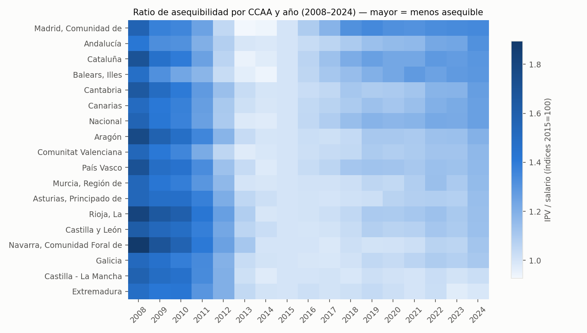
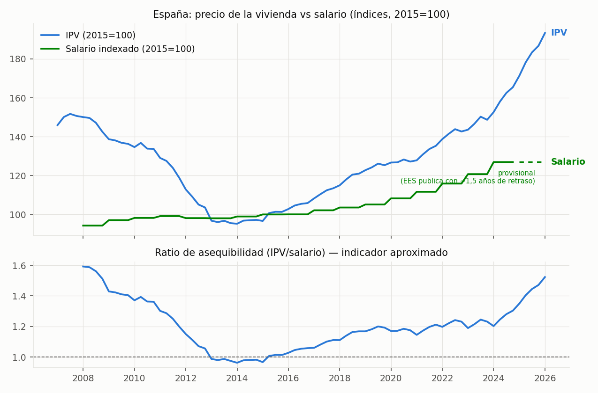
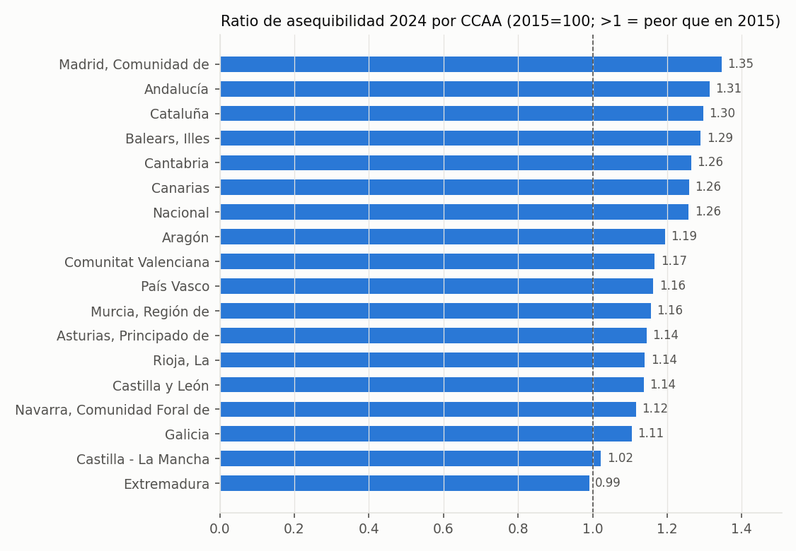
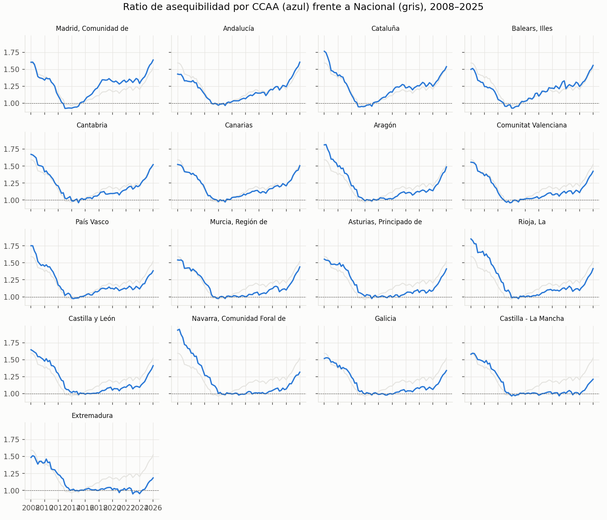
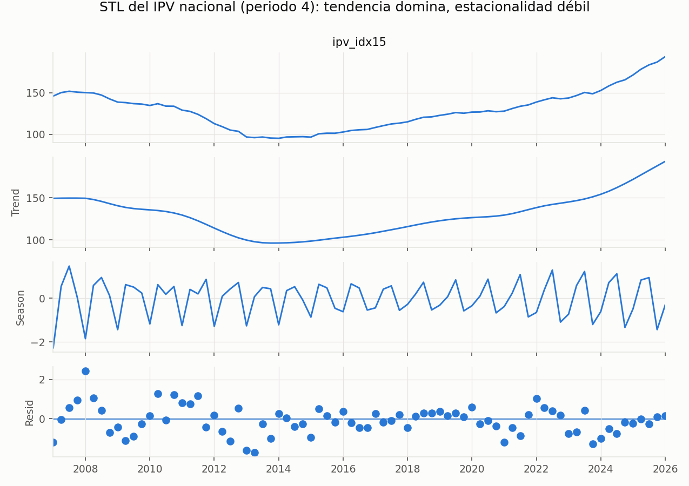
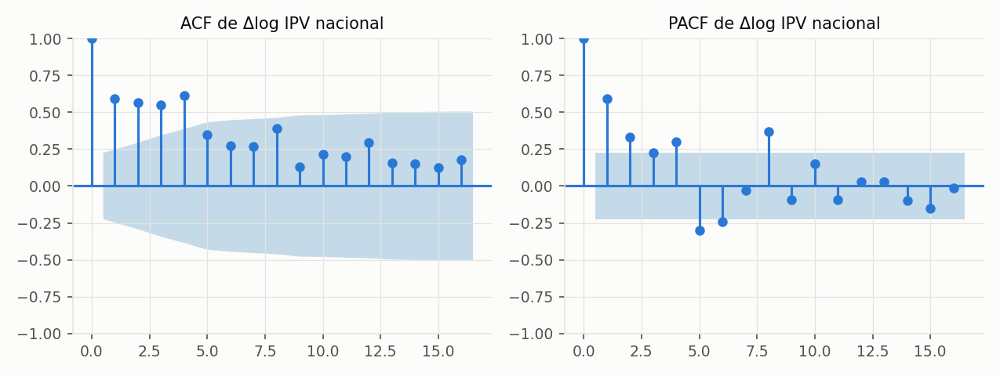
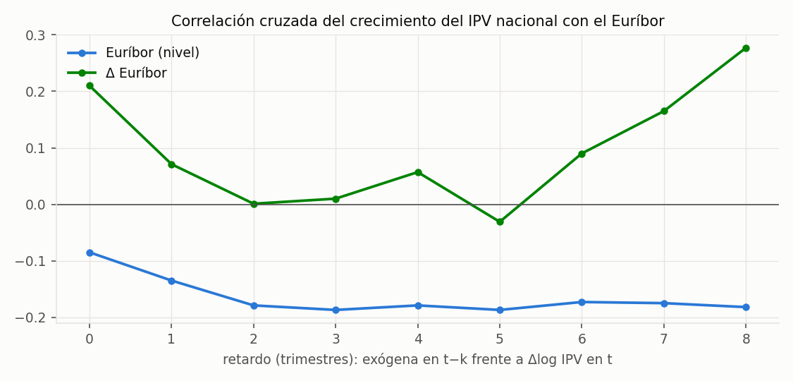

# Resultados: vivienda (el núcleo T1)

Todo el bloque de vivienda: análisis exploratorio, la competición de modelos de pronóstico bajo protocolo, el producto final, los drivers de oferta y demanda, las señales adelantadas, el deep learning y la comparación internacional.

## Contenido

- [EDA §2-A — Hallazgos y decisiones de especificación (T1)](#eda-2-a-hallazgos-y-decisiones-de-especificación-t1)
- [Backtesting T1 — harness y baselines (la vara a batir)](#backtesting-t1-harness-y-baselines-la-vara-a-batir)
- [Candidatos T1 — resultados y veredicto (pre-registrado)](#candidatos-t1-resultados-y-veredicto-pre-registrado)
- [Test final T1 — única pasada sobre 2024Q1–2025Q4](#test-final-t1-única-pasada-sobre-2024q12025q4)
- [Pronóstico de producción T1 — abanico empírico y escenarios (MVP)](#pronóstico-de-producción-t1-abanico-empírico-y-escenarios-mvp)
- [Capas de demanda, crédito y suelo (expansión Tier 1-3, 2026-07-19)](#capas-de-demanda-crédito-y-suelo-expansión-tier-1-3-2026-07-19)
- [Driver de oferta `oferta_nueva` — primera pata (permisos residenciales)](#driver-de-oferta-oferta_nueva-primera-pata-permisos-residenciales)
- [Proxies adelantados: variables que anticipan el precio de la vivienda](#proxies-adelantados-variables-que-anticipan-el-precio-de-la-vivienda)
- [Dos rutas de deep learning contra el protocolo T1 (2026-07-19)](#dos-rutas-de-deep-learning-contra-el-protocolo-t1-2026-07-19)
- [Panel internacional de vivienda y suelo (2026-07-19)](#panel-internacional-de-vivienda-y-suelo-2026-07-19)
- [A2 — Tipologías de composición del gasto público (PCA + clustering)](#a2-tipologías-de-composición-del-gasto-público-pca-clustering)

---

## EDA §2-A — Hallazgos y decisiones de especificación (T1)

*2026-07-18. Ejecuta el análisis previo al modelado definido en la [Entrega 4 §2-A](entregas/04_analisis_modelado.md). Script reproducible: [`analysis/eda_vivienda.py`](../analysis/eda_vivienda.py); figuras y tablas en [`docs/figures/eda/`](figures/eda/). Las tres decisiones de especificación del §6.2 de la Entrega 4 quedan fijadas aquí, ANTES de comparar modelos.*

---

### 1. Hallazgos descriptivos

**El ciclo es nacional; el nivel de presión es regional.** El heatmap y los small multiples muestran la misma forma en las 17 CCAA (caída 2008–2013/14, mínimo, recuperación acelerada desde 2021), con diferencias sostenidas de nivel: en 2024 el ratio va de 0,99 (Rioja/Extremadura, recuperó los niveles de 2015) a 1,35 (Madrid), con Andalucía (1,31) y Cataluña (1,30) detrás y la media nacional en 1,26.

**La divergencia precio-salario es el fenómeno central.** Desde 2014 el IPV nacional sube de ~96 a ~193 (2015=100) mientras el salario indexado solo alcanza ~127; el ratio pasa de 1,0 a 1,26 en 2024 (y ~1,5 provisional en 2025–26, pendiente del salario EES). El tramo provisional del salario va marcado en la figura, como exige el diseño anti-fuga.

### 2. Diagnósticos de series (deciden la especificación)

| Diagnóstico | Resultado | Implicación |
|---|---|---|
| ADF sobre el nivel (log IPV), 20/20 series | p > 0,05 en todas | No estacionario en nivel: nadie modela el nivel directamente |
| ADF sobre Δlog, 20/20 series | p > 0,05 en todas (Nacional: 0,75) | **El crecimiento tampoco es estacionario según ADF**: persistencia alta |
| KPSS sobre Δlog (Nacional) | p = 0,01 (rechaza estacionariedad) | Concuerda con ADF: el crecimiento tiene componente persistente/tendencial |
| ADF sobre Δ²log (Nacional) | p ≈ 0,000 | La segunda diferencia sí es claramente estacionaria |
| AR(1) de Δlog (Nacional) | 0,61 | El crecimiento de este trimestre predice buena parte del siguiente |
| STL (periodo 4) | tendencia domina; estacionalidad débil | La componente S existe pero es secundaria frente a la T |

Matiz honesto: con n≈77 trimestres que contienen dos regímenes largos (caída 2008–14, expansión 2014–25) el ADF tiene poca potencia y "unit root en el crecimiento" y "crecimiento con cambios de régimen lentos" son observacionalmente parecidos. Por eso la decisión no se juega a un test: la arbitra el backtesting.

### 3. Correlaciones cruzadas con las exógenas candidatas

Sobre Δlog IPV nacional (tabla completa en `figures/eda/xcorr_table.csv`):

| Exógena | Mejor retardo | r | Lectura |
|---|---|---|---|
| Euríbor (nivel) | t−3 | −0,19 | Signo esperado: tipos altos, crecimiento menor ~3 trimestres después. Magnitud modesta |
| Δ salario | t−5 | +0,33 | Los salarios llegan al precio con ~1 año largo de retardo |
| Δlog IPC | t0 | +0,25 | Componente nominal contemporánea |
| Δ Euríbor | t−8 | +0,28 | Signo contraintuitivo a 2 años; probable artefacto del ciclo de rebote, NO se persigue (regla anti-metric-chasing) |

Ninguna |r| supera 0,35: las exógenas aportan, pero poco — coherente con lo pre-registrado: los baselines serán difíciles de batir y el criterio de aceptación (MASE < 1) no está garantizado.

### 4. Decisiones de especificación (quedan fijadas)

**D1 — Transformación:** la variable modelada es **Δlog del IPV** con estructura AR y deriva (SARIMAX (p,1,q) con constante sobre el log-nivel), que captura la persistencia observada (AR(1)=0,61). Dada la evidencia ADF/KPSS, se añade UNA variante d=2 al conjunto de candidatos como comprobación, aceptando su coste en ruido. Decide el backtesting rolling-origin, no el test de raíz unitaria.

**D2 — Pooling:** el ciclo común domina y la heterogeneidad es de nivel → el candidato global (LightGBM sobre el panel apilado con efectos CCAA) es razonable y los per-CCAA (SARIMAX) también; ambos se mantienen tal como estaban diseñados. La dispersión 0,99–1,35 en 2024 justifica conservar efectos regionales en cualquier candidato.

**D3 — Exógenas:** entran Euríbor (retardos 2–4), Δlog IPC (contemporáneo y t−1) y crecimiento salarial (retardos 4–6, con flag provisional). El Δ Euríbor a t−8 NO entra (artefacto probable). Los drivers V2 (suelo, ICSC, extranjeros, `oferta_nueva` de la Revisión 1) siguen siendo deseables, no núcleo.

### 5. Conexión con el MVP

F1 (heatmap), F2 (divergencia nacional) y F3 (ranking) son las tres figuras centrales del MVP descritas en la Entrega 2; F4 (small multiples) alimenta la discusión regional. Todas salen de la capa gold con un único script reproducible.

---

## Backtesting T1 — harness y baselines (la vara a batir)

*2026-07-18. Implementa el diseño pre-registrado de la [Entrega 4 §7](entregas/04_analisis_modelado.md): validación rolling-origin con orígenes 2019Q4–2023Q4 y horizontes h=1–8; los últimos 8 trimestres (2024Q1–2025Q4) quedan reservados como test final de un solo uso. Script: [`analysis/backtest_t1.py`](../analysis/backtest_t1.py); resultados en [`docs/figures/backtest/`](figures/backtest/); propiedades verificadas por tests ([`tests/test_backtest.py`](../tests/test_backtest.py): sin fuga temporal, test intocable, baselines exactos en casos conocidos).*

---

### 1. Resultados de los baselines (validación, 18 series × 16 orígenes efectivos)

MASE (escala naive-estacional in-sample), media sobre CCAA × orígenes:

| h | drift | naive | snaive |
|---|---|---|---|
| 1 | 0,24 | 0,30 | 0,84 |
| 2 | 0,36 | 0,50 | 0,87 |
| 3 | 0,47 | 0,72 | 0,90 |
| 4 | 0,55 | 0,94 | 0,94 |
| 5–8 | 0,66–0,98 | 1,21–2,13 | 1,86–2,13 |

**Media h≤4: drift 0,40 · naive 0,61 · snaive 0,89.**

### 2. Lecturas (importantes para no engañarse)

1. **La vara real es el drift, no el naive estacional.** En la ventana de validación (2019–2023, mercado en subida sostenida) extrapolar la tendencia reciente es muy difícil de batir: MASE h≤4 < 1 en las 18 series (rango 0,28 Aragón – 0,54 Andalucía), e incluso en los orígenes COVID (2020Q1–Q3) aguanta (0,27, favorecido por la propia escala).
2. **Que el snaive puntúe 0,89 (<1) delata la escala, no un buen baseline:** la escala MASE se calcula in-sample desde 2008 e incluye las caídas de la crisis, mucho mayores que los movimientos año-a-año del periodo de validación. Comparar candidatos solo contra "MASE < 1" sería un listón cómodo.
3. **El criterio de aceptación pre-registrado (MASE < 1 en h≤4 en ≥12/17 CCAA) queda por tanto REFORZADO** antes de entrenar ningún candidato: además del criterio original, un candidato solo se considera mejora real si su MASE medio en h≤4 **bate al drift** en ≥12 de las 17 CCAA. Se declara ahora, con los candidatos aún sin ejecutar, para mantener la disciplina de pre-registro (la regla se endurece, nunca se relaja a posteriori).
4. El drift pierde fuelle con el horizonte (0,98 en h=8) y es ciego a giros de ciclo: su debilidad esperable es el punto de giro (2013–14, o el próximo enfriamiento). Los candidatos con exógenas (Euríbor) deberían ganar precisamente ahí; si no ganan en media, se documenta el resultado negativo tal como prevé la Entrega 4.

### 3. Qué queda listo para los candidatos

- El harness acepta cualquier `forecaster(train, h) -> list[float]` con la misma firma que los baselines: SARIMAX y LightGBM se enchufan sin tocar la evaluación.
- Los errores por punto (`backtest_errores.csv`) permiten análisis por CCAA, origen y horizonte, y los tests garantizan que ningún candidato podrá ver datos posteriores a su origen ni tocar el test final.
- Siguiente paso (F4.1b): candidato 1 SARIMAX con exógenas (especificación D1–D3 del [EDA](RESULTADOS_VIVIENDA.md)) y candidato 2 LightGBM global, evaluados en esta misma parrilla.

---

## Candidatos T1 — resultados y veredicto (pre-registrado)

*2026-07-18. Ejecuta los candidatos de la [Entrega 4 §3](entregas/04_analisis_modelado.md) con la especificación del [EDA (D1–D3)](RESULTADOS_VIVIENDA.md) sobre la parrilla de [backtesting](RESULTADOS_VIVIENDA.md). Script: [`analysis/candidates_t1.py`](../analysis/candidates_t1.py). El test final (2024Q1–2025Q4) sigue SIN tocar.*

---

### 1. Qué se ejecutó

| Candidato | Especificación |
|---|---|
| `sarimax` | SARIMAX sobre log-IPV por CCAA, órdenes {(1,1,1),(2,1,0)} con deriva, elegidos por AIC dentro de cada train (D1) |
| `sarimax_eur` | Ídem + exógena Euríbor t−3 (D3); para h>3 la exógena se congela en el último valor conocido: pronóstico condicionado a "tipos constantes", declarado |
| `gbm` | LightGBM global directo por horizonte (D2): objetivo log y(t+h) − log y(t); features en t: Δlog IPV rezagos 0–3, trimestre, CCAA categórica, Euríbor (nivel y Δ), Δlog IPC, salario interanual en t−6 (compatible con la publicación EES) |

### 2. Resultados (MASE, media CCAA × orígenes)

| h | drift | sarimax | sarimax_eur | gbm |
|---|---|---|---|---|
| 1 | **0,24** | 0,26 | 0,27 | 0,28 |
| 2 | **0,36** | 0,41 | 0,43 | 0,56 |
| 3 | **0,47** | 0,58 | 0,59 | 0,90 |
| 4 | **0,55** | 0,68 | 0,70 | 1,02 |
| 6 | 0,74 | 1,18 | 1,17 | **0,68** |
| 8 | 0,98 | 1,87 | 1,85 | **0,78** |

**Criterio reforzado (batir al drift en h≤4, por CCAA):** sarimax 1/17 · sarimax_eur 0/17 · gbm 0/17. **Ninguno lo supera.**

### 3. Veredicto según las reglas pre-registradas

1. **Resultado negativo a corto plazo, y se publica como tal** (Entrega 4 §7 lo preveía): en h≤4, con una ventana de validación sin giros de ciclo (2019–2023), nada bate a extrapolar la tendencia reciente. **El modelo de producción para h≤4 es el baseline drift.**
2. **El endurecimiento del criterio demostró su valor:** los tres candidatos habrían "aprobado" el criterio original (MASE < 1: sarimax 0,47 de media en h≤4), y solo el listón del drift revela que no aportan mejora real. Sin la disciplina de pre-registro, este proyecto estaría ahora mismo celebrando un SARIMAX peor que una regla de dos líneas.
3. **Hallazgo secundario (post-hoc, se declara como tal):** el GBM cruza por debajo del drift en h≥6 (0,68–0,78 vs 0,74–0,98) — las exógenas y el pooling aportan justo donde el drift es ciego, el horizonte largo. Como la selección por-horizonte NO estaba pre-registrada, esta ventaja **no se adopta**: queda como hipótesis a confirmar en el test final de un solo uso. Si el test la confirma, el MVP usará drift en h≤4 y GBM en h≥6, con esa procedencia explicada. **[Actualización: el test final la REFUTÓ — 0/17 CCAA; ver [test_final_t1.md](RESULTADOS_VIVIENDA.md).]**
4. **Sesgo estructural conocido:** la validación 2019–2023 premia al drift porque no contiene puntos de giro. La debilidad del drift (giros) no está representada en la ventana — se dice explícitamente para no sobrevender el baseline.

### 4. Qué podría mover el resultado (trabajo futuro declarado)

- **El driver de oferta `oferta_nueva`** (Revisión 1 de la Entrega 4): los visados con su retardo de 18–24 meses son el candidato natural a anticipar giros de ciclo — exactamente el fallo del drift. Si un driver puede cambiar el veredicto a corto, es este.
- Features de régimen (dummies de ciclo, spread hipotecario) para el GBM.
- Evaluación específica en el único giro de la muestra (2013–14) como diagnóstico, sin re-seleccionar sobre él.

### 5. Estado de la disciplina de evaluación

- Test final 2024Q1–2025Q4: **intacto**, cero evaluaciones (verificado por test automático sobre los CSV publicados).
- Todo lo anterior sale de validación; la única evaluación del test final se hará una vez, con el modelo/combinación elegido y declarado antes de mirar.

---

## Test final T1 — única pasada sobre 2024Q1–2025Q4

*2026-07-18. La evaluación de un solo uso reservada desde la [Entrega 4 §7](entregas/04_analisis_modelado.md). Protocolo y regla de decisión fijados en el código ANTES de ejecutar ([`analysis/final_test_t1.py`](../analysis/final_test_t1.py)): se evalúan exactamente drift y GBM (los SARIMAX quedaron eliminados en validación), origen único 2023Q4, h=1–8; el híbrido drift+GBM solo se adoptaría si el GBM batiera al drift en h=6–8 en ≥12 de 17 CCAA.*

---

### 1. Resultados

MASE (media sobre las 18 series; escala in-sample hasta 2023Q4):

| h | drift | gbm |
|---|---|---|
| 1 | 0,39 | 1,29 |
| 2 | 0,96 | 1,33 |
| 4 | 1,51 | 4,58 |
| 6 | 3,02 | 7,88 |
| 8 | 3,85 | 9,27 |

Medias: h≤4 drift 1,05 / gbm 2,69 · h≥6 drift 3,48 / gbm 8,71.
**Regla de decisión: el GBM bate al drift en 0 de 17 CCAA → VEREDICTO: drift en todos los horizontes. Hipótesis del híbrido REFUTADA.**

### 2. Lecturas

1. **La ventaja del GBM en validación no generalizó — y la disciplina evitó un desastre.** En el panel derecho se ve el fallo: el GBM pronosticó una CAÍDA del IPV nacional (≈145→127) justo cuando el mercado subía de 152 a 187. El modelo aprendió reversión a la media de los años de crisis 2008–14 ("tras rachas calientes vienen caídas") y la aplicó al inicio del mayor boom de la muestra. Si el hallazgo post-hoc de validación se hubiera adoptado sin test final, el MVP habría publicado una predicción de desplome en pleno auge. Este es el argumento definitivo a favor del protocolo pre-registrado.
2. **2024–2025 fue una aceleración fuera de régimen para TODOS los métodos.** Hasta el drift, ganador claro, queda en MASE 1,05 en h≤4 (frente a 0,40 en validación) y 3,85 en h=8: el mercado creció por encima de cualquier extrapolación de su tendencia 2022–23. Conclusión honesta: a 2 años vista, en cambios de régimen, ningún método entrenado con esta información acota bien el nivel — la incertidumbre comunicada importa más que la predicción puntual.
3. **Consecuencia para el MVP:** producción = drift en h=1–8 con INTERVALOS EMPÍRICOS anchos derivados de los errores de backtesting (por horizonte), presentados como abanico. La predicción puntual se acompaña siempre del intervalo y de la advertencia de régimen; el motor de escenarios (Euríbor/salarios) pasa a ser la herramienta principal de comunicación, no la predicción central.
4. **El test está gastado.** No habrá más selección de modelos contra 2024–2025. Las mejoras futuras (driver `oferta_nueva`, features de régimen) se evalúan en validación y solo se confirmarán con datos nuevos (2026 en adelante), que irán llegando trimestre a trimestre.

### 3. Registro

- Ejecutado una única vez el 2026-07-18; errores completos en `figures/backtest/test_final_errores.csv` y desglose h=6–8 por CCAA en `test_final_por_ccaa_h6_8.csv`.
- Cadena completa del protocolo: [baselines](RESULTADOS_VIVIENDA.md) → [candidatos](RESULTADOS_VIVIENDA.md) → este test. Cada endurecimiento o decisión quedó declarado antes de mirar el dato siguiente.

---

## Pronóstico de producción T1 — abanico empírico y escenarios (MVP)

*2026-07-18. Cierra el contrato de salida de la [Entrega 4 §5](entregas/04_analisis_modelado.md): `storage/gold/gold_forecast_ccaa.csv` (432 filas = 18 series × h 1–8 × 3 escenarios), generado por [`analysis/forecast_t1.py`](../analysis/forecast_t1.py) y verificado por [`tests/test_forecast.py`](../tests/test_forecast.py). Modelo: drift, el ganador del [protocolo completo](RESULTADOS_VIVIENDA.md).*

---

### 1. Cómo se construye

- **Punto:** drift puro (tendencia de los últimos 8 trimestres) desde el origen 2025Q4, h=1–8 (2026Q1–2027Q4).
- **Bandas 80/95 %:** cuantiles empíricos del error RELATIVO del drift por horizonte, sobre validación + test final (486 → 180 errores según h). El test está gastado para seleccionar; reutilizarlo para calibrar anchuras se declara: sin sus errores, las bandas ignorarían el único episodio fuera de régimen observado (2024–25).
- **Asimetría honesta:** la mediana del error es positiva y crece con el horizonte (+0,5 % en h=2 → +4,9 % en h=8): históricamente el drift SE QUEDA CORTO en este mercado. Las bandas lo heredan (h=8: −2,5 % / +18 %), y en h=8 el cuantil 10 ya es positivo — el punto cae marginalmente por debajo de su propia banda 80 %. No se corrige el punto (sería re-seleccionar tras el test); se muestra tal cual con su banda.
- **Escenarios (mueven el denominador, no el IPV):** sendas salariales anuales {0 %, 2 % central, 4 %} desde el último salario observado (EES 2024) → `ratio_aseq_pred`. Herramienta de comunicación, no predicción salarial.

### 2. Lectura central (escenario salarial 2 %)

| Periodo | IPV nacional (2015=100) | banda 80 % | ratio asequibilidad |
|---|---|---|---|
| 2026Q4 (h=4) | 205,8 | 200,4 – 218,1 | 1,54 |
| 2027Q4 (h=8) | 224,8 | 225,7 – 253,8 | 1,64 |

Si la tendencia 2024–25 continúa, el ratio nacional pasaría de 1,26 (2024 observado) a ~1,5–1,6 en 2027 incluso con salarios creciendo al 2 %: la brecha no se cierra sin un cambio de régimen (de tipos, de oferta o salarial). Con salarios al 4 %, el ratio 2027Q4 baja solo unas centésimas — el mensaje del MVP es que el denominador no puede compensar por sí solo el ritmo actual del numerador.

### 3. Advertencias que acompañan SIEMPRE a esta salida

1. El ratio es un **indicador aproximado** de evolución relativa (feedback del tutor, [PLAN_MAESTRO §7](PLAN_MAESTRO.md)); el complemento de esfuerzo real (cuota teórica) llegará con el precio por m².
2. El drift es ciego a giros de ciclo y 2024–25 demostró que también se queda corto en aceleraciones: la banda es la parte informativa del pronóstico, no el punto.
3. Actualización trimestral: cada IPV nuevo del INE re-ejecuta pipeline → gold → pronóstico; los errores frente a 2026 en adelante serán la primera validación verdaderamente out-of-sample del protocolo.

---

## Capas de demanda, crédito y suelo (expansión Tier 1-3, 2026-07-19)

Segunda ronda de conectores tras `DATOS.md`: las capas con potencial
predictivo para T1 y la medida de suelo urbanizable pedida.

### 1. Conectores nuevos (todos verificados en vivo)

| Capa | Fuente / id | Cobertura | Archivo |
|---|---|---|---|
| Compraventas de vivienda | INE ETDP tabla **6149** (mensual, CCAA) | 2007M01– | `ine_compraventas_ccaa.csv` |
| Hipotecas constituidas (viviendas) | INE HPT tabla **76316** (mensual, CCAA) | 2003M01– | `ine_hipotecas_ccaa.csv` |
| Población residente trimestral | INE ECP tabla **56940** (FK 19–22 = Q1–Q4) | **1971Q1–** | `ine_poblacion_q_ccaa.csv` |
| Mercado de suelo: nº, valor, superficie, precio | MITMA Boletín v2, sección 36 (**36100500/36200500/36300500/36400500**) | 2004Q1– | `mitma_suelo_ccaa.csv` |
| Stock de suelo por clases urbanísticas | MITMA **SIU**, añadas 2021 y 2025 (la de 2021 rescatada del Wayback: el CDN la retiró) | 2 añadas | `siu_clases_suelo_ccaa.csv` |
| Criterios de crédito vivienda | **ECB BLS** `BLS.Q.ES.ALL.Z.H.H.B3.ST.S.FNET` (la serie del BdE muere en 2021) | 2003Q1– | `bls_criterios_vivienda.csv` |
| Interés de búsqueda (Trends) | Google Trends ES, 3 términos, ventanas de 5 años encadenadas por solape | 2004M01–, añada congelada | `gtrends_vivienda.csv` |

Bloqueados esta ronda (motivo declarado): **Idealista/Fotocasa** (API con clave y
licencia; sin clave en el entorno), **Catastro suelo vacante** (el portal
estadístico antiguo es ahora una SPA sin ficheros descargables localizables;
serie ideal si reaparece), **Registradores** (microdatos de pago).

### 2. La medida de suelo urbanizable y su evolución

Dos piezas complementarias (no existe una serie anual larga de stock):

**STOCK planificado (SIU)** — `gold/gold_suelo_ccaa.csv`: % de la superficie
estudiada clasificada como urbanizable (delimitado + no delimitado) por CCAA,
2021 vs 2025. La cobertura municipal cambia entre añadas (p. ej. Andalucía
49 %→71 % de municipios), así que se comparan porcentajes y la cobertura viaja
en la tabla. Lecturas: Murcia es la CCAA con más suelo urbanizable relativo
(20,3 %→21,2 %; 2.378 km²); Madrid, con cobertura 100 % en ambas añadas,
REDUCE su urbanizable (9,4 %→8,9 %: se consume más de lo que se reclasifica);
La Rioja sube (7,3 %→9,0 %) aunque con cobertura baja (11 %→17 %, leer con
cautela); Comunitat Valenciana baja (5,4 %→4,3 %).

**FLUJO transmitido (MITMA)** — superficie de transacciones de suelo: pico
117 millones m²/año (2004), colapso a 20 (2012), 2024 en 25 — **el mercado de
suelo sigue a ~1/5 del pico** mientras los precios de vivienda aceleran: la
restricción de oferta empieza en el suelo, no solo en los visados. Figura
`docs/figures/atlas/b17_suelo_transacciones.png`.

### 3. Contest de validación (protocolo intacto) — CUARTO resultado negativo

Candidato: el MISMO LightGBM global de C2 (hiperparámetros congelados) +
6 features nuevas conocidas en el origen (compraventas YoY t−1, hipotecas YoY
t−1, Δpoblación YoY t−1, superficie de suelo YoY t−2, BLS t−1, Trends t−1).
Orígenes 2019Q4–2023Q4, h=1–8, test 2024+ intocable.

| | MASE h≤4 | CCAA que baten al drift |
|---|---|---|
| drift (producción) | **0.395** | — |
| GBM sin capas nuevas | 0.666 | 0/17 |
| GBM + demanda/crédito/suelo | 0.653 | **0/17** |

Las capas nuevas mejoran al GBM un 2 % — y siguen a +65 % del drift. A h5–8:
0.88 vs 0.80, tampoco. **El modelo de producción no cambia.** Lectura honesta:
en una ventana de validación sin giros de ciclo, ningún regresor rezagado
supera a la persistencia con deriva; el valor de estas capas es (a) descriptivo
(suelo, crédito, demografía en el atlas y el RAG) y (b) opción de giro para
2026+ (los volúmenes colapsan antes que los precios en 2007-08 — eso solo se
podrá validar con datos futuros, nunca readjudicando el test gastado).

---

## Driver de oferta `oferta_nueva` — primera pata (permisos residenciales)

*2026-07-18. Ejecuta el compromiso de la [Revisión 1 de la Entrega 4](entregas/04_analisis_modelado.md) y la línea de trabajo futuro declarada en [candidatos](RESULTADOS_VIVIENDA.md) §4: incorporar la construcción privada como señal de oferta. Script: [`analysis/oferta_nueva.py`](../analysis/oferta_nueva.py); datos: `storage/processed/building_permits_q.csv` (Eurostat `sts_cobp_q`, permisos de vivienda nº, residencial excl. residencias colectivas, índice 2021=100, 39 geos, ES 1995Q1–2026Q1).*

---

### 1. Hallazgos

1. **La serie es un sismógrafo del ciclo:** permisos españoles 1042 (media 2006, índice 2021=100) → **44** (2013), un colapso del 96 %, con caída iniciada en 2006–07 — MUCHO antes que los precios. Hoy: 283 (2025), casi el triple del nivel 2021, en plena aceleración con el boom.
2. **Es la señal adelantada más fuerte encontrada en todo el proyecto:** correlación de los permisos (crecimiento interanual) con el crecimiento futuro del IPV, r = 0,57 con 11 trimestres de adelanto — muy por encima del mejor exógeno anterior (salarios, 0,33; Euríbor, −0,19).
3. **En el único giro de la muestra funcionó:** mínimo de permisos 2013Q2, mínimo del IPV 2014Q1 — 3 trimestres de aviso. Exactamente el punto ciego del drift.
4. **Mecanismo, con honestidad:** la correlación positiva a largo adelanto dice que los permisos suben ANTES de que los precios aceleren — funciona como barómetro de demanda de los promotores tanto como señal de oferta futura. Para pronosticar da igual el canal; para interpretar, no, y se declara.

### 2. Reglas de uso (disciplina post-test)

- El test final 2024–25 está GASTADO: este driver se evaluará en la parrilla de **validación** (feature candidata: crecimiento interanual de permisos con retardos 8–12) y su adopción exigirá confirmación con **datos nuevos de 2026 en adelante**, trimestre a trimestre.
- **Pata regional COMPLETADA (2026-07-19)** con una corrección de ruta: los visados de aparejadores NO están en el Boletín Online (comprobado); lo que MITMA publica por CCAA son las **licencias municipales de obra** — misma familia de señal de oferta. Extraídas con [`connectors/mitma.py`](../connectors/mitma.py) (BoletinOnline v1, tabla "viviendas según tipo de obra" por territorio): `storage/processed/mitma_licencias_ccaa.csv`, 19 territorios, anual 2000–2022 (Ceuta/Melilla hasta 2019). El colapso regional es aún más brutal que en el índice de permisos: **737.186 viviendas de nueva planta con licencia (2006) → 31.236 (2013), una caída ×24**. CAVEAT: publican con ~2 años de retraso → features históricas regionales (giros, panel), no señal viva; la señal viva sigue siendo Eurostat.

---

## Proxies adelantados: variables que anticipan el precio de la vivienda

Búsqueda sistemática de un proxy — una variable observable HOY que anticipe la
evolución FUTURA de otra difícil de prever. El proyecto ya tenía uno (visados de
obra → crecimiento del precio, r=0,57 a 11 trimestres). Este barrido
(`analysis/proxy_lead_scan.py` → `gold/gold_proxy_lead_scan.csv`) encuentra dos
más, uno de ellos especialmente valioso porque ataca el punto ciego del modelo.

Método: correlación cruzada de cada candidato con ΔlogIPV_{t+k} (crecimiento
del precio k trimestres en el futuro), k=0..12, nacional. **Caveat declarado:
es correlación in-sample, no causalidad ni validación.** Un proxy prometedor
pasa después al harness de backtesting bajo la regla de siempre (batir al drift,
adopción solo con datos 2026+).

### Ranking (|correlación| con el precio futuro)

| Proxy | r | Adelanto | n | Lectura |
|---|---|---|---|---|
| **Aceleración de población** | **+0,59** | **10 trim.** | 39 | El proxy del SHOCK DE DEMANDA |
| **Hipotecas (interanual)** | **+0,65** | **1 trim.** | 76 | El proxy de crédito, robusto y corto |
| Compraventas (interanual) | +0,49 | 1 trim. | 72 | Volumen lidera precio |
| Google Trends "comprar piso" | +0,47 | 4 trim. | 73 | Interés de búsqueda |
| Euríbor (nivel) | −0,46 | 12 trim. | 65 | Tipos altos → precio futuro más flojo |
| Población interanual | −0,68 | 12 trim. | 37 | Fuerte pero FRÁGIL (ver abajo) |

### El hallazgo clave: la aceleración de la población

**Cuando el crecimiento de la población se ACELERA, el precio de la vivienda
sube ~10 trimestres (2,5 años) después.** Con datos 2007–2023:

- trimestres con aceleración positiva → ΔlogIPV a +10 trim. = **+1,7 % de media**
- trimestres con aceleración negativa → ΔlogIPV a +10 trim. = **−0,5 % de media**

Por qué importa para el poder de predicción: **este es exactamente el régimen
que el modelo campeón (drift) no puede ver.** La subida de precios de 2024–25
fue un shock de demanda que ningún candidato anticipó — y la aceleración
demográfica de los años previos lo venía señalando. No es un proxy más: es el
candidato a convertir el punto ciego estructural del drift (los giros) en algo
anticipable. La población es además el driver MÁS predecible a medio plazo (los
residentes de dentro de 2,5 años ya están casi todos aquí), lo que lo hace
idóneo para una cadena condicional (ver `docs/METODOLOGIA.md`).

### El compañero robusto: las hipotecas

Las hipotecas constituidas (interanual) lideran el precio en 1 trimestre, y la
correlación decae de forma SUAVE con el adelanto (r = 0,63 → 0,65 → 0,61 → 0,56
→ 0,43 a leads 0–4), señal de robustez, no de un pico espurio. Muestra completa
(n=76). El crédito que fluye hoy es precio mañana: el termómetro de corto plazo.

### Lo que NO se adopta sin más

- La **población interanual** a 12 trimestres (r=−0,68) es la correlación más
  alta pero la más frágil: n=37, adelanto en el borde de la muestra, y el signo
  negativo lo domina un único episodio (el boom migratorio 2005–07 que precedió
  al desplome de 2011–13). Se reporta, no se destaca.
- Ningún proxy es todavía un modelo de producción. El contest previo
  (`docs/RESULTADOS_VIVIENDA.md`) ya probó hipotecas/compraventas/población como
  features de un GBM y NO batieron al drift a corto plazo — recordatorio de que
  correlación adelantada in-sample ≠ ganar out-of-sample. La aceleración de
  población NO se había probado a su adelanto natural de 10 trimestres; es el
  próximo candidato legítimo para el harness, evaluado en validación y adoptado
  solo si gana con datos 2026+.

### Uso propuesto

1. Añadir `aceleracion_poblacion` (retardo 10 trim.) como feature al candidato
   T1 y correr la parrilla pre-registrada — su valor está en los GIROS, que la
   ventana de validación 2019–2023 apenas contiene, así que su prueba real
   llegará con los datos de 2026+.
2. Como cadena condicional: proyección de población (driver predecible) →
   aceleración → señal de presión de precios a 2,5 años, con su banda.

---

## Dos rutas de deep learning contra el protocolo T1 (2026-07-19)

Pregunta: ¿qué bases de datos permiten entrenar DL de verdad? Respuesta
ejecutada: las dos rutas viables con datos abiertos, ambas bajo la parrilla
pre-registrada intacta (orígenes 2019Q4–2023Q4, h=1–8, test 2024+ gastado e
intocable, adopción solo con ≥12/17 CCAA batiendo al drift a h≤4).

### Ruta 2 — Modelo fundacional zero-shot (Chronos-Bolt, Amazon)

Preentrenado sobre millones de series, aplicado sin ajuste al IPV por CCAA
(`analysis/foundation_t1.py`). Caveat declarado: su corpus de preentrenamiento
no es auditable — si contiene series que solapan la ventana, juega con ventaja
y aun así pierde.

| h | chronos | drift |
|---|---|---|
| 1–4 (media) | 0.460 | **0.395** |
| 5–8 (media) | 1.032 | **0.796** |

**0/17 CCAA.** Mejor que todos los candidatos clásicos (GBM 0.653–0.666) pero
por debajo del campeón en TODOS los horizontes, y se descompone a h≥6 (1.36 a
h=8): la misma reversión a la media importada que hundió al GBM en el test.

### Ruta 1 — DL global entrenado en 1.760 series regionales extranjeras

`connectors/hpi_regional_global.py`: FHFA (410 metros + 51 estados, 1975–),
Zillow (894 metros, 2000–), UK Land Registry (405 áreas, 1968–) → 208.640
observaciones trimestrales. España JAMÁS en el entrenamiento; ventanas con
objetivo ≤2019Q3 (nada posterior a los orígenes desde ninguna geografía).
MLP 16→128→128→64→8 sobre Δlog, 113.649 ventanas (`analysis/dl_global_t1.py`).

| h | dl_global | drift |
|---|---|---|
| 1 | 0.242 | 0.241 |
| 2 | **0.344** | 0.358 |
| 3 | 0.481 | 0.465 |
| 4 | 0.574 | 0.553 |
| 1–4 (media) | 0.401 | **0.395** |
| 5–8 (media) | 0.862 | **0.796** |

**7/17 CCAA — no alcanza el criterio (12/17): no se adopta.** Pero es el
primer candidato en CINCO contests que llega al empate técnico con el campeón,
y el único que gana a algún horizonte (h=2). La hipótesis "ha visto morir
docenas de booms en EE. UU./UK y eso transfiere a España" tiene ya su primera
evidencia — insuficiente bajo la regla, y la regla no se relaja.

### Veredicto y camino declarado

1. Producción sigue siendo drift. Quinto contest, quinta no-adopción; la
   diferencia es que esta vez el margen es 0,006 de MASE, no 0,26.
2. La ruta prometedora es la 1 (corpus regional global), no la 2 (fundacional
   genérico): el dominio importa más que la escala del preentrenamiento.
3. Siguiente paso legítimo: revalidar dl_global cuando existan orígenes 2026+
   (fuera de la ventana ya juzgada). Nada de re-tunear contra la ventana
   actual: sería optimizar contra un examen ya corregido.
4. El interés de dl_global para la defensa: si algún candidato puede anticipar
   un GIRO (el punto ciego estructural del drift), es el que entrenó con giros
   extranjeros. El día que el ciclo español gire, esta apuesta se podrá
   auditar en tiempo real.

---

## Panel internacional de vivienda y suelo (2026-07-19)

Respuesta a "¿se puede obtener en otros países la evolución del suelo edificable
y el precio medio de la vivienda?". Resumen: la evolución de PRECIOS sí y con
solidez (tres fuentes oficiales que se cruzan); los NIVELES (€/m² comparables)
no existen en abierto; el suelo urbanizable LEGAL no está armonizado en ningún
organismo — se usan proxies de suelo consumido y se declara la diferencia.

### 1. Fuentes conectadas (verificadas en vivo)

| Fuente | Qué da | Cobertura | Archivo |
|---|---|---|---|
| BIS `WS_SPP` (API v2) | Índice de precios residenciales nominal y REAL | 61 áreas, trimestral; núcleo desde años 70 (ES real 1971–, US 1927–) | `bis_precios_vivienda.csv` |
| OECD `DF_HOUSE_PRICES` (SDMX) | HPI, real, **precio/renta disponible** (HPI_YDH), precio/alquiler | 50 países, trimestral, 1960– | `oecd_precios_vivienda.csv` |
| OECD `DF_LAND_COVER` (ENV) | Superficie artificial LC_SUR_ART (km², satélite ESA) | ~200 territorios, épocas 2000–2022 | `oecd_suelo_artificial.csv` |
| Eurostat `lan_lcv_ovw` (LUCAS) | % suelo artificial (encuesta de campo) | UE, oleadas 2009/12/15/18/22 | `lucas_artificial.csv` |

Gold: `gold/gold_vivienda_global.csv` (país × precio/renta, crecimiento real
2000– y 2015–, suelo artificial 2022 y su crecimiento 2000–22, LUCAS %).
Figura: `docs/figures/atlas/b18_vivienda_global.png`.

### 2. Lo que NO existe (declarado)

- **€/m² medio comparable entre países**: ninguna serie oficial abierta.
  Eurostat tiene un ejercicio experimental reciente; el resto son consultoras
  (PDF) o crowdsourcing con licencia. La comparación honesta es por RATIOS
  (precio/renta), igual que en el panel español.
- **Suelo urbanizable legal**: concepto nacional no armonizado. El SIU español
  es una rareza; Alemania/Francia/Inglaterra publican los suyos en formatos
  heterogéneos (conector por país, extensión declarada). Los proxies de
  arriba miden suelo CONSUMIDO, no suelo PERMITIDO — la brecha española
  (mercado de suelo a 1/5 del pico con precios acelerando) es invisible para
  el satélite.

### 3. Lecturas (descriptivas, no causales)

| País | Precio/renta (2015=100) | Real desde 2015 | Suelo artificial 2000–22 |
|---|---|---|---|
| Portugal | **178,8** | +125,5 % | +103 % |
| Países Bajos | 135,5 | +61,4 % | +65 % |
| **España** | **132,5** | **+46,4 %** | **+119,8 %** |
| EE. UU. | 126,9 | +35,8 % | +51 % |
| Irlanda | 124,0 | +62,4 % | +79 % |
| Alemania | 107,0 | +18,4 % | +50 % |
| Francia | 93,6 | +4,4 % | +74 % |
| Italia | 89,1 | −3,7 % | +62 % |

- España es el país del panel núcleo que **más suelo artificial ha creado en
  proporción (+120 % desde 2000, el doble que Alemania o EE. UU.) y aun así
  su precio/renta está un 32 % por encima de 2015**: urbanizar mucho no ha
  comprado asequibilidad.
- Generalizando a 40 países: Spearman(precio/renta, crecimiento de suelo
  artificial 2000–22) = **+0,01** — sin relación transversal. Coherente con el
  hallazgo español: el cuello de botella no es el suelo físico consumido sino
  el suelo que llega al mercado y se convierte en vivienda (transacciones a
  1/5 del pico, visados a un tercio).
- El contraste Portugal (+125 % real) / Italia (−3,7 %) delimita el rango
  europeo completo; España va por la senda portuguesa, no la italiana.
- BIS real 1971–: España acumula TRES ciclos completos (1974–85, 1986–97,
  1998–2013) y el actual; la figura b18 los muestra contra DE/FR/IT/PT/IE.

### 4. Uso en el proyecto

Capa descriptiva y de contexto (atlas + RAG + defensa): sitúa el caso español
en distribución internacional. NO entra como feature de T1 (frecuencia y
retardos incompatibles con el panel trimestral CCAA; y la lección del cuarto
negativo aplica igual). El D1 global de deuda ya usaba WEO; este panel es su
espejo de vivienda.

---

## A2 — Tipologías de composición del gasto público (PCA + clustering)

*2026-07-19. Cierra la pregunta A2 del [PLAN_MAESTRO](PLAN_MAESTRO.md), el último bloque ML pendiente del núcleo. Script: [`analysis/tipologias_a2.py`](../analysis/tipologias_a2.py); salida: `storage/gold/gold_tipologias_gasto.csv` (30 países); figura: `docs/figures/a1/a2_tipologias.png`.*

---

### Método
Composición funcional del gasto: 10 funciones COFOG como % del gasto total, media 2019–2023, panel europeo sin agregados (30 países). Estandarización, PCA para el mapa (PC1 27 % + PC2 19 % de la varianza) y KMeans con k elegido por silueta (k=2..6). Análisis descriptivo: sin outcome, sin ranking.

### Resultados

- **El hallazgo honesto es que las tipologías son DÉBILES**: la mejor silueta es 0,20 (k=2) — la composición del gasto europeo es más un continuo que un conjunto de familias nítidas. Se publica el mapa, no una taxonomía.
- Los dos polos suaves que sí existen: (1) **"inversión y Estado clásico"** (10 países, sobre-representados asuntos económicos +2,4 pp y orden público: HU, RO, BG, LV, HR, MT, EE, CZ, CY, SK — esencialmente los miembros de 2004+, con fondos europeos pesando en GF04); (2) **"Estado del bienestar maduro"** (20 países, protección social +3,2 pp: nórdicos, DE, FR, IT, ES…).
- **España**: clúster del bienestar, sin rasgos extremos en el mapa (PC1 +0,9): protección social 40,9 % del gasto y sanidad 14,6 % — composición de Estado del bienestar típico, más cerca de FR/PT que de los nórdicos.
- El eje PC1 se lee casi como "renta + antigüedad en la UE": la composición acompaña al desarrollo, coherente con el hallazgo de A1 (la renta domina).

### Límites
n=30 y ventana 2019–23 (incluye COVID: GF07/GF10 inflados en todos, lo que COMPRIME diferencias); k por silueta con estructura débil es orientativo; las funciones COFOG de nivel 1 esconden heterogeneidad interna (GF06 vivienda apenas pesa y no separa). Extensión natural: repetir sobre el histórico por décadas para ver si los polos convergen.
