# Atlas de evolución del gasto público — lectura guiada (F2.1)

*2026-07-18. Una figura por pregunta del bloque B del [PLAN_MAESTRO](PLAN_MAESTRO.md), generadas desde la capa gold por [`analysis/atlas.py`](../analysis/atlas.py) (figuras en [`docs/figures/atlas/`](figures/atlas/)). España siempre resaltada frente a la mediana del panel europeo (banda p25–p75) o la mediana mundial del histórico GMD/JST (202 países). Todo descriptivo: el atlas muestra, no prescribe.*

---

| # | Figura | Lectura (con el dato) |
|---|---|---|
| B1 | 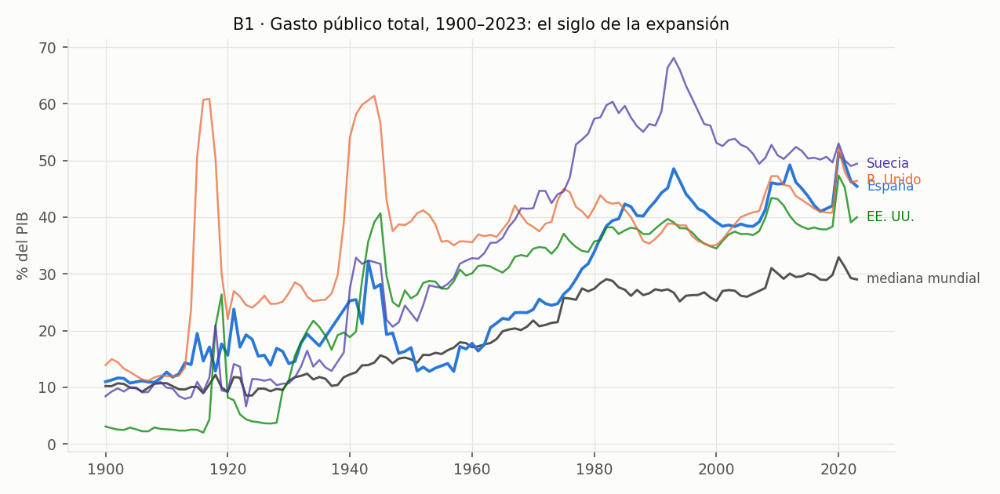 | **El siglo de la expansión:** la mediana mundial pasa de ~10 %PIB (1900) a ~30 % (hoy). España sigue la ola con retraso y la remonta en los 80: 11 % en 1900, 45,4 % en 2023. Los picos del Reino Unido son las guerras mundiales. |
| B2 | 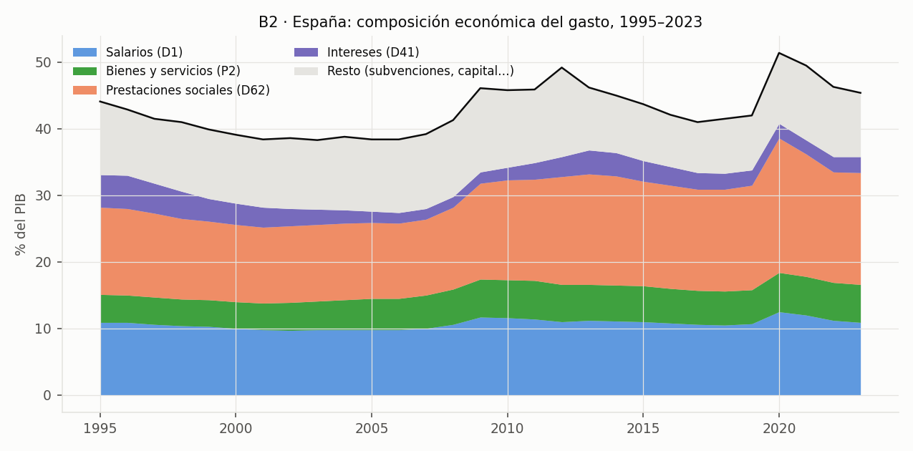 | **Qué compra el gasto español:** prestaciones sociales (D62) y salarios (D1) son el grueso; los intereses (D41) caen de ~5 %PIB (1995) a 2,4 % (2023) — el dividendo del euro — y financian en la práctica la expansión de lo demás. |
| B3 |  | **La figura de la Revisión 1:** la inversión residencial TOTAL española va de 6 %PIB (1995) a 11,7 % (pico 2006), se hunde a 3,9 % (2015) y vuelve a 5,8 % (2025); el gasto público GF06 se mueve entre 1,3 y 0,5 %PIB. La palanca pública es un orden de magnitud menor que la promoción privada — contexto obligatorio de cualquier conclusión sobre vivienda. |
| B4 | 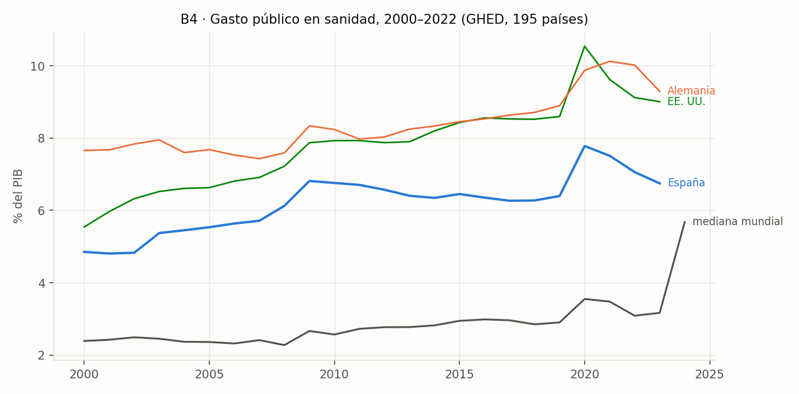 | **Sanidad pública:** España sube de 4,9 %PIB (2000) a 6,7 % (2023), por encima de la mediana mundial y por debajo de Alemania; el escalón COVID es visible en casi todas las series. |
| B5 | 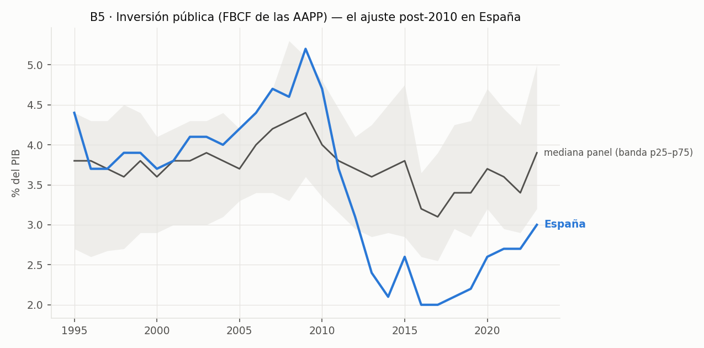 | **El ajuste silencioso:** la FBCF pública española cae del ~5 % al 3,0 %PIB tras 2010 y no se recupera — la inversión fue la variable de ajuste de la consolidación. |
| B6 | 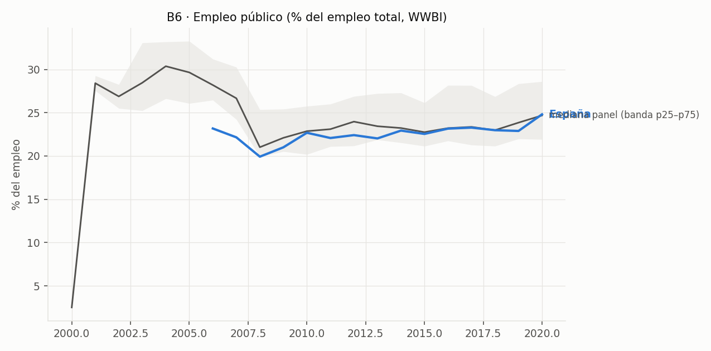 | **Empleo público:** ~24,8 % del empleo total (2020, WWBI), en la zona alta de la banda del panel. |
| B7 | 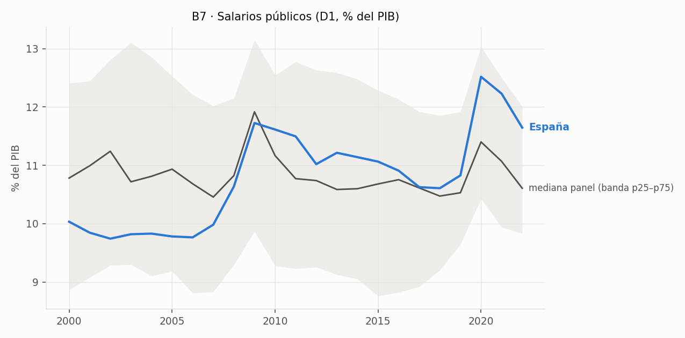 | **Masa salarial pública:** España ~10–12,5 %PIB, estable y algo por encima de la mediana; el pico coincide con la caída del denominador en 2009–2013 y en 2020. |
| B8 | 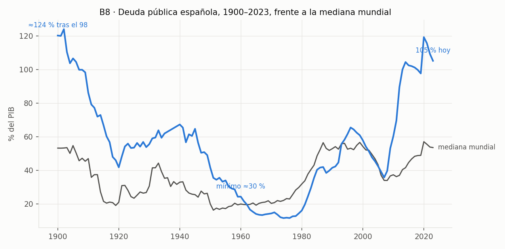 | **La deuda en U:** ≈124 %PIB tras el desastre del 98, mínimo ≈30 % en 1960, 105 % hoy. España termina el siglo XX donde lo empezó, con dos guerras mundiales de distancia y muy por encima de la mediana mundial actual. |
| B9 | 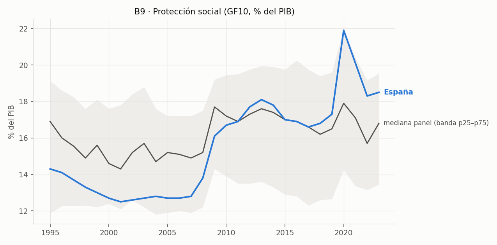 | **Protección social (GF10):** de 14,3 %PIB (1995) a 18,5 % (2023), con máximos de 21,9 % en la doble crisis; la partida más grande del Estado y la que más crece. |
| B10 | 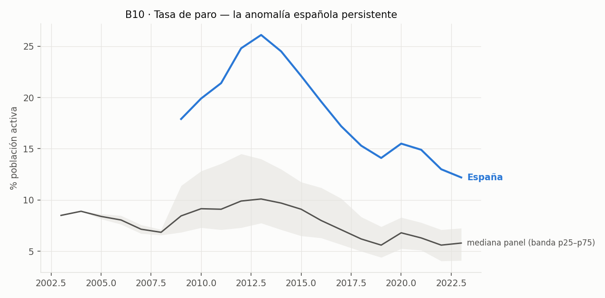 | **La anomalía persistente:** el paro español (máximo 26,1 % en 2013; 12,2 % en 2023) vive estructuralmente por encima de la banda p25–p75 europea durante toda la muestra. |
| B11 | 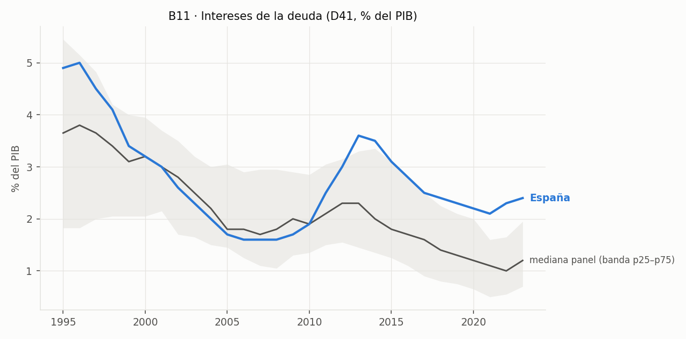 | **Intereses:** de ~5 %PIB (1995) a 2,4 % (2023) pese a duplicarse la deuda — el precio del dinero importó más que el volumen. La subida de tipos de 2022+ asoma al final de la serie. |
| B12 | 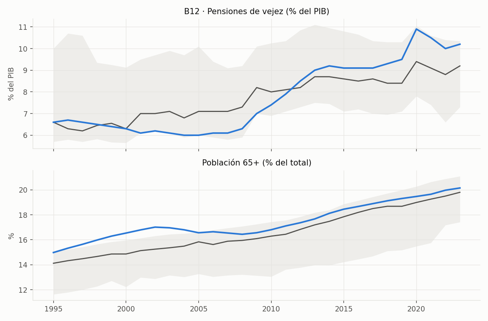 | **La tenaza demográfica:** pensiones de vejez 10,2 %PIB (2023) con la población 65+ pasando del 15,0 % (1995) al 20,1 % (2023). Los dos paneles se mueven juntos — el numerador es demografía. |
| B13 | 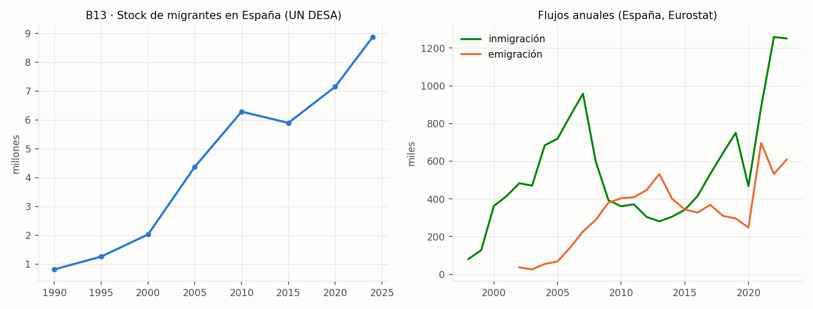 | **El amortiguador migratorio:** el stock de migrantes en España se multiplica (UN DESA, 1990–2024) y la inmigración anual alcanza ~1,25 millones (2023) — la única fuerza que frena el envejecimiento del panel B12/B16. |
| B14 | 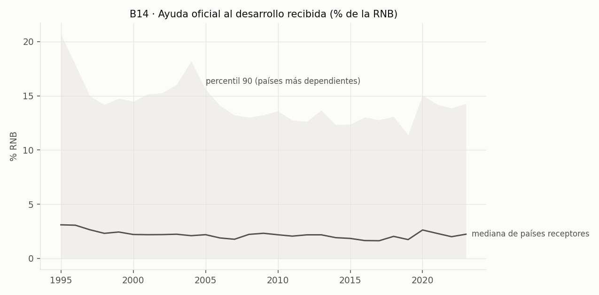 | **La otra cara fiscal:** para la mediana de países receptores la AOD ronda el 1–3 % de la RNB, con el percentil 90 muy por encima — hay Estados cuyo "presupuesto" depende del exterior; contexto para no leer el atlas solo en clave OCDE. |
| B15 | 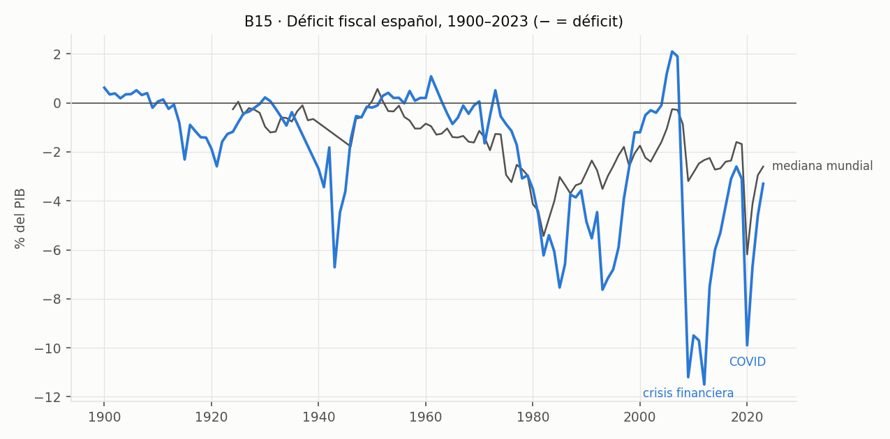 | **El déficit como sismógrafo:** −11,2 %PIB (2009), −9,9 % (2020), −3,3 % (2023). Las crisis se leen mejor en el déficit que en ninguna otra serie. |
| B16 | 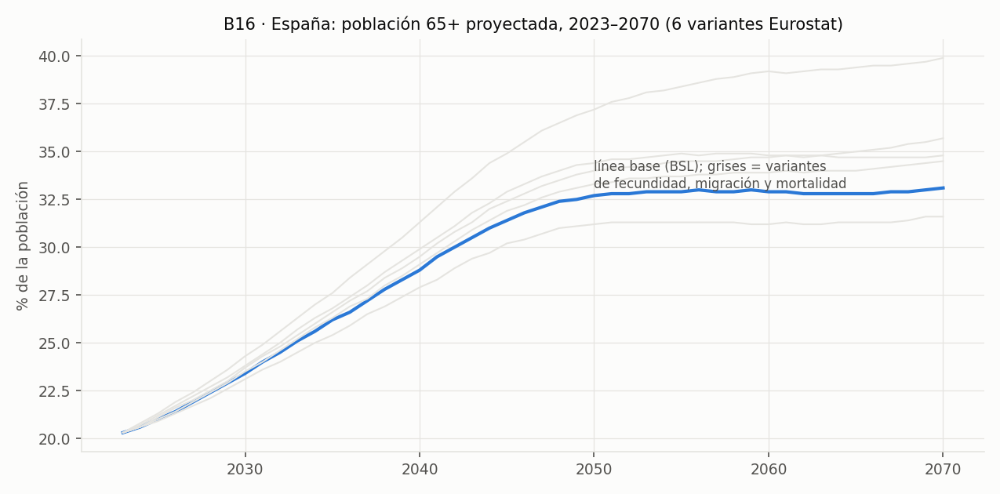 | **El futuro que empuja todo lo anterior:** la población 65+ española pasa del 20 % actual al **33,1 % en 2070** (línea base Eurostat); las seis variantes demográficas se abren en abanico — este es el insumo del motor de proyección de pensiones y sanidad 2023–2070. |

## Notas de método

- Histórico (B1, B8, B15): GMD 2026-06 + JST; la mediana mundial se calcula solo en años con ≥30 países informando. El desglose funcional continuo no existe antes de ~1970 (PLAN_MAESTRO, advertencia B2–B5): por eso las figuras funcionales empiezan en 1995 (Eurostat COFOG).
- Panel europeo: ~40 geos Eurostat (más agregados), banda p25–p75 y mediana; España en azul siempre.
- B3 usa la serie `nama_10_an6` (FBCF en viviendas, %PIB) extraída el 2026-07-18 vía el mismo cliente Eurostat del pipeline (`storage/processed/gfcf_dwellings.csv`), cumpliendo el compromiso de la [Revisión 1](entregas/04_analisis_modelado.md).
- B6 (WWBI) llega solo hasta 2020 y B7 (masa salarial WWBI/Eurostat) hasta 2022: cobertura declarada, no se interpola.
