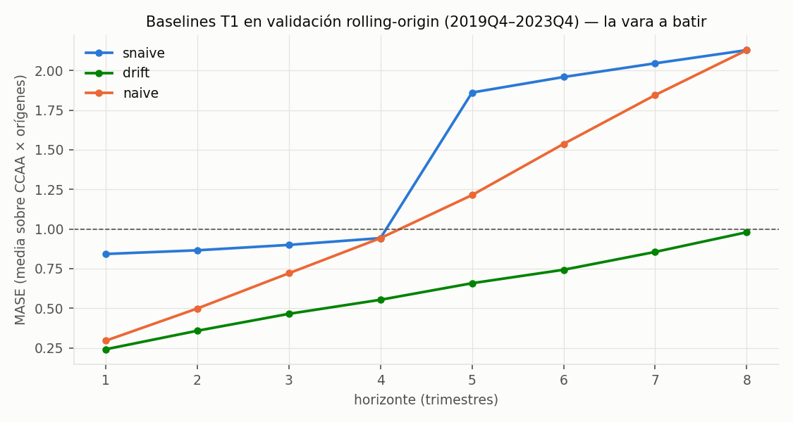

# Backtesting T1 — harness y baselines (la vara a batir)

*2026-07-18. Implementa el diseño pre-registrado de la [Entrega 4 §7](entregas/04_analisis_modelado.md): validación rolling-origin con orígenes 2019Q4–2023Q4 y horizontes h=1–8; los últimos 8 trimestres (2024Q1–2025Q4) quedan reservados como test final de un solo uso. Script: [`analysis/backtest_t1.py`](../analysis/backtest_t1.py); resultados en [`docs/figures/backtest/`](figures/backtest/); propiedades verificadas por tests ([`tests/test_backtest.py`](../tests/test_backtest.py): sin fuga temporal, test intocable, baselines exactos en casos conocidos).*

---

## 1. Resultados de los baselines (validación, 18 series × 16 orígenes efectivos)

MASE (escala naive-estacional in-sample), media sobre CCAA × orígenes:

| h | drift | naive | snaive |
|---|---|---|---|
| 1 | 0,24 | 0,30 | 0,84 |
| 2 | 0,36 | 0,50 | 0,87 |
| 3 | 0,47 | 0,72 | 0,90 |
| 4 | 0,55 | 0,94 | 0,94 |
| 5–8 | 0,66–0,98 | 1,21–2,13 | 1,86–2,13 |

**Media h≤4: drift 0,40 · naive 0,61 · snaive 0,89.**

## 2. Lecturas (importantes para no engañarse)

1. **La vara real es el drift, no el naive estacional.** En la ventana de validación (2019–2023, mercado en subida sostenida) extrapolar la tendencia reciente es muy difícil de batir: MASE h≤4 < 1 en las 18 series (rango 0,28 Aragón – 0,54 Andalucía), e incluso en los orígenes COVID (2020Q1–Q3) aguanta (0,27, favorecido por la propia escala).
2. **Que el snaive puntúe 0,89 (<1) delata la escala, no un buen baseline:** la escala MASE se calcula in-sample desde 2008 e incluye las caídas de la crisis, mucho mayores que los movimientos año-a-año del periodo de validación. Comparar candidatos solo contra "MASE < 1" sería un listón cómodo.
3. **El criterio de aceptación pre-registrado (MASE < 1 en h≤4 en ≥12/17 CCAA) queda por tanto REFORZADO** antes de entrenar ningún candidato: además del criterio original, un candidato solo se considera mejora real si su MASE medio en h≤4 **bate al drift** en ≥12 de las 17 CCAA. Se declara ahora, con los candidatos aún sin ejecutar, para mantener la disciplina de pre-registro (la regla se endurece, nunca se relaja a posteriori).
4. El drift pierde fuelle con el horizonte (0,98 en h=8) y es ciego a giros de ciclo: su debilidad esperable es el punto de giro (2013–14, o el próximo enfriamiento). Los candidatos con exógenas (Euríbor) deberían ganar precisamente ahí; si no ganan en media, se documenta el resultado negativo tal como prevé la Entrega 4.

## 3. Qué queda listo para los candidatos

- El harness acepta cualquier `forecaster(train, h) -> list[float]` con la misma firma que los baselines: SARIMAX y LightGBM se enchufan sin tocar la evaluación.
- Los errores por punto (`backtest_errores.csv`) permiten análisis por CCAA, origen y horizonte, y los tests garantizan que ningún candidato podrá ver datos posteriores a su origen ni tocar el test final.
- Siguiente paso (F4.1b): candidato 1 SARIMAX con exógenas (especificación D1–D3 del [EDA](eda_vivienda.md)) y candidato 2 LightGBM global, evaluados en esta misma parrilla.
