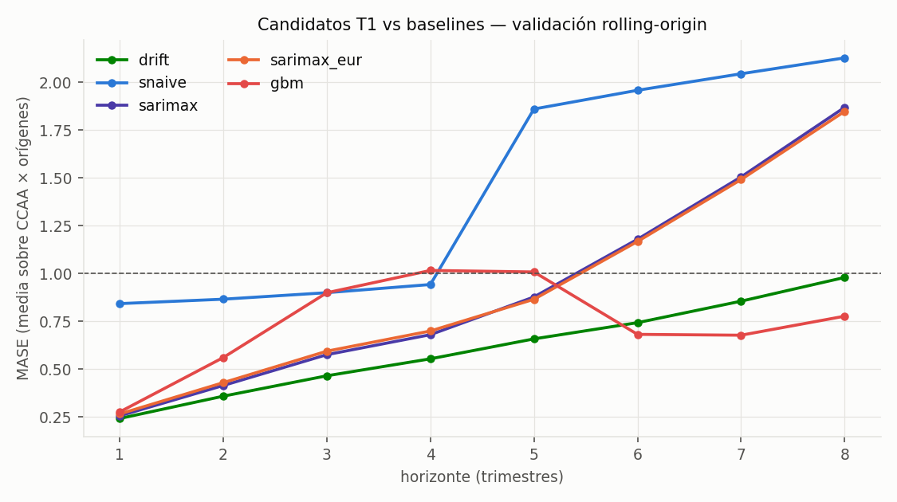

# Candidatos T1 — resultados y veredicto (pre-registrado)

*2026-07-18. Ejecuta los candidatos de la [Entrega 4 §3](entregas/04_analisis_modelado.md) con la especificación del [EDA (D1–D3)](eda_vivienda.md) sobre la parrilla de [backtesting](backtest_t1_baselines.md). Script: [`analysis/candidates_t1.py`](../analysis/candidates_t1.py). El test final (2024Q1–2025Q4) sigue SIN tocar.*

---

## 1. Qué se ejecutó

| Candidato | Especificación |
|---|---|
| `sarimax` | SARIMAX sobre log-IPV por CCAA, órdenes {(1,1,1),(2,1,0)} con deriva, elegidos por AIC dentro de cada train (D1) |
| `sarimax_eur` | Ídem + exógena Euríbor t−3 (D3); para h>3 la exógena se congela en el último valor conocido: pronóstico condicionado a "tipos constantes", declarado |
| `gbm` | LightGBM global directo por horizonte (D2): objetivo log y(t+h) − log y(t); features en t: Δlog IPV rezagos 0–3, trimestre, CCAA categórica, Euríbor (nivel y Δ), Δlog IPC, salario interanual en t−6 (compatible con la publicación EES) |

## 2. Resultados (MASE, media CCAA × orígenes)

| h | drift | sarimax | sarimax_eur | gbm |
|---|---|---|---|---|
| 1 | **0,24** | 0,26 | 0,27 | 0,28 |
| 2 | **0,36** | 0,41 | 0,43 | 0,56 |
| 3 | **0,47** | 0,58 | 0,59 | 0,90 |
| 4 | **0,55** | 0,68 | 0,70 | 1,02 |
| 6 | 0,74 | 1,18 | 1,17 | **0,68** |
| 8 | 0,98 | 1,87 | 1,85 | **0,78** |

**Criterio reforzado (batir al drift en h≤4, por CCAA):** sarimax 1/17 · sarimax_eur 0/17 · gbm 0/17. **Ninguno lo supera.**

## 3. Veredicto según las reglas pre-registradas

1. **Resultado negativo a corto plazo, y se publica como tal** (Entrega 4 §7 lo preveía): en h≤4, con una ventana de validación sin giros de ciclo (2019–2023), nada bate a extrapolar la tendencia reciente. **El modelo de producción para h≤4 es el baseline drift.**
2. **El endurecimiento del criterio demostró su valor:** los tres candidatos habrían "aprobado" el criterio original (MASE < 1: sarimax 0,47 de media en h≤4), y solo el listón del drift revela que no aportan mejora real. Sin la disciplina de pre-registro, este proyecto estaría ahora mismo celebrando un SARIMAX peor que una regla de dos líneas.
3. **Hallazgo secundario (post-hoc, se declara como tal):** el GBM cruza por debajo del drift en h≥6 (0,68–0,78 vs 0,74–0,98) — las exógenas y el pooling aportan justo donde el drift es ciego, el horizonte largo. Como la selección por-horizonte NO estaba pre-registrada, esta ventaja **no se adopta**: queda como hipótesis a confirmar en el test final de un solo uso. Si el test la confirma, el MVP usará drift en h≤4 y GBM en h≥6, con esa procedencia explicada.
4. **Sesgo estructural conocido:** la validación 2019–2023 premia al drift porque no contiene puntos de giro. La debilidad del drift (giros) no está representada en la ventana — se dice explícitamente para no sobrevender el baseline.

## 4. Qué podría mover el resultado (trabajo futuro declarado)

- **El driver de oferta `oferta_nueva`** (Revisión 1 de la Entrega 4): los visados con su retardo de 18–24 meses son el candidato natural a anticipar giros de ciclo — exactamente el fallo del drift. Si un driver puede cambiar el veredicto a corto, es este.
- Features de régimen (dummies de ciclo, spread hipotecario) para el GBM.
- Evaluación específica en el único giro de la muestra (2013–14) como diagnóstico, sin re-seleccionar sobre él.

## 5. Estado de la disciplina de evaluación

- Test final 2024Q1–2025Q4: **intacto**, cero evaluaciones (verificado por test automático sobre los CSV publicados).
- Todo lo anterior sale de validación; la única evaluación del test final se hará una vez, con el modelo/combinación elegido y declarado antes de mirar.
