<!-- _class: cover -->

GUÍA DE USO · DEFENSA TFM

# España en escenarios

## Cómo funciona el modelo, cómo se opera y qué resultados produce

 <b>danribes.github.io/tfm-data-science</b> &nbsp;·&nbsp;  API en Hugging Face Spaces &nbsp;·&nbsp;  vintage congelado 2026-07-31

Simulador macro-fiscal condicional para España, 2026–2050 · motor de identidad de deuda con 10 palancas · 12 perfiles ciudadanos · Monte Carlo · análogos históricos

---

# Qué vamos a ver cuatro bloques

<h2> 1 · El modelo</h2>
Una pregunta, una identidad contable y una cadena de transmisión con coeficientes con nombre. Arquitectura de datos y despliegue.

<h2> 2 · Cómo se opera</h2>
Punto de partida (vintage), las 10 palancas y sus rangos, los 8 presets, el horizonte y cómo leer cada tipo de resultado.

<h2> 3 · Recorrido por las pestañas</h2>
Inicio, 12 perfiles, Laboratorio (abanico, Sankey, sensibilidad, gemelo empírico, análogos), Biblioteca, Evidencia, Predicción, método.

<h2> 4 · Escenarios ilustrativos</h2>
Cuatro escenarios de extremo a extremo con sus números, líneas rojas y lectura. Comparativa de los 8 presets y límites del modelo.

Todas las cifras del deck provienen de la API en producción (motor v1.0.0) el 6-sep-2026. Las capturas son de la web publicada.

---

<!-- _class: divider -->

01

# El modelo

## una pregunta, una identidad, una cadena de transmisión

---

# Qué pregunta responde y qué no

<b>¿Qué le pasaría a la deuda, al paro, a los precios y al esfuerzo de comprar vivienda si algunas condiciones cambiaran y se mantuvieran así?</b>

<h2> Es una proyección condicional</h2>
No dice qué va a pasar; dice qué implica el modelo si mueves una palanca y la dejas quieta. Nadie sabe dónde estará el Euríbor en 2040 — sí se puede ser explícito sobre la aritmética que lo conecta con la deuda.

<h2> Enseña el margen de error</h2>
Cada escenario lleva un abanico de 4.000 trayectorias Monte Carlo (semilla 42). Lo informativo es la anchura de la banda, no la mediana.

<h2> Baja al bolsillo</h2>
El mismo número agregado se traduce a 12 perfiles: bonista, banca, comprador de vivienda, jubilado, joven, autónomo… con datos observados del vintage y proyección 2026–2050.

 No es una previsión ni una recomendación de compra, venta o voto. Es lo que el modelo implica si esas palancas se mantuvieran en esos valores.

---

# La identidad que gobierna todo casi todo el motor existe para alimentar tres términos

b(t+1) = b(t) · (1 + r − g) − sp

<h2> r · tipo efectivo de la deuda</h2>
Lo que cuesta la deuda viva. Sólo se refinancia el <b>14 %</b> cada año (<code>REFI</code>), así que un tipo nuevo entra en el coste poco a poco. El bono a 10 años = <code>r + TERM + prima/100</code>.

<h2> g · crecimiento nominal</h2>
Lo que crece la economía. Recoge productividad (λ), demanda externa (Y*), y el freno del propio tipo (<code>E_R</code>). Por Okun mueve el paro; por Phillips la inflación.

<h2> sp · saldo primario</h2>
Ingresos menos gastos sin intereses. La única palanca que reduce deuda directamente. El vintage arranca con déficit primario; la consolidación (S3) lo mueve +1 pp PIB.

<h2> r &lt; g → la deuda se diluye sola</h2>
Aunque no haya superávit, la ratio baja: la economía crece más deprisa que el coste de la deuda. Base 2026: r − g = <b>−0,62 pp</b>.

<h2> r &gt; g → bola de nieve</h2>
Hace falta superávit primario sólo para que la deuda no crezca. La zona que el crecimiento no absorbe se ensancha cada año sin ninguna decisión nueva de gasto.

---

# Cómo viaja un cambio subir el tipo no toca la deuda directamente — recorre un camino con coeficientes con nombre

<b>1 · Palanca</b>Euríbor 12m sube +2 pp (preset S1).r

→

<b>2 · Coste de la deuda</b>Sólo el 14 % de la deuda viva se refinancia cada año; el bono 10A se forma como r + TERM + prima.REFI 0,14TERM 0,17

→

<b>3 · Demanda</b>El tipo frena inversión y consumo; el multiplicador amplifica, la persistencia amortigua.E_R 0,45MULT 1,4RHO 0,62

→

<b>4 · Empleo y precios</b>Menos PIB es menos g. El paro sube por Okun y arrastra la inflación por Phillips.OKUN 0,48KAPPA 0,22

→

<b>5 · Deuda</b>Menos g y más r vuelven a la identidad: la ratio deuda/PIB se capitaliza más deprisa.b(t+1)

<h2> Otros canales</h2><ul>
<li><b>Energía (pᵐ)</b> → inflación importada con decaimiento <code>PM_DECAY 0,45</code>; efecto real <code>E_PM 0,012</code>.</li>
<li><b>Oferta (λ, τ, z)</b> → desplazan la curva de precios (PS) y de salarios (WS): <code>A_LAM 0,45 · A_TAU 0,3 · A_Z 1,1</code>.</li>
<li><b>Vivienda</b> → precio responde al tipo (<code>E_IPV_R 2,6</code>) y al crecimiento (<code>E_IPV_G 1,1</code>); esfuerzo = cuota francesa / salario.</li>
<li><b>Demografía (β₆₅) e indexación (ι)</b> → gasto en pensiones comprometido antes de decidir.</li></ul>

<h2> Por qué las palancas no suman</h2>
El panel de Inicio descompone el movimiento palanca a palanca: vuelve a correr el motor con una sola palanca movida y compara. Como los canales se refuerzan entre sí, la suma de efectos individuales <b>no iguala</b> el efecto conjunto — la diferencia se dibuja como una barra más, en lugar de repartirla disimuladamente.

<em>Las constantes son calibraciones (v16), no estimaciones sobre estos datos. La pestaña Evidencia declara cuáles son identificables.</em>

---

# Arquitectura de 141 fuentes congeladas a 19 pestañas

<b>Fuentes · vintage 2026-07-31</b>141 series congeladas: BCE, Eurostat, INE, AMECO, WEO, PWT, OCDE, Banco Mundial, Polity5. Nada se actualiza en caliente.csv gold/

→

<b>Capa gold</b>CSVs auditados con manifest: proyecciones, escenarios de deuda, fiscal 1850–2023, panel impagos 1960–2023, panel análogos 1980–2023.pandas

→

<b>Motor Python</b>Identidad de deuda + 40 series derivadas, Monte Carlo (4.000 × AR(1)), líneas rojas, clasificador de impago, HMM de regímenes, KNN análogos.FastAPInumpy

→

<b>Motor TypeScript</b>Réplica del motor en el navegador con paridad verificada (fixtures compartidos). El escenario te sigue entre páginas sin latencia.ReactViteZustand

→

<b>Interfaz</b>Inicio · 12 perfiles · Laboratorio · Biblioteca · Evidencia · Predicción · Cómo funciona · Datos y método.19 pestañas

<h2> Frontend · GitHub Pages</h2>
<code>danribes.github.io/tfm-data-science</code> Build Vite en cada push a <code>main</code>. 248 tests (Vitest + MSW).

<h2> API · Hugging Face Spaces</h2>
<code>danribes-evo-espana-api.hf.space</code> Docker · FastAPI. Duerme sin uso (≈1 min de arranque). 382 tests pytest.

<h2> Reproducibilidad</h2>
Semilla fija (42), vintage inmutable, constantes en un solo fichero, paridad Python ↔ TS por fixtures. El corpus de la Biblioteca nunca sale de la máquina local.

---

<!-- _class: divider -->

02

# Cómo se opera

## punto de partida · palancas · presets · horizonte · lectura de resultados

---

# Punto de partida la línea base del vintage, con todas las palancas en su valor observado

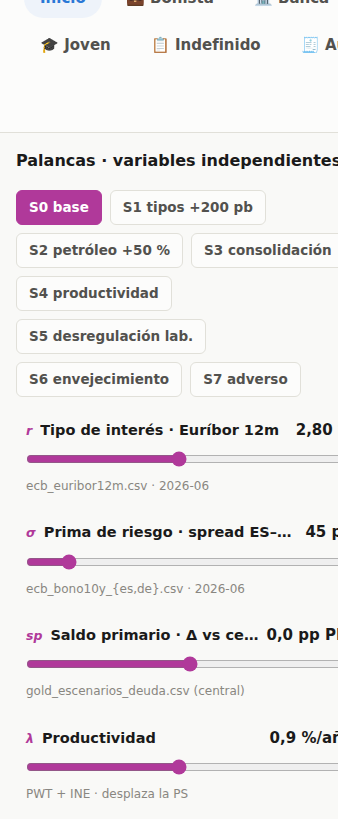

Panel izquierdo: presets, 10 deslizadores, horizonte y «volver a base». El escenario te sigue entre páginas.

<h3>España 2026 · observado</h3>

106,3<small>%PIB</small>

Deuda pública

−4,2<small>%PIB</small>

Saldo público

10,1<small>%</small>

Paro

3,0<small>%</small>

IPCA

3,42<small>%</small>

Bono 10A

−0,62<small>pp</small>

r − g (el crecimiento diluye)

<h3 style="margin-top:10px">Senda central sin tocar nada</h3>

Deuda 2050: <b>223,8 %PIB</b> · saldo −15,0 · la economía ×2,2 y la deuda ×4,6. No es un pronóstico: es lo que implica mantener el déficit primario del vintage 24 años.

---

<!-- _class: dense -->
# Las 10 palancas los rangos son la envolvente de lo que cada variable ha hecho históricamente

<table>
<tr><th></th><th>Palanca</th><th>Canal</th><th class="n">Base</th><th class="n">Rango</th><th>Fuente del vintage</th></tr>
<tr><td><b>r</b></td><td>Tipo de interés · Euríbor 12m</td><td>financiero</td><td class="n">2,80 %</td><td class="n">0 … 6</td><td>ecb_euribor12m · 2026-06</td></tr>
<tr><td><b>σ</b></td><td>Prima de riesgo · spread ES–DE</td><td>financiero</td><td class="n">45 pb</td><td class="n">0 … 400</td><td>ecb_bono10y es/de · 2026-06</td></tr>
<tr><td><b>sp</b></td><td>Saldo primario · Δ vs central</td><td>fiscal</td><td class="n">0,0 pp PIB</td><td class="n">−4 … +4</td><td>gold_escenarios_deuda (central)</td></tr>
<tr><td><b>τ</b></td><td>Presión fiscal · cuña laboral</td><td>fiscal</td><td class="n">0,00 pp</td><td class="n">−5 … +5</td><td>Eurostat GFS · desplaza la WS</td></tr>
<tr><td><b>λ</b></td><td>Productividad</td><td>oferta</td><td class="n">0,9 %/año</td><td class="n">−0,5 … 2,5</td><td>PWT + INE · desplaza la PS</td></tr>
<tr><td><b>z</b></td><td>Instituciones laborales</td><td>oferta</td><td class="n">0,0 índice</td><td class="n">−2 … +2</td><td>OECD/Eurostat · desplaza la WS</td></tr>
<tr><td><b>pᵐ</b></td><td>Precio importaciones / energía</td><td>exterior</td><td class="n">0 % a/a</td><td class="n">−50 … +100</td><td>WEO commodity prices</td></tr>
<tr><td><b>Y*</b></td><td>Demanda externa</td><td>exterior</td><td class="n">1,8 % a/a</td><td class="n">−4 … +6</td><td>WEO · canal exterior</td></tr>
<tr><td><b>β₆₅</b></td><td>Presión demográfica</td><td>estructural</td><td class="n">0,00 ×</td><td class="n">−1 … +1</td><td>gold_projections · 6 variantes INE</td></tr>
<tr><td><b>ι</b></td><td>Indexación pensiones / nóminas</td><td>estructural</td><td class="n">0,0 IPC+pp</td><td class="n">−1,5 … +1</td><td>regla de revalorización</td></tr>
</table>

Cada deslizador muestra su fuente y fecha de corte debajo. No puedes poner el Euríbor al 40 % porque el modelo no está calibrado ahí. β₆₅ ofrece las variantes demográficas del INE (migración alta/baja, fecundidad baja, mortalidad baja, sin migración).

---

# Los 8 presets escenarios de un clic — cada uno mueve una o tres palancas y deja el resto en base

<h2> S0 · base</h2>
Todas las palancas en su valor observado. Senda central del vintage.

<code>—</code>

<h2> S1 · tipos +200 pb</h2>
Euríbor de 2,80 % a 4,80 %. Prueba el canal financiero puro.

<code>r = 4,80</code>

<h2> S2 · petróleo +50 %</h2>
Choque de precios importados con decaimiento. Prueba el canal de inflación.

<code>pᵐ = +50</code>

<h2> S3 · consolidación</h2>
Saldo primario +1 pp PIB sostenido. La única palanca que ataca la deuda directamente.

<code>sp = +1,0</code>

<h2> S4 · productividad</h2>
De 0,9 a 1,4 %/año. Prueba el canal de crecimiento (g).

<code>λ = 1,4</code>

<h2> S5 · desregulación laboral</h2>
Instituciones −1 y cuña fiscal −1,5. Desplaza la curva de salarios.

<code>z = −1,0 · τ = −1,5</code>

<h2> S6 · envejecimiento</h2>
Presión demográfica +0,6. Pensiones comprometidas antes de decidir.

<code>β₆₅ = +0,6</code>

<h2> S7 · adverso</h2>
Tipos +200 pb, petróleo +50 % y prima a 150 pb a la vez. Choque combinado.

<code>r = 4,80 · pᵐ = 50 · σ = 150</code>

Los presets son un punto de partida: después puedes mover cualquier otro deslizador. El pill del preset activo cambia a «condicional» y cada KPI muestra su Δ vs base.

---

# El panel de control cinco gestos bastan para operar el modelo

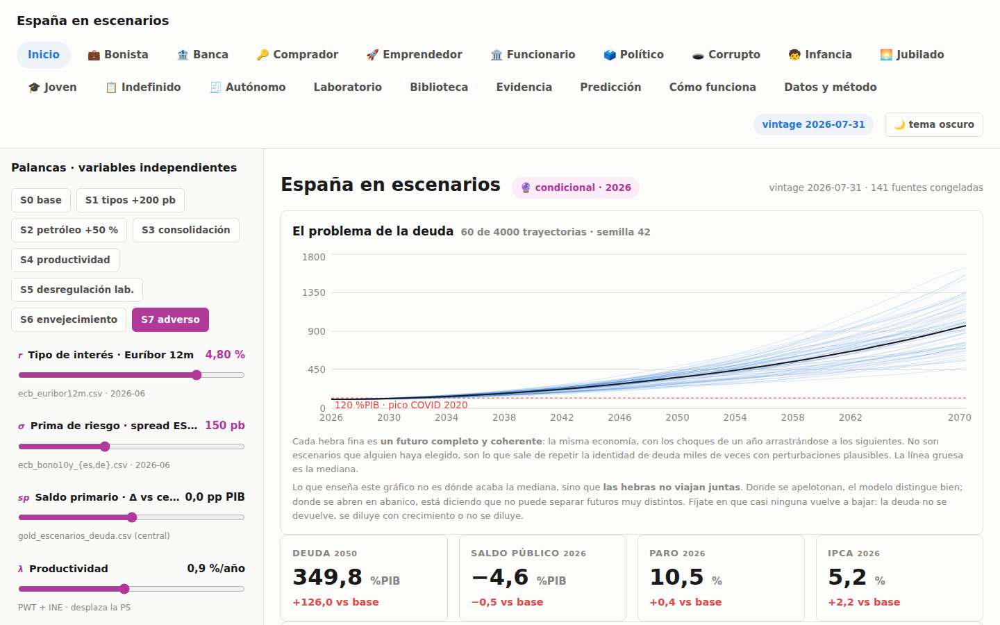

<h2>1Elige un preset o parte de base</h2>
S0…S7 arriba del panel. El pill «condicional · 2026» indica que el escenario ya no es la base.

<h2>2Mueve deslizadores</h2>
Cada uno con símbolo, nombre, unidad, valor y fuente. Los movidos se resaltan en morado.

<h2>3Fija el horizonte</h2>
2026 · 2030 · 2035 · 2040 · 2050. Las líneas rojas y los KPIs se evalúan en ese año.

<h2>4Lee la Δ vs base</h2>
Cada KPI muestra el nivel y cuánto se debe a ti. Todo lo demás ya estaba en los datos.

<h2>5Cambia de pestaña</h2>
El escenario te sigue: los 12 perfiles y el Laboratorio recalculan con tus palancas. «↺ volver a base» lo deshace.

---

# Cómo leer los resultados cuatro tipos de salida, cuatro lecturas distintas

<h2> KPIs con Δ vs base</h2>
<b>Nivel</b> en el año del horizonte y <b>diferencia</b> respecto a la base congelada. La Δ es lo único que has causado tú. Badge «dato observado» cuando el año es 2026.

<h2> Abanico Monte Carlo</h2>
4.000 trayectorias con choques AR(1) sobre tipo, crecimiento y saldo. Mira la <b>anchura</b> p5–p95, no la mediana. Semilla 42: dos personas ven lo mismo.

<h2> Líneas rojas</h2>
9 umbrales anclados a episodios reales. Estado <b>calculado</b> cada año: segura cerca cruzada. «Cerca» = 10 % del umbral. Una línea cruzada en base ya lo estaba hoy.

<h2> Probabilidad de impago</h2>
Clasificador sobre 377 impagos reales 1960–2023. AUC 0,674: ordena razonablemente pero no calibra un nivel. Lee la <b>posición relativa</b> frente a la tasa base 9,7 %.

<h2> Descomposición palanca a palanca</h2>
El bloque «Qué está pasando» de Inicio vuelve a correr el motor con una sola palanca movida y compara. La barra de interacción es la parte que no se reparte.

<h2> Análogos históricos</h2>
Los 3 país-año más parecidos a tu escenario (Mahalanobis sobre 6 rasgos), cómo evolucionaron después, y en qué se diferencia España estructuralmente.

---

<!-- _class: dense -->
# Las 9 líneas rojas umbrales con fuente, evaluados en 2026 sobre la base

<table>
<tr><th>Línea roja</th><th class="n">Umbral</th><th class="n">Base 2026</th><th>Estado</th><th>Ancla histórica / regla</th></tr>
<tr><td>Bono 10A</td><td class="n">&gt; 7 %</td><td class="n">3,42</td><td>segura</td><td>Zona rescate: GRC/PRT/IRL pidieron rescate con bonos ≈7 %; ES tocó 7,6 % en jul-2012</td></tr>
<tr><td>Paro</td><td class="n">&gt; 26,9 %</td><td class="n">10,1</td><td>segura</td><td>Máximo histórico ES (T1-2013)</td></tr>
<tr><td>Déficit</td><td class="n">&gt; 3 % PIB</td><td class="n">−4,2</td><td>cruzada</td><td>Umbral de Maastricht (regla UE)</td></tr>
<tr><td>Déficit</td><td class="n">&gt; 11,3 % PIB</td><td class="n">−4,2</td><td>segura</td><td>Suelo 2009: ES −11,3 % PIB</td></tr>
<tr><td>Deuda</td><td class="n">&gt; 105 % PIB</td><td class="n">106,3</td><td>cruzada</td><td>crack23: «deuda brutal que ya está por encima del 105 %»</td></tr>
<tr><td>Deuda</td><td class="n">&gt; 120 % PIB</td><td class="n">106,3</td><td>segura</td><td>≈ pico COVID ES 2020: 119,3</td></tr>
<tr><td>Inflación</td><td class="n">&gt; 10 %</td><td class="n">3,0</td><td>segura</td><td>Ola inflacionaria 2022: ES pico 10,8 % jul-2022</td></tr>
<tr><td>Esfuerzo vivienda</td><td class="n">&gt; 40 %</td><td class="n">42,6</td><td>cruzada</td><td>Definición Eurostat de sobrecarga (housing cost overburden)</td></tr>
<tr><td>Pobreza infantil</td><td class="n">&gt; 30 %</td><td class="n">28,5</td><td>cerca</td><td>ES 27–28 % crónico, 30 % en picos post-2013; media UE ≈19 %</td></tr>
</table>

 Tres líneas ya están cruzadas en la base y una en banda de aviso. Que un escenario las muestre cruzadas no significa que las haya roto — significa que España ya está por encima hoy. El estado se recalcula en el año del horizonte.

---

<!-- _class: divider -->

03

# Recorrido por las pestañas

## Inicio · 12 perfiles · Laboratorio · Biblioteca · Evidencia · Predicción · método

---

# Inicio el problema de la deuda en una pantalla

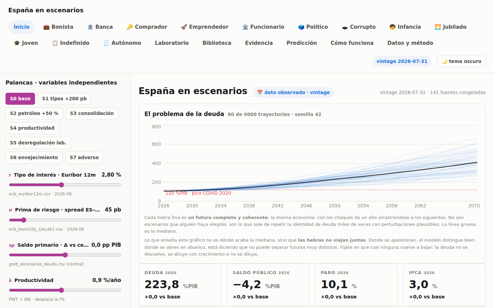

<h2> El problema de la deuda</h2>
60 de las 4.000 trayectorias como hebras finas; la mediana gruesa. Donde se abren en abanico el modelo no distingue futuros. Casi ninguna vuelve a bajar.

<h2> Cuatro KPIs</h2>
Deuda 2050, saldo, paro e IPCA con Δ vs base y badge de dato observado / proyectado.

<h2> Por qué cuesta devolverla</h2>
Deuda y PIB en índice 2026 = 100 y el término r − g. La zona sombreada es la deuda que el crecimiento no absorbe.

<h2> Siglo y medio de calma y crisis</h2>
Saldo español 1850–2023 con regímenes detectados por un HMM de 2 estados — no anotados a mano.

---

# Inicio · segunda mitad de la macro al bolsillo, líneas rojas, impago, perfiles y narrativa

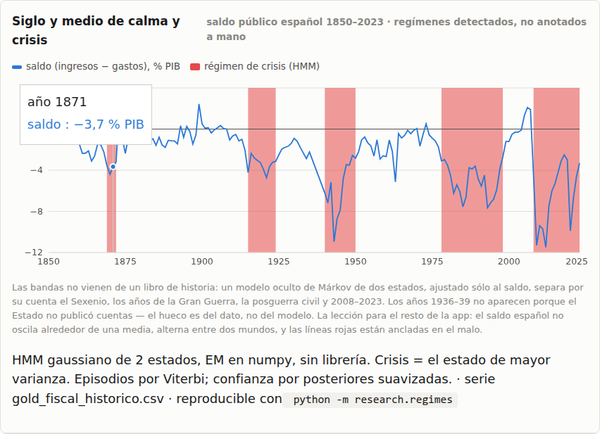
<b>Regímenes 1850–2023.</b> HMM gaussiano de 2 estados ajustado sólo al saldo separa el Sexenio, la Gran Guerra, la posguerra y 2008–2023. El saldo español alterna entre dos mundos; las líneas rojas están ancladas en el malo.

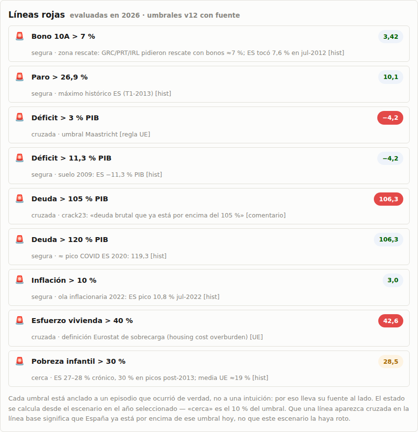
<b>Líneas rojas.</b> Umbral, valor, estado y fuente. Se recalculan en el año del horizonte.

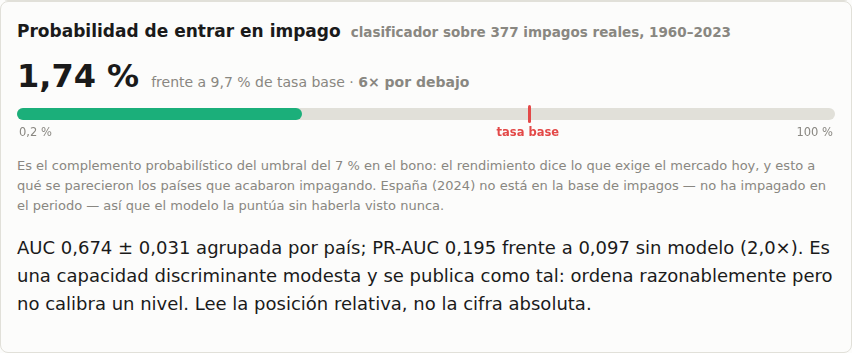
<b>Probabilidad de impago.</b> 1,74 % frente a 9,7 % de tasa base (6× por debajo). España no está en la base de impagos: el modelo la puntúa sin haberla visto.

<h2> 12 perfiles + «Qué está pasando»</h2>
Rejilla de perfiles con su pregunta, y un texto determinista que explica qué líneas rojas cruza el escenario y por qué. Sin IA en producción pública.

---

# Los 12 perfiles el mismo número, visto desde abajo — cada uno hace una pregunta concreta

<b>💼 Bonista</b>Inversor en bonos: ¿me pagarán los 10 años?

<b>🏦 Banca</b>Banco hipotecario: ¿a quién presto, a qué tipo y con qué mora esperada?

<b>🔑 Comprador</b>Comprador de vivienda: ¿qué esfuerzo me exige el techo?

<b>🚀 Emprendedor</b>¿Aguanta el ciclo lo que tarda mi empresa en nacer?

<b>🏛️ Funcionario</b>¿Mi nómina real sobrevive al ajuste que viene?

<b>🗳️ Político</b>¿Qué palanca puedo mover sin cruzar una línea roja?

<b>🕳️ Corrupto</b>¿Dónde no mira nadie? — partidas con más discrecionalidad, señaladas para quien SÍ mira

<b>🧒 Infancia</b>¿Qué país hereda quien hoy tiene 8 años?

<b>🌅 Jubilado</b>¿Mi pensión sigue al IPC — y quién la paga en 2035?

<b>🎓 Joven</b>¿Primer contrato o cola del paro — y podré irme de casa?

<b>📋 Indefinido</b>¿Crece mi salario por encima del IPC?

<b>🧾 Autónomo</b>¿Caja, cuota y ciclo — en qué orden me golpean?

<h2> Anatomía de un perfil</h2>
Pregunta · 5–6 KPIs con badge «dato observado · vintage» o «proyectado» y Δ vs base · histórico observado (sparkline) · proyección 2026–2050 escenario vs base · fuentes al pie.

<h2> Cómo llega la macro a cada uno</h2>
Bono 10A → cuota hipotecaria (fórmula francesa) · intereses → gasto que nadie elige · g → paro (Okun) y salario real (Phillips) · prima → crédito y mora · β₆₅ e ι → pensiones.

---

# Dos perfiles en detalle Comprador de vivienda · Jubilado

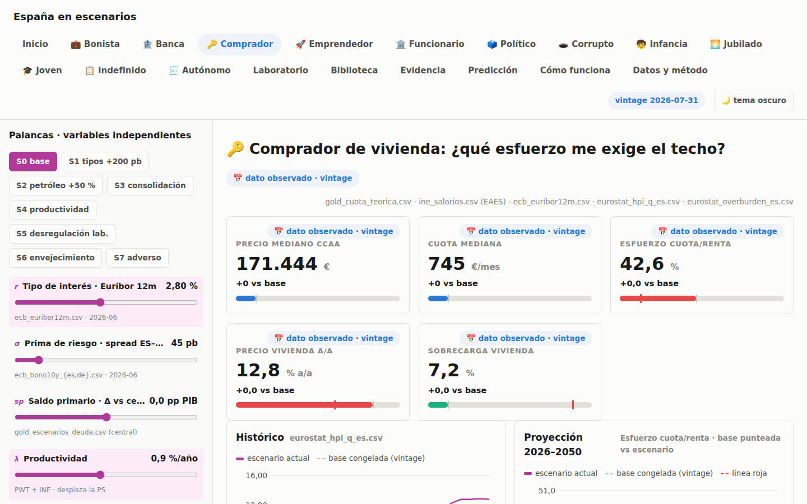
<b>🔑 Comprador.</b> Precio de la vivienda (€/m²), cuota mensual, esfuerzo (%), salario, sobrecarga. La cuota sale del bono 10A vía Euríbor; el precio responde al tipo (E_IPV_R 2,6) y al crecimiento. Esfuerzo 42,6 % en 2026: línea roja cruzada ya en base.

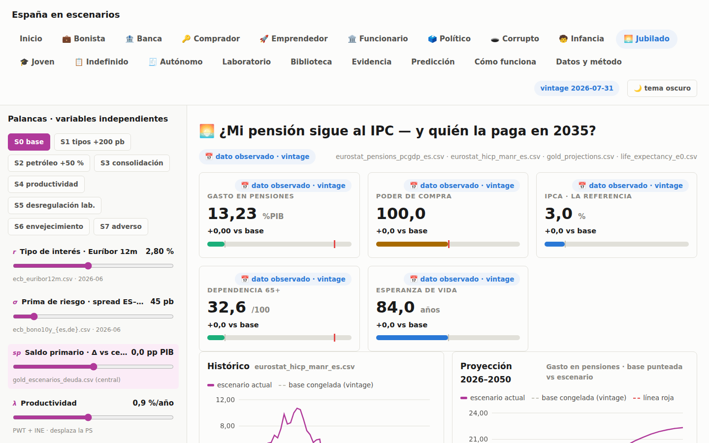
<b>🌅 Jubilado.</b> Gasto en pensiones (%PIB), poder de compra, IPC, dependencia 65+, esperanza de vida. La regla de revalorización (ι) y la tasa de dependencia (β₆₅) deciden cuánto del gasto futuro está comprometido antes de empezar a decidir.

 Mueve S6 (envejecimiento) y salta al Jubilado; mueve S1 (tipos) y salta al Comprador. La Δ vs base de cada KPI es la única parte causada por ti.

---

# Laboratorio · explorar y cuantificar la incertidumbre 40 series, abanico Monte Carlo, palancas en crudo

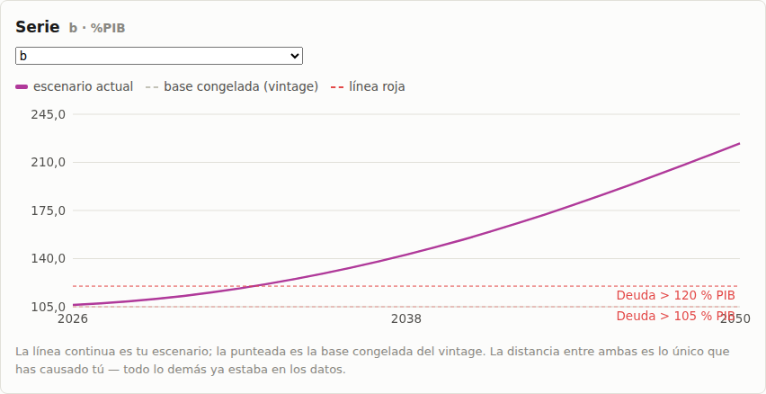
<b>Explorador de series.</b> Cualquiera de las 40 series del motor (b, u, pi, g, bono, esf, pensiones, salario real…): línea continua = tu escenario; punteada = base congelada; líneas rojas dibujadas donde aplican.

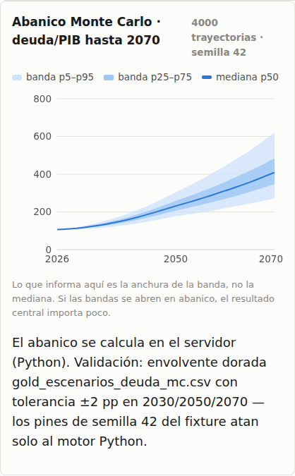
<b>Abanico Monte Carlo hasta 2070.</b> 4.000 trayectorias, bandas p5–p95 y p25–p75, mediana p50. Se calcula en el servidor (Python) y se valida contra la envolvente dorada con tolerancia ±2 pp en 2030/2050/2070.

<h2> Informe de política pública · versión imprimible</h2>
Botón en cabecera: genera un informe determinista con las cifras del escenario activo, listo para imprimir o adjuntar.

---

# Laboratorio · a dónde va cada euro Sankey fiscal y acumulación de deuda, por año de proyección

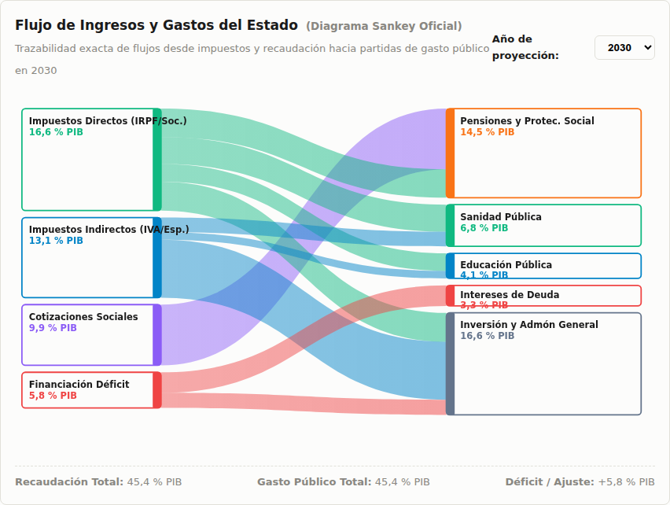
<b>Flujo de ingresos y gastos del Estado.</b> Impuestos directos, indirectos, cotizaciones y financiación del déficit → pensiones, sanidad, educación, intereses, inversión. Selector de año 2026–2050. Recaudación total y gasto total en %PIB.

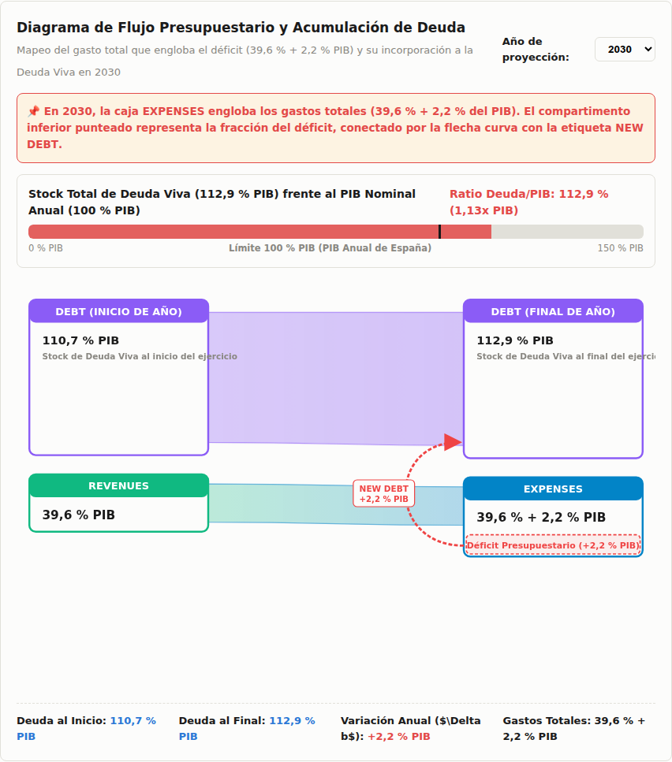
<b>Flujo presupuestario y acumulación de deuda.</b> Deuda al inicio → ingresos, gastos y la fracción del déficit que se convierte en NEW DEBT → deuda al final del año. Ratio deuda/PIB frente al límite del 100 % del PIB anual.

---

# Laboratorio · qué mueve la deuda matriz de sensibilidad (∂Y/∂L) y gemelo empírico

<h3>Deuda 2050 si cada palanca se mueve de tope a tope</h3>

r · Euríbor 12m

+205 pp

β₆₅ · Presión demográfica

+194 pp

σ · Prima de riesgo

+115 pp

λ · Productividad

−107 pp

sp · Saldo primario

−104 pp

Y* · Demanda externa

−30 pp

pᵐ · Energía

−6 pp

τ · z · ι

−0 pp

Única columna que se puede leer hacia abajo: hace la misma pregunta a todas las palancas. Las derivadas por unidad (en gris en la app) no son comparables entre filas — β₆₅ marca +96,9 frente a +34,2 del tipo, y sin embargo, de tope a tope, el tipo pesa más.

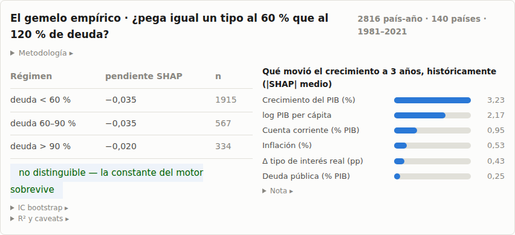
<b>El gemelo empírico.</b> ¿Pega igual un tipo al 60 % que al 120 % de deuda? Panel externo de 2.816 país-año (140 países, 1981–2021), árboles + SHAP por régimen de deuda. Resultado: <b>no distinguible</b> — el IC bootstrap incluye el cero; la constante del motor sobrevive, «no contradicha», que es menos que validada y se dice tal cual.

---

# Laboratorio · análogos históricos ¿a qué país-año se parece tu escenario y qué pasó después?

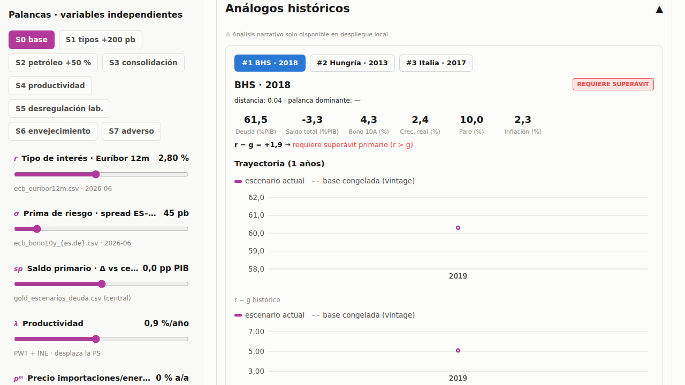

<b>Consulta</b>6 rasgos del escenario en el horizonte: deuda, saldo, bono 10A, crecimiento, paro, inflación.z-score

→

<b>Búsqueda</b>KNN con distancia de Mahalanobis sobre 6.370 país-año (120+ países, 1980–2023). Bonus 20 % si el país-año destaca en la palanca dominante.k = 3

→

<b>Lectura</b>Trayectoria posterior hasta el horizonte, veredicto r − g y 8 diferencias estructurales con España.✓ ✗ ≈

<h2> Veredicto de Blanchard</h2>
AUTO-LIQUIDABLE r &lt; g − 0,5 &nbsp; LÍMITE |r − g| &lt; 0,5 pp &nbsp; REQUIERE SUPERÁVIT r &gt; g + 0,5

<h2> 8 diferencias estructurales</h2>
Zona euro · régimen cambiario · deuda externa / total · calidad institucional (Polity5) · apertura comercial · vencimiento de la deuda · tendencia TFP · productividad laboral. Cada una con ✓ converge, ✗ diverge, ≈ neutral, y «sin datos» cuando el panel no cubre.

Narrativa por IA sobre el corpus sólo en despliegue local; en público, plantilla determinista.

---

# Biblioteca y Evidencia preguntar al corpus · declarar qué está calibrado y qué estimado

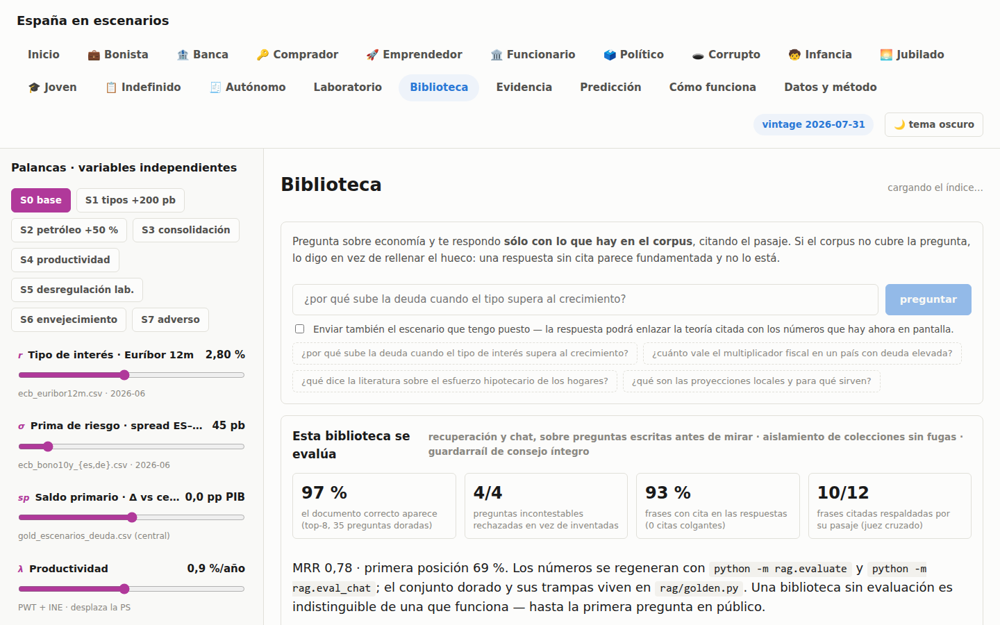
<b>Biblioteca.</b> Preguntas sobre el escenario y la deuda respondidas <b>sólo desde pasajes</b> del corpus (RAG). Si el corpus no cubre la pregunta, se dice. Evaluación publicada sobre preguntas dorada (aciertos, cobertura, fidelidad). El corpus nunca sale de la máquina local.

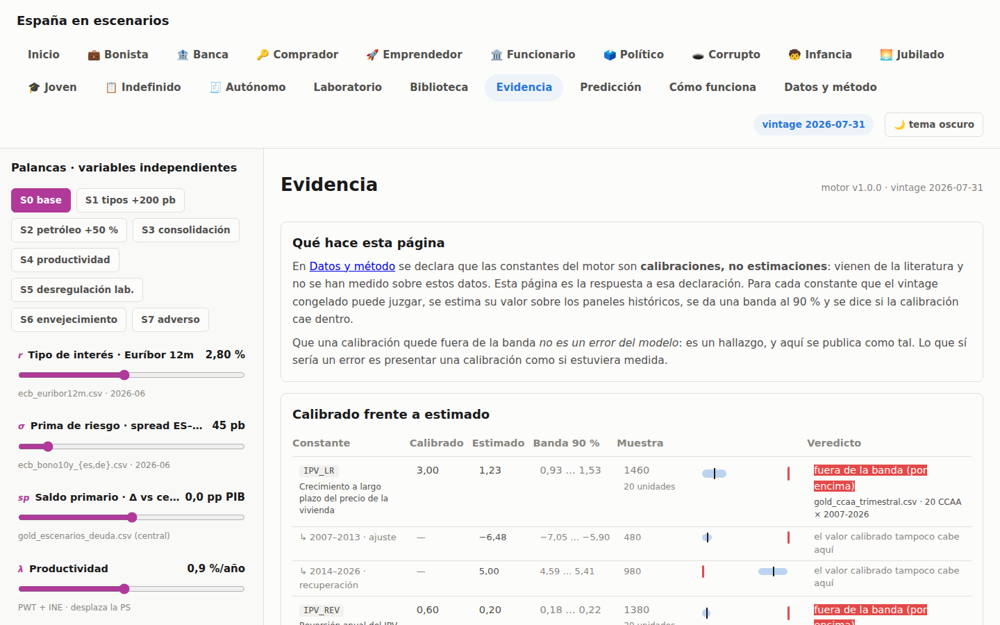
<b>Evidencia.</b> Tabla de constantes del motor: valor calibrado, valor estimado sobre el vintage cuando es posible, banda, y veredicto de identificabilidad. Declara explícitamente qué coeficientes no se pueden estimar con los datos congelados — un revisor puede discutirlos, y debería.

---

# Predicción · Cómo funciona · Datos y método contraste fuera de muestra, guía del motor y trazabilidad de datos

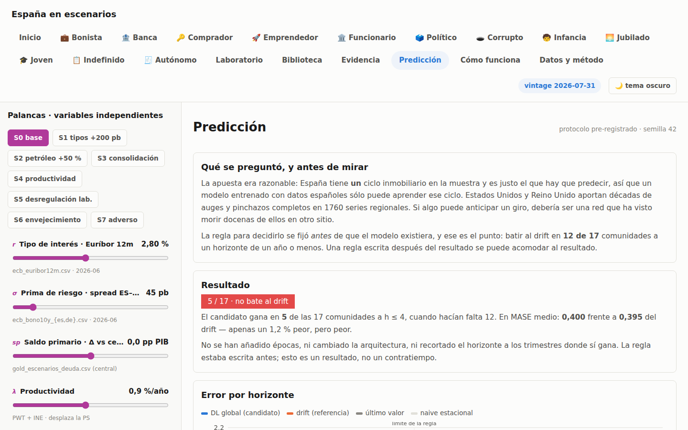
<b>Predicción.</b> Contraste del motor fuera de muestra: acierto direccional por comunidad y error por horizonte. Publica lo que acierta y lo que no, con el drift entre vintages.

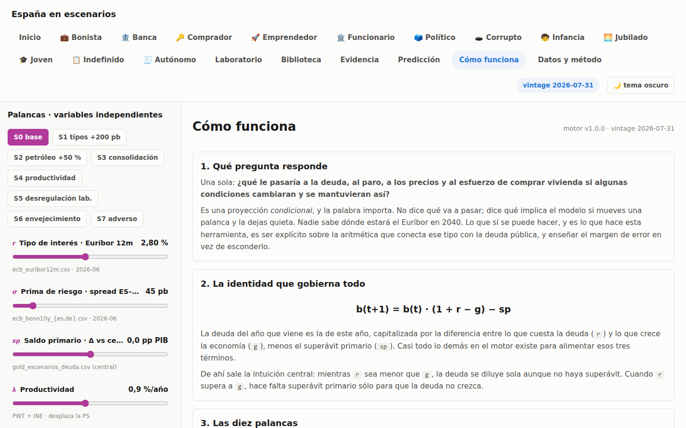
<b>Cómo funciona.</b> Siete secciones: la pregunta, la identidad, las 10 palancas, cómo viaja un cambio, cómo leer el abanico, qué significan las líneas rojas, qué no puede decirte.

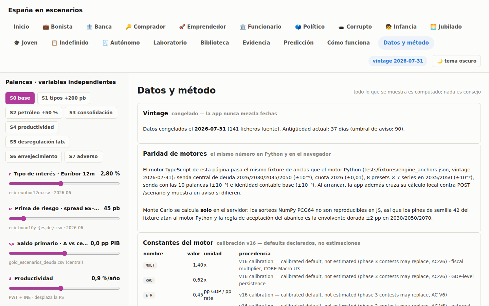
<b>Datos y método.</b> Vintage 2026-07-31 con 141 fuentes congeladas y sus fechas de corte, paridad Python ↔ TypeScript por fixtures, constantes del motor con origen, huecos de datos conocidos.

---

<!-- _class: divider -->

04

# Escenarios ilustrativos

## cuatro casos de extremo a extremo, con números de la API en producción

---

# Escenario S1 · tipos +200 pb Euríbor 2,80 → 4,80 %, todo lo demás en base

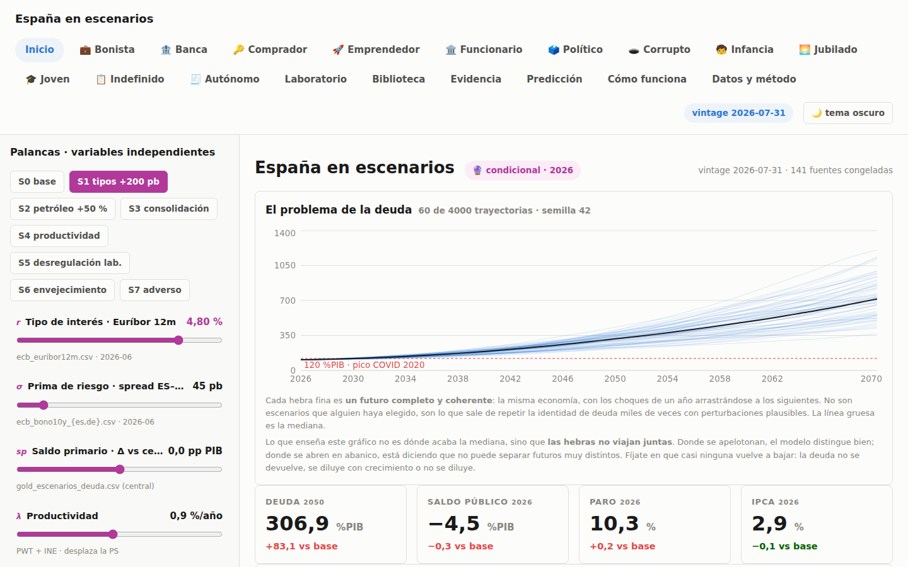
Inicio con el preset aplicado: los deslizadores movidos en morado, pill «condicional», KPIs con Δ vs base.

<h3>Horizonte 2050 · Δ vs base</h3>

306,9<small>%PIB</small>

Deuda 2050

+83,1 vs base

−23,3<small>%PIB</small>

Saldo 2050

−8,3

5,4<small>%</small>

Bono 10A

+2,0

10,7<small>%</small>

Paro 2050

+0,6

2,7<small>%</small>

IPCA 2050

−0,3

15,5<small>%</small>

Esfuerzo vivienda

−24,3

<h3 style="margin-top:8px">Líneas rojas en 2050</h3>

cruzada déficit &gt; 3 · deuda &gt; 105 · deuda &gt; 120 &nbsp; cerca pobreza infantil &nbsp; segura bono, paro, inflación, esfuerzo

<h3 style="margin-top:8px">Lectura</h3>
<ul style="font-size:0.85em"><li>El canal financiero puro: +2 pp de tipo son <b>+83 pp de deuda</b> en 2050 — la palanca más pesada de tope a tope.</li><li>Entra despacio (REFI 14 %/año) pero, una vez dentro, tarda años en salir.</li><li>El esfuerzo de vivienda <b>baja</b>: el precio cae (E_IPV_R 2,6) más de lo que sube la cuota. Un resultado que hay que leer con cuidado, no celebrar.</li></ul>

---

# Escenario S3 · consolidación fiscal saldo primario +1 pp PIB sostenido 24 años

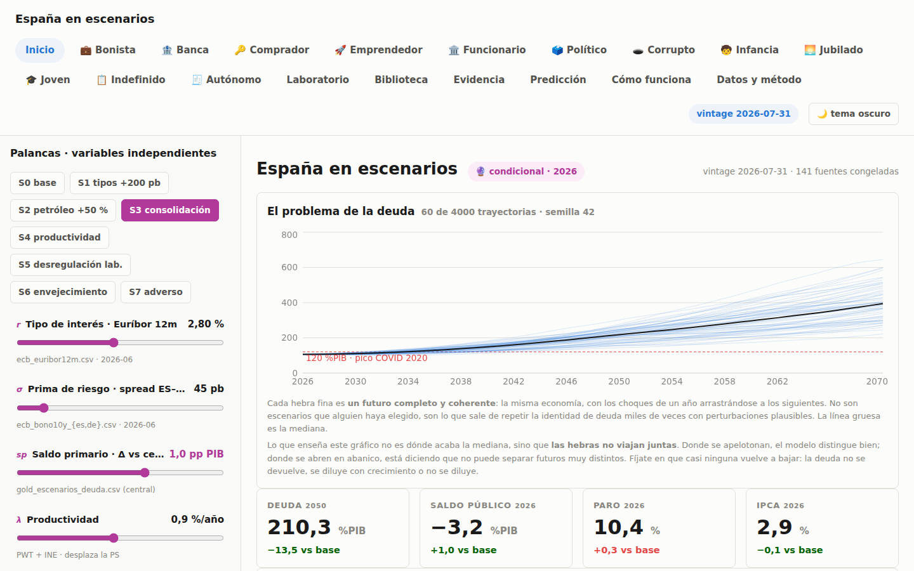
Inicio con el preset aplicado: los deslizadores movidos en morado, pill «condicional», KPIs con Δ vs base.

<h3>Horizonte 2050 · Δ vs base</h3>

210,3<small>%PIB</small>

Deuda 2050

−13,5 vs base

−13,5<small>%PIB</small>

Saldo 2050

+1,5

3,4<small>%</small>

Bono 10A

=

10,8<small>%</small>

Paro 2050

+0,7

2,7<small>%</small>

IPCA 2050

−0,3

44,2<small>%</small>

Esfuerzo vivienda

+4,4

<h3 style="margin-top:8px">Líneas rojas en 2050</h3>

cruzada déficit &gt; 3 · deuda &gt; 105 · deuda &gt; 120 · <b>esfuerzo &gt; 40</b> &nbsp; cerca pobreza infantil

<h3 style="margin-top:8px">Lectura</h3>
<ul style="font-size:0.85em"><li>La única palanca que ataca la deuda directamente: <b>−13,5 pp</b> en 2050 — pero la ratio sigue creciendo porque el déficit primario del vintage no se cierra con 1 pp.</li><li>Coste: el ajuste frena la demanda (MULT 1,4): paro +0,7 y esfuerzo de vivienda cruza la línea roja.</li><li>Ilustra el dilema del perfil 🗳️ Político: qué palanca mover sin cruzar una línea roja.</li></ul>

---

# Escenario S4 · productividad λ de 0,9 a 1,4 %/año — el canal del crecimiento

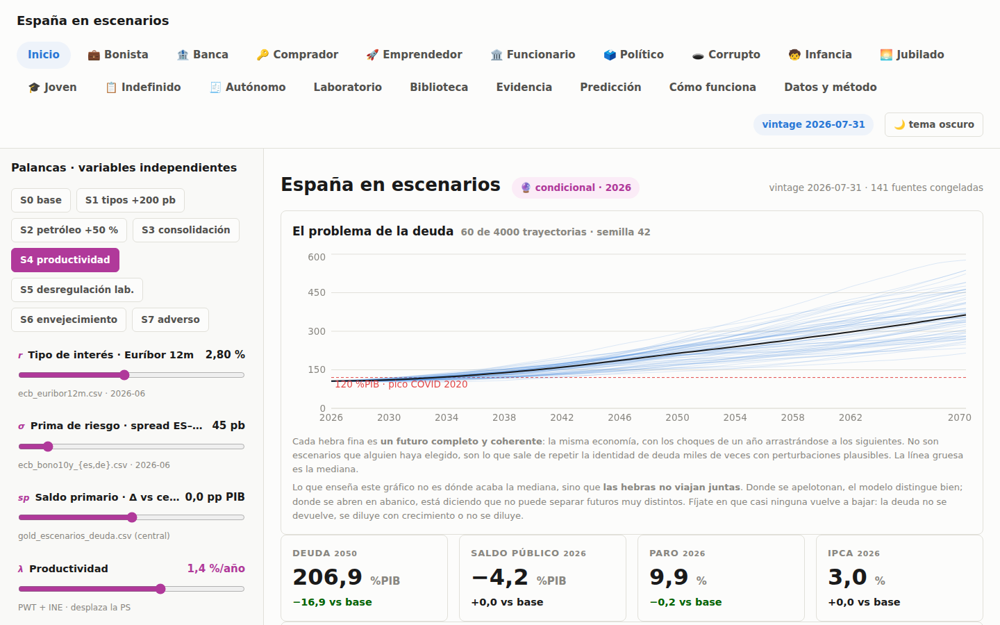
Inicio con el preset aplicado: los deslizadores movidos en morado, pill «condicional», KPIs con Δ vs base.

<h3>Horizonte 2050 · Δ vs base</h3>

206,9<small>%PIB</small>

Deuda 2050

−16,9 vs base

−14,4<small>%PIB</small>

Saldo 2050

+0,6

3,2<small>%</small>

Crecimiento real

+0,5

9,9<small>%</small>

Paro 2050

−0,2

3,0<small>%</small>

IPCA 2050

=

40,2<small>%</small>

Esfuerzo vivienda

+0,4

<h3 style="margin-top:8px">Líneas rojas en 2050</h3>

cruzada déficit &gt; 3 · deuda &gt; 105 · deuda &gt; 120 · esfuerzo &gt; 40 (por décimas) &nbsp; cerca pobreza infantil

<h3 style="margin-top:8px">Lectura</h3>
<ul style="font-size:0.85em"><li>Medio punto de productividad reduce la deuda <b>más que un punto de consolidación</b> (−16,9 vs −13,5) y sin subir el paro: g trabaja en la identidad todos los años.</li><li>Es la palanca «buena» — y la más difícil de mover en la realidad; el modelo enseña la aritmética, no si es realista.</li><li>El precio de la vivienda sube con g (E_IPV_G 1,1): el esfuerzo roza la línea roja.</li></ul>

---

# Escenario S7 · adverso tipos +200 pb · petróleo +50 % · prima 150 pb, a la vez

Inicio con el preset aplicado: los deslizadores movidos en morado, pill «condicional», KPIs con Δ vs base.

<h3>Horizonte 2050 · Δ vs base</h3>

349,8<small>%PIB</small>

Deuda 2050

+126,0 vs base

−28,8<small>%PIB</small>

Saldo 2050

−13,8

6,5<small>%</small>

Bono 10A

+3,1

11,1<small>%</small>

Paro 2050

+1,0

3,3<small>%</small>

IPCA 2030

+0,3

15,4<small>%</small>

Esfuerzo vivienda

−24,4

<h3 style="margin-top:8px">Líneas rojas en 2050</h3>

cruzada déficit &gt; 3 · déficit &gt; 11,3 · deuda &gt; 105 · deuda &gt; 120 &nbsp; cerca <b>bono &gt; 7 %</b> · pobreza infantil

<h3 style="margin-top:8px">Lectura</h3>
<ul style="font-size:0.85em"><li>Los canales se refuerzan: +126 pp no es la suma de S1 (+83) y S2 (−2) más la prima — la interacción se dibuja como barra aparte.</li><li>El bono entra en <b>banda de aviso del 7 %</b>: el punto de no retorno empírico de GRC/PRT/IRL. A partir de ahí el mercado exige más precisamente porque duda.</li><li>Déficit por debajo del suelo de 2009. Es el escenario que mira el 💼 Bonista.</li></ul>

---

<!-- _class: dense -->
# Los 8 presets comparados motor v1.0.0 · horizonte 2050 salvo indicación · Δ vs base entre paréntesis

<table>
<tr><th>Preset</th><th>Palancas</th><th class="n">Deuda 2030</th><th class="n">Deuda 2050</th><th class="n">Saldo 2050</th><th class="n">Paro 2050</th><th class="n">Bono 10A</th><th class="n">Esfuerzo 2050</th><th>Líneas rojas 2050 (además de las 4 de base)</th></tr>
<tr><td><b>S0</b> base</td><td>—</td><td class="n">112,9</td><td class="n"><b>223,8</b></td><td class="n">−15,0</td><td class="n">10,1</td><td class="n">3,4</td><td class="n">39,8</td><td>cerca esfuerzo · pobreza infantil</td></tr>
<tr><td><b>S1</b> tipos</td><td>r 4,80</td><td class="n">118,6</td><td class="n"><b>306,9</b> (+83,1)</td><td class="n">−23,3</td><td class="n">10,7</td><td class="n">5,4</td><td class="n">15,5</td><td>cerca pobreza infantil</td></tr>
<tr><td><b>S2</b> petróleo</td><td>pᵐ +50</td><td class="n">106,2</td><td class="n"><b>221,8</b> (−2,0)</td><td class="n">−14,9</td><td class="n">10,5</td><td class="n">3,4</td><td class="n">39,7</td><td>cerca esfuerzo · pobreza infantil · IPCA 2030 3,6</td></tr>
<tr><td><b>S3</b> consolidación</td><td>sp +1,0</td><td class="n">110,1</td><td class="n"><b>210,3</b> (−13,5)</td><td class="n">−13,5</td><td class="n">10,8</td><td class="n">3,4</td><td class="n">44,2</td><td>cruzada esfuerzo &gt; 40</td></tr>
<tr><td><b>S4</b> productividad</td><td>λ 1,4</td><td class="n">110,3</td><td class="n"><b>206,9</b> (−16,9)</td><td class="n">−14,4</td><td class="n">9,9</td><td class="n">3,4</td><td class="n">40,2</td><td>cruzada esfuerzo &gt; 40 (40,2)</td></tr>
<tr><td><b>S5</b> desregulación</td><td>z −1 · τ −1,5</td><td class="n">112,9</td><td class="n"><b>223,8</b> (=)</td><td class="n">−15,0</td><td class="n"><b>8,5</b></td><td class="n">3,4</td><td class="n">39,8</td><td>cerca esfuerzo · pobreza infantil</td></tr>
<tr><td><b>S6</b> envejecimiento</td><td>β₆₅ +0,6</td><td class="n">115,9</td><td class="n"><b>282,0</b> (+58,2)</td><td class="n">−20,8</td><td class="n">10,1</td><td class="n">3,4</td><td class="n">39,8</td><td>cerca esfuerzo · pobreza infantil</td></tr>
<tr><td><b>S7</b> adverso</td><td>r 4,80 · pᵐ 50 · σ 150</td><td class="n">113,5</td><td class="n"><b>349,8</b> (+126,0)</td><td class="n">−28,8</td><td class="n">11,1</td><td class="n">6,5</td><td class="n">15,4</td><td>cruzada déficit &gt; 11,3 &nbsp; cerca <b>bono &gt; 7 %</b></td></tr>
</table>

Las 4 líneas rojas cruzadas en todos los escenarios a 2050: déficit &gt; 3 %, deuda &gt; 105 %, deuda &gt; 120 % — y la ratio sube en todos porque el déficit primario del vintage no se cierra. S5 mueve el paro (−1,6) pero no la deuda: las palancas de oferta desplazan WS/PS sin tocar la identidad en este motor. Ningún escenario baja la ratio: la deuda no se devuelve, se diluye con crecimiento o no se diluye.

---

# Guion de demostración en 5 minutos un recorrido que enseña el modelo entero

<b>0:00 · Inicio en base</b>Señala los 4 KPIs, el abanico y las 3 líneas rojas ya cruzadas hoy. «Nada está proyectado todavía».S0

→

<b>1:00 · Preset S1</b>Tipos +200 pb. Deuda 2050 salta de 224 a 307. Abre «ver el mecanismo»: la cadena REFI → E_R → Okun.S1

→

<b>2:00 · Comprador</b>Salta al perfil 🔑: la cuota sube con el bono, el precio cae. La Δ vs base en cada KPI.persona/03

→

<b>3:00 · Laboratorio</b>Abanico hasta 2070 (anchura, no mediana) y matriz de sensibilidad: r y β₆₅ pesan más que sp.laboratorio

→

<b>4:00 · Análogos</b>Horizonte 2050 → «Buscar análogo histórico». Tres vecinos, veredicto r − g, 8 diferencias estructurales.analog

→

<b>4:45 · Límites</b>«Qué no puede decirte»: no es previsión, constantes calibradas, sin banco central endógeno.como-funciona

<h2> Antes de la defensa</h2>
La API duerme en Hugging Face sin uso: abre la web 2 minutos antes para despertarla (≈1 min). El motor TypeScript en el navegador cubre Inicio y perfiles aunque la API tarde; el abanico y los análogos necesitan el servidor.

<h2> Frases que anclan</h2>
«Proyección condicional, no previsión» · «la anchura, no la mediana» · «mientras r &lt; g la deuda se diluye sola» · «las palancas no suman» · «no contradicho, que es menos que validado».

---

# Qué no puede decirte los límites forman parte del modelo, no de la letra pequeña

<h2> No es una previsión</h2>
Con todas las palancas en su base, lo que ves es la senda central del vintage, no un pronóstico. Deuda 2050 = 223,8 %PIB es aritmética condicional.

<h2> Constantes calibradas, no estimadas</h2>
Vienen de la literatura y de la calibración v16. La pestaña Evidencia declara cuáles son identificables con los datos congelados y cuáles no.

<h2> Sin política monetaria endógena</h2>
Mueves el tipo a mano; no hay un banco central que reaccione a la inflación que el propio modelo genera.

<h2> Sin ruptura estructural</h2>
Coeficientes fijos en todo el horizonte. El modelo no sabe representar una crisis que cambie las reglas del juego — el HMM de Inicio enseña que España las ha cambiado.

<h2> Capacidad discriminante modesta</h2>
Impago: AUC 0,674. Gemelo empírico: R² fuera de país ≈ 0. Se publican como tales: ordenan, no calibran niveles.

<h2> No es consejo</h2>
Ni de compra, ni de venta, ni de voto. Pie de página en todas las pestañas: «proyección condicional, no recomendación».

---

<!-- _class: cover -->

GRACIAS

# España en escenarios

## Una pregunta, una identidad, diez palancas — y el margen de error a la vista

 <b>danribes.github.io/tfm-data-science</b>

 <b>danribes-evo-espana-api.hf.space</b> &nbsp;·&nbsp;  github.com/danribes/tfm-data-science

FastAPI · numpy · pandas · React · Vite · TypeScript · Zustand · Vitest · MSW · pytest · Marp · iconografía Microsoft Fluent UI System Icons

Daniel Ribes · Máster en Data Science · vintage 2026-07-31 · motor v1.0.0

