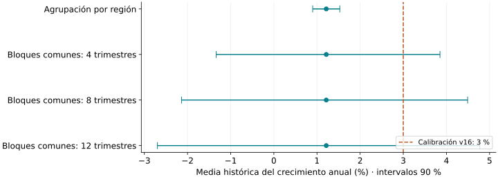
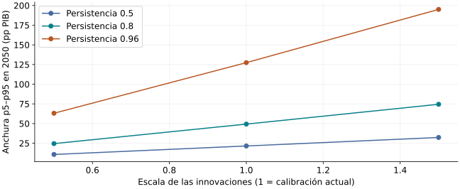

<!-- _class: cover -->
# España en escenarios
## Simulación transparente, evaluación empírica y explicaciones trazables

Daniel Ribes · Máster en Inteligencia Artificial y Data Science

Defensa académica · borrador para revisión del autor y tutor

---

# Preguntas y contribuciones

1. **Coherencia:** ¿pueden servidor y navegador reproducir un escenario macrofiscal trazable?
2. **Evidencia:** ¿qué apoyan los datos sobre la vivienda y qué añade la transferencia neuronal frente a baselines?
3. **Explicaciones:** ¿qué calidad demuestra el sistema RAG y qué evaluación falta?

Aportaciones: sistema integrado, contrastes reproducibles y comunicación explícita de límites. La comparación independiente final del RAG sigue pendiente.

---

# Arquitectura que permite auditar

**Fuentes y tablas congeladas → motor Python → API → aplicación React**

- El navegador ejecuta el mismo modelo con anclas compartidas.
- La investigación publica parámetros, métricas y resultados negativos.
- Las explicaciones separan hechos calculados y texto generado.
- Los documentos y el índice RAG son locales; la generación remota envía pasajes seleccionados al proveedor.

La paridad numérica demuestra coherencia de implementación; la evaluación empírica responde otras preguntas.

---

# Datos: referencia, muestra y fechas

- Referencia del escenario: **2026-07-31**; adquisición y construcción se documentan por separado.
- Vivienda: **17 CCAA + Ceuta y Melilla**; Nacional excluido.
- Red global: series extranjeras; objetivos de entrenamiento hasta **2019Q3**.
- Distress: **3.874 observaciones, 377 eventos, 154 países** en la muestra evaluada.
- Tablas y resultados sellados con SHA-256; parte del pipeline original todavía no está reconstruida.

Congelar un archivo permite repetir cálculos, sin certificar su autenticidad o eliminar revisiones históricas.

---

# Identidad de deuda y alcance del escenario

$$b_t=b_{t-1}\frac{1+i_t/100}{1+g^{nom}_t/100}-pb_t$$

- Coste efectivo y crecimiento nominal en unidades compatibles.
- Saldo primario en puntos de PIB.
- Diez palancas generan desviaciones condicionales sobre la referencia.
- Las elasticidades de comportamiento son principalmente calibraciones.

**Un diferencial negativo ayuda a diluir la deuda heredada. Un déficit primario puede hacer subir la ratio total.**

---

# Vivienda: una corrección que cambia la dinámica

Tasa anual de reversión: **0.2039**. Persistencia: **0.7961**.

$$h_k=\mu+(h_0-\mu)(1-\kappa)^k+\text{canales de tipos y crecimiento}$$

- Antes se utilizaba la tasa de reversión como factor de persistencia.
- Python y TypeScript ahora aplican la misma definición.
- El .60 de v16 era persistencia, equivalente a reversión .40.
- La comparación LP acumula log-precios, excluye crecimiento realizado y muestra puntos anuales; su amplitud se normaliza en el primer año.

Media histórica estimada: **1.2151%**. No identifica por sí sola una tendencia estructural.

---

# La incertidumbre depende de la inferencia

El 3% queda fuera de la banda regional, pero dentro de las bandas que conservan choques nacionales comunes. **Su rechazo no es robusto.** 500 réplicas, semilla 42; sensibilidad condicional a ventana y bloques.

---

# Transferencia neuronal: resultado negativo

| Contraste principal conservado | Resultado |
|---|---:|
| Regiones donde vence al baseline | 5/17 |
| Regiones requeridas por el criterio | 12 |
| MASE candidato (horizontes hasta 4 trimestres) | 0.400 |
| MASE drift | 0.395 |

**Esta configuración no supera drift.** El protocolo usa orígenes móviles y escalado con entrenamiento. El holdout final y la sensibilidad a semillas siguen pendientes. No se reentrenó la red en esta revisión.

---

# Distress: discriminación, no riesgo calibrado

- AUC por grupos de países: **0.674**.
- Average precision: **0.195**.
- El score se muestra en escala 0–1; no como probabilidad para España.
- Muestra seleccionada por disponibilidad de etiquetas; tasa base no representativa del mundo.
- Separar países no equivale a evaluar el futuro con entrenamiento pasado.

Pendiente: negativos representativos, baseline logístico, validación temporal y calibración. Métricas históricas conservadas, sin nueva estimación.

---

# SHAP y regímenes: lectura descriptiva

**Gemelo empírico:** R² fuera de país **-0.007**.

- La falta de poder predictivo limita la interpretación de las pendientes SHAP.
- Un intervalo que incluye cero no demuestra que la constante del motor sea correcta.
- SHAP describe asociaciones del predictor; no identifica intervenciones causales.
- Los regímenes HMM describen retrospectivamente la serie y dependen de la especificación.

Estas capas ayudan a explorar hipótesis; su utilidad no convierte sus resultados en pronósticos validados.

---

# RAG: qué se midió realmente

| Evidencia histórica de desarrollo | Lectura correcta |
|---|---|
| 34/35 documentos esperados en top-8 | Recuperación de libro, no corrección de respuesta |
| 10/12 afirmaciones muestreadas respaldadas | Primera afirmación citada, juicio de otro LLM |
| Pesos/glosario ajustados sobre preguntas doradas | Conjunto de desarrollo, no test independiente |

Las métricas no se han vuelto a medir después de esta revisión. No justifican afirmar ausencia de alucinaciones.

---

# RAG revisado y test independiente pendiente

- Comprobación formal de citas y referencias; salida interrumpida → fallback.
- Narración: inventario de magnitudes numéricas; no valida completamente signos, unidades o asociación cifra–concepto.
- `grounded` conserva compatibilidad: significa contexto recuperado.
- Protocolo ejecutable: corpus y etiquetas congelados, BM25/dense/híbrido/bilingüe, relevancia de pasajes y revisión humana de afirmaciones.

La plantilla está intencionadamente incompleta: no se presenta como anotación independiente realizada.

---

# Análogos: comparación descriptiva corregida

**4,091 observaciones completas · 173 países · 1991–2020**

- Consulta en el año seleccionado: deuda, saldo total, crecimiento real, paro e inflación.
- Mahalanobis: covarianza y diferencias en las mismas coordenadas.
- Sin bonus por palanca ni imputación de huecos como valores observados.
- Tipo bancario de préstamo excluido del matching y de cualquier r−g soberano.
- Sin veredicto de sostenibilidad; información estructural no medida se declara ausente.

La semejanza histórica no predice la trayectoria española.

---

# Monte Carlo: sensibilidad, no cobertura predictiva

4.000 trayectorias, semilla común 42. La amplitud cambia con los supuestos. La banda contiene el 90% central de simulaciones; su cobertura en datos reales no está validada.

---

# Escenarios ilustrativos actuales · 2050

| Preset | Deuda (% PIB) | Paro (%) | Cuota/salario (%) |
|---|---:|---:|---:|
| S0 | 223.8 | 10.1 | 35.1 |
| S1 | 306.9 | 10.7 | 13.5 |
| S2 | 221.8 | 10.5 | 35.0 |
| S3 | 210.3 | 10.8 | 39.0 |
| S4 | 206.9 | 9.9 | 35.5 |
| S5 | 223.8 | 8.5 | 35.1 |
| S6 | 282.0 | 10.1 | 35.1 |
| S7 | 349.8 | 11.1 | 13.5 |

Cálculos locales del motor **1.1.0**. Son implicaciones de supuestos mantenidos; no resultados observados ni previsiones.

---

# Reproducción y pruebas

- Dependencias Python restringidas y lock npm; entorno de desarrollo registrado.
- Contratos Python/TypeScript regenerados desde los defaults actuales.
- Crosswalk de países congelado; errores de cobertura visibles.
- Tests ordinarios sin inferencia remota ni corpus privado.
- Checksum de tablas e informes, CI y comandos documentados.

Limitaciones: no se ha probado aquí una instalación limpia; faltan algunas transformaciones originales. La CI añadida no se presenta como una ejecución remota ya realizada.

---

# Demostración breve

1. Abrir S0 y separar dato, supuesto y resultado.
2. Aplicar S1: refinanciación → crecimiento → deuda.
3. Mostrar vivienda: persistencia y bandas alternativas.
4. Buscar un análogo en el año elegido; comprobar qué datos faltan.
5. Contrastar explicaciones deterministas con el alcance de la evidencia RAG.

Usar esta versión regenerada. Las capturas antiguas de producción no prueban el comportamiento del motor revisado.

---

# Conclusiones y trabajo pendiente

**Aportación demostrable:** sistema integrado, trazable y evaluable; correcciones científicas reproducibles y resultados negativos publicados.

- La red no supera el baseline principal en el experimento conservado.
- La conclusión sobre crecimiento de vivienda cambia al tratar choques comunes.
- Distress, HMM, SHAP y análogos mantienen alcance exploratorio.
- Pendientes: test RAG humano independiente, holdout final de vivienda, evaluación temporal/calibración de distress y reconstrucción completa de fuentes.

La memoria distingue resultados medidos, comprobaciones de software y trabajo futuro.

---

# Referencias y artefactos

- Jordà (2005), *Estimation and Inference of Impulse Responses by Local Projections*.
- Hyndman y Koehler (2006), *Another look at measures of forecast accuracy*.
- Cameron y Miller (2015), *A Practitioner's Guide to Cluster-Robust Inference*.
- Lewis et al. (2020), *Retrieval-Augmented Generation for Knowledge-Intensive NLP Tasks*.
- FMI: marco de riesgo soberano y sostenibilidad de deuda.

Referencias primarias completas: **docs/MEMORIA_TFM.md**.
Métodos y límites: **docs/RESULTS.md**, **docs/REPRODUCIBILITY.md**.
Artefactos y nuevas sensibilidades: **docs/eval/**.
