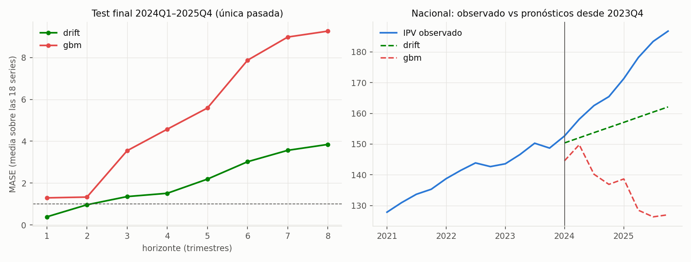
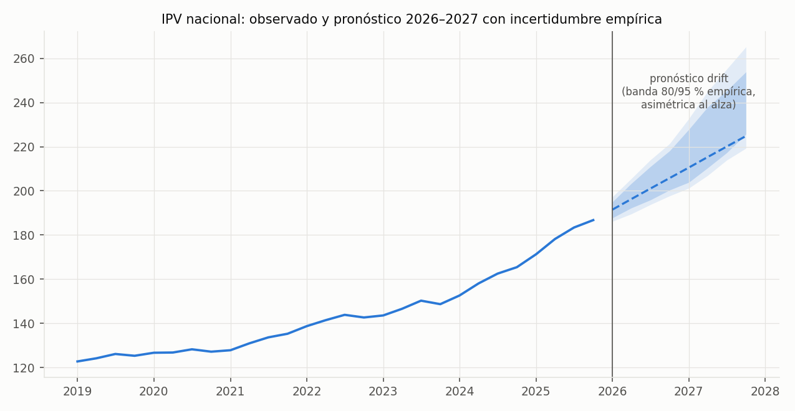
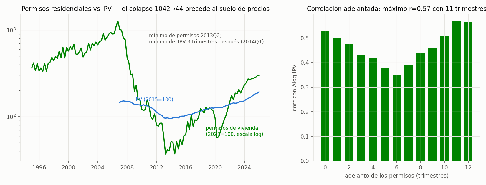
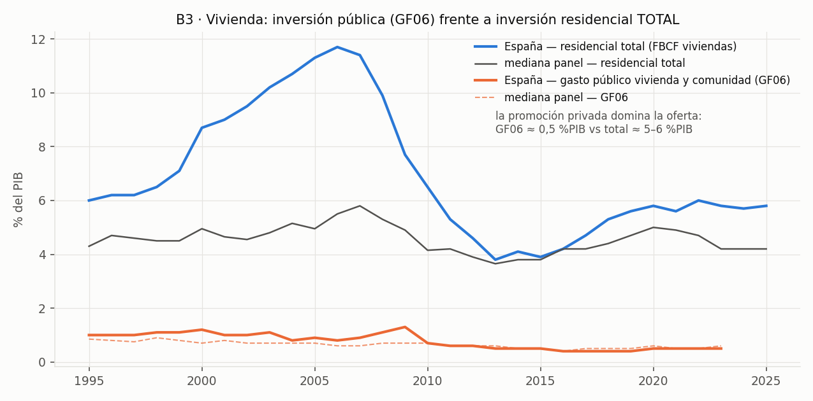
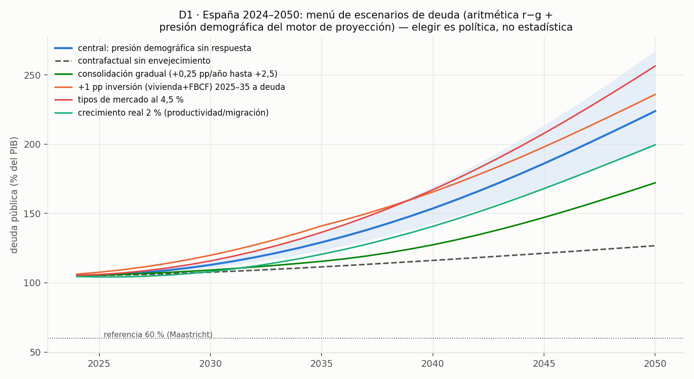

<!-- _class: cover -->

# Dinero público → Resultados

**Defensa del Trabajo de Fin de Máster · Máster en Data Science (Evolve)**

Daniel Ribes · julio 2026

github.com/danribes/tfm-data-science

---

# El problema y la evolución del proyecto

- **Pregunta**: ¿qué obtiene un país (y una CCAA) a cambio de su gasto público?
- Origen avalado: **índice de asequibilidad de vivienda por CCAA** (entregas 1–3)
- Evolución: la vivienda es una partida más (GF06) → el marco general la **contiene y conserva como núcleo**
- El feedback del tutor, convertido en especificación verificable:
  - ratio SIEMPRE como indicador aproximado + medida de esfuerzo real
  - **MVP primero**: nada bloquea el núcleo
  - "el formato de entrega funciona como un contrato" → el repositorio ES la entrega

---

# Arquitectura de datos

```
connectors/ → raw (vintage) → processed (32) → gold (11) → analysis · api · app
```

- Más de **30 fuentes públicas**: INE, BdE, Eurostat, FMI, OMS, Banco Mundial, GMD/JST (1870–2023), UN DESA, MITMA
- `vintage_manifest.csv`: qué versión del dato existía en cada descarga
- **51 tests automáticos** del contrato de datos y modelos
- Nada entra en gold sin clave primaria verificada y smoke test

---

# La calidad de datos como resultado

- **3 bugs de pipeline detectados, corregidos y blindados con test de regresión**:
  - IPC: promediaba 1.120 series en vez de filtrar la general
  - IPV trimestral: se descargaba pero no se persistía
  - `str.split(". ")` de pandas es REGEX → rompía las CCAA compuestas (ratio solo en 8 de 18 territorios)
- El riesgo declarado en la Entrega 2 **se materializó**: el INE renumeró las tablas del IPV (49300/76201 → 80271/80270) — la mitigación prevista funcionó

---

# Metodología: protocolo pre-registrado

**Los criterios se fijan antes de mirar; endurecerlos vale, relajarlos no.**

1. EDA con decisiones vinculantes (transformación, pooling, exógenas)
2. Baselines difíciles ANTES de los candidatos
3. Validación rolling-origin con guardas anti-fuga verificadas por tests
4. **Test final de un solo uso** (2024–2025), regla de decisión escrita en el código
5. Multiverso: sin estabilidad entre especificaciones, no se publica
6. Incertidumbre SIEMPRE visible

---

# T1 · La vara a batir no era la esperada

- Naive estacional: MASE 0,89 — cómodo porque la escala la infla la crisis 2008–14
- **El drift (tendencia reciente): MASE 0,40** — imbatido en las 18 series, COVID incluido
- El criterio de aceptación se **ENDURECIÓ antes de entrenar candidatos**: batir al drift en ≥12 de 17 CCAA
- Sin ese endurecimiento, los tres candidatos habrían "aprobado"

---

# T1 · El test final evitó publicar un desplome



SARIMAX 1/17 · GBM 0/17 en validación corta; la hipótesis "GBM gana a largo" quedó **refutada 0/17**: pronosticó caída en pleno boom (reversión aprendida de la crisis)

---

# T1 · Pronóstico de producción



- Drift + **abanico empírico 80/95 %** (asimétrico: el drift se queda corto en booms)
- **Ratio nacional: 1,26 (2024) → ~1,5–1,6 (2027) incluso con salarios al 2 %**

---

# El driver de oferta: la señal más fuerte del proyecto



- Permisos residenciales: **r = 0,57 con 11 trimestres de adelanto**; avisó del giro 2013–14 con 3 trimestres
- Pata regional (licencias MITMA): colapso **×24** (737.186 → 31.236 viviendas/año)
- Disciplina: se adoptará solo si lo confirman los datos de 2026+

---

# Atlas fiscal · la figura que exige contexto



**La palanca pública de vivienda (0,5 %PIB) es un orden de magnitud menor que la promoción privada (5,8 %PIB)** — contexto obligatorio de cualquier conclusión

---

# A1 · Rendimiento sanitario: nunca una liga


- España: **+2,7 ± 3,5 años** — por encima de lo esperado, DENTRO de su banda
- Hallazgo honesto: hasta el OLS empata con la mediana del grupo de renta — **la renta domina**

---

# D1 · Escenarios de deuda: la demografía domina



- Central 2050: **224 %PIB** (banda 198–267) vs 127 % sin envejecimiento
- Ninguna palanca aislada estabiliza; el menú cuantifica, no prescribe

---

# El producto: publicado y replicable

- **Dashboard de 5 pestañas EN ABIERTO**: tfm-data-science-…streamlit.app — se redespliega con cada push
- **API FastAPI** con simulador interactivo (`POST /scenario`, palancas r/g/pb)
- **Réplica garantizada**: `docker compose up --build` — datos dentro de las imágenes, sin Python ni descargas
- La honestidad viaja en el payload: `"no es un ranking"`, `"la banda es la parte informativa"`

---

# ¿Y esto no lo hace un LLM?

| | LLM | Este sistema |
|---|---|---|
| El número | recordado del texto de entrenamiento | **calculado** de datos con cadena de custodia |
| Evaluación | no puede suspender un backtest | **suspendió cinco veces en público** — prueba de que es real |
| Incertidumbre | tono de confianza | cuantiles medidos, conformal, cobertura comprobable |
| Reproducible | varía con prompt y versión | mismo código+datos → mismos números (91 tests) |
| Lo normativo | prescribe con soltura | pone precio y devuelve la elección a la política |

**Declaración**: LLM usado como herramienta de proceso (código, redacción), nunca como fuente de números. **El LLM narra; el sistema calcula.**

---

# Cinco contests de pronóstico: el drift sigue en pie

| Candidato | MASE h≤4 (drift 0,395) | CCAA que baten |
|---|---|---|
| SARIMAX / +Euríbor | ≥0,74 | 1/17 · 0/17 |
| LightGBM (± capas de demanda) | 0,666 · 0,653 | 0/17 |
| Chronos (fundacional, zero-shot) | 0,460 | 0/17 |
| **DL global (1.760 series extranjeras)** | **0,401 — empate técnico** | **7/17** (regla: 12) |

- El DL entrenado con **booms extranjeros que murieron** es el único que gana algún horizonte (h=2)
- No se adopta: la regla no se relaja — queda como apuesta auditable si el ciclo gira

---

# El triángulo fiscal completo, reconciliado

- **Gasto por función**: COFOG, 89 países (FMI) + UE (Eurostat) — brechas entre compiladores de 0,03–0,06 pp
- **Ingresos por tipo**: WoRLD, 195 países — ESP 2023: 41,2 % = impuestos 23,6 (IRPF 8,7 > IS 2,9) + cotizaciones 13,2
- **Resultados de bienestar**: marco MPI/MODA de pobreza infantil, 13 series — 15/15 checks de reconciliación OK
- Historia empalmada **1703–2025** con la trampa de perímetro MEDIDA (JST = solo Estado central: −21 pp)

---

# Horizonte 50 años: sobres, nunca pronósticos

- Un solo driver pronosticado: **demografía** (los mayores de 2075 ya nacen); todo lo demás, palanca del usuario
- **Monte Carlo 2070** con las SE de las elasticidades propagadas: central 409 % PIB [272–619] — el ancho ES el mensaje
- Panel within: el ingreso público compra bienestar a **retardo 8 años** (−0,36 %/pp), 3× menos que la foto transversal; la renta domina
- Calibración con la propia historia: proyectar 50 años por continuidad erró **~13 pp de PIB** de mediana → ningún sobre puede ser más estrecho

---

# Conclusiones

1. Solo con fuentes públicas y código abierto: **datos → modelos → producto**, con trazabilidad profesional
2. **La aportación diferencial es la disciplina**: cinco contests sin adopción (el mejor, empate 0,401 vs 0,395), cinco fronteras donde ganó el OLS, y un test final que evitó publicar una predicción de desplome en pleno boom
3. Sustantivo: la asequibilidad no se corrige sola; el cuello de botella empieza en el suelo (mercado a 1/5 del pico); la renta domina salud y bienestar; la demografía domina la deuda; urbanizar más no compra asequibilidad (ρ=+0,01 en 40 países)

---

# Trabajo futuro y cierre

- Revalidación del DL global y del driver de oferta con orígenes 2026+ (nunca contra el test gastado)
- Catastro "suelo vacante" si reaparece publicado · microdatos MPI/MODA · panel quinquenal A1
- Actualización trimestral: cada IPV nuevo re-ejecuta pipeline → gold → pronóstico → redespliegue

**Gracias.**

github.com/danribes/tfm-data-science · demo en vivo: tfm-data-science-…streamlit.app · `docs/MEMORIA.md`
