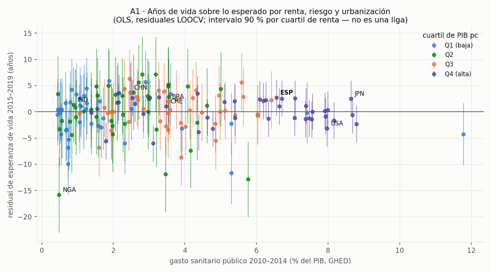
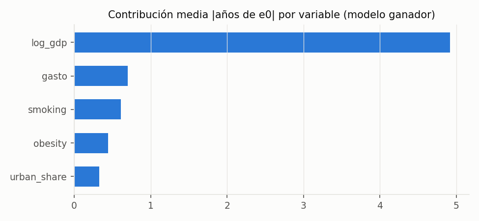

# A1 — Rendimiento ajustado del gasto sanitario público (F3.1, módulo salud)

*2026-07-18. Primera instanciación global de la pregunta A1 del [PLAN_MAESTRO](PLAN_MAESTRO.md) ("¿qué país es más eficiente gastando?"), respondida como RENDIMIENTO AJUSTADO CON INCERTIDUMBRE, nunca como liga. Script: [`analysis/rendimiento_a1.py`](../analysis/rendimiento_a1.py); salida: `storage/gold/gold_rendimiento_pais.csv` (164 países); tests: [`tests/test_rendimiento.py`](../tests/test_rendimiento.py).*

---

## 1. Diseño (declarado antes de mirar resultados)

Outcome: esperanza de vida al nacer, media 2015–2019 (pre-COVID a propósito). Exposición: gasto sanitario público %PIB (GHED), media 2010–2014 — retardo de 5 años. Controles: log PIB pc PPP, obesidad, tabaquismo, % urbano. Muestra: 164 países con casos completos. Grupos de renta: cuartiles de PIB pc (proxy declarado). Validación: leave-one-country-out; los residuales publicados son SIEMPRE out-of-fold. Aceptación del GBM: MAE ≤ 0,90·OLS **y** Spearman ≥ 0,8 del residual entre 3 definiciones de gasto.

## 2. Resultados de la selección

| Modelo | MAE LOOCV (años) |
|---|---|
| mediana del cuartil de renta | 2,79 |
| **OLS (ganador)** | 2,82 |
| spline (GAM-lite) | 3,24 |
| LightGBM | 2,95 |

- **El GBM no cumple el criterio** (necesitaba ≤ 2,54): tercera vez consecutiva en el proyecto que la regla pre-registrada tumba al modelo flexible. El multiverso sí era estable (Spearman 0,83 con `che_gdp`, 0,88 con `public_share`), pero la precisión no acompaña con n=164.
- **Lectura incómoda y honesta:** hasta el OLS empata con la mediana del grupo de renta (2,82 vs 2,79). La renta explica la mayor parte de la esperanza de vida entre países; el margen del gasto y los controles, a esta granularidad, es pequeño. Cualquier "eficiencia" que se lea en este módulo es un efecto de segundo orden — y así se dice.

## 3. El funnel (la respuesta a A1)

- **España: +2,7 ± 3,5 años → por encima de lo esperado, pero DENTRO de la banda de su grupo.** Exactamente el caso que justifica el "nunca una liga": un titular diría "España, campeona de la eficiencia sanitaria"; el intervalo dice "buena posición, indistinguible de sus pares de renta alta con esta evidencia".
- Solo **16 de 164 países** quedan fuera de su banda del 90 %. Negativos: Nigeria (−15,8), Nauru, Esuatini, Lesoto — VIH/sida y fragilidad, no "ineficiencia del gasto". Positivos: Albania (+6,3), Costa Rica (+5,6) — casos clásicos de outperformance sanitaria con gasto modesto.
- La forma de embudo aparece: las bandas se estrechan del cuartil pobre (±~7 años) al rico (±~3,5) — la heterogeneidad no explicada se concentra donde la renta es baja.
- EE. UU.: residual ligeramente negativo con el gasto público más alto del cuartil — la anomalía conocida, aquí con su intervalo.

## 4. Límites (en primera plana, PLAN_MAESTRO §6)

1. **Asociación, no causalidad**: el retardo de 5 años mitiga, no resuelve, la endogeneidad.
2. **n=164 países es la restricción dominante**: por eso ganan los modelos simples y por eso las bandas son anchas. El paso natural es el panel por bloques quinquenales (más n efectivo), declarado como siguiente iteración.
3. La falacia ecológica aplica: nada de esto habla de sistemas sanitarios concretos.
4. El outcome pre-COVID evita confundir gestión pandémica con rendimiento estructural; la versión con 2020–2023 es un análisis distinto, no una actualización.
