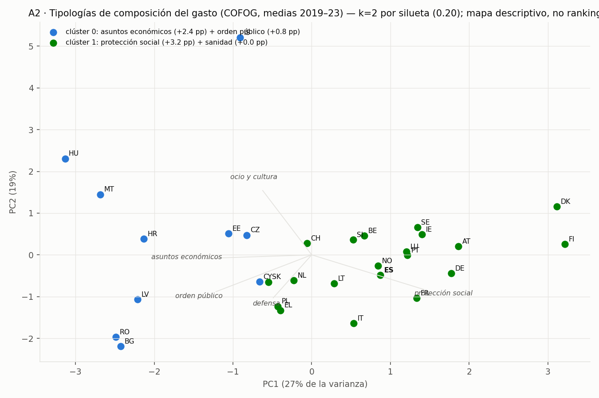

# A2 — Tipologías de composición del gasto público (PCA + clustering)

*2026-07-19. Cierra la pregunta A2 del [PLAN_MAESTRO](PLAN_MAESTRO.md), el último bloque ML pendiente del núcleo. Script: [`analysis/tipologias_a2.py`](../analysis/tipologias_a2.py); salida: `storage/gold/gold_tipologias_gasto.csv` (30 países); figura: `docs/figures/a1/a2_tipologias.png`.*

---

## Método
Composición funcional del gasto: 10 funciones COFOG como % del gasto total, media 2019–2023, panel europeo sin agregados (30 países). Estandarización, PCA para el mapa (PC1 27 % + PC2 19 % de la varianza) y KMeans con k elegido por silueta (k=2..6). Análisis descriptivo: sin outcome, sin ranking.

## Resultados

- **El hallazgo honesto es que las tipologías son DÉBILES**: la mejor silueta es 0,20 (k=2) — la composición del gasto europeo es más un continuo que un conjunto de familias nítidas. Se publica el mapa, no una taxonomía.
- Los dos polos suaves que sí existen: (1) **"inversión y Estado clásico"** (10 países, sobre-representados asuntos económicos +2,4 pp y orden público: HU, RO, BG, LV, HR, MT, EE, CZ, CY, SK — esencialmente los miembros de 2004+, con fondos europeos pesando en GF04); (2) **"Estado del bienestar maduro"** (20 países, protección social +3,2 pp: nórdicos, DE, FR, IT, ES…).
- **España**: clúster del bienestar, sin rasgos extremos en el mapa (PC1 +0,9): protección social 40,9 % del gasto y sanidad 14,6 % — composición de Estado del bienestar típico, más cerca de FR/PT que de los nórdicos.
- El eje PC1 se lee casi como "renta + antigüedad en la UE": la composición acompaña al desarrollo, coherente con el hallazgo de A1 (la renta domina).

## Límites
n=30 y ventana 2019–23 (incluye COVID: GF07/GF10 inflados en todos, lo que COMPRIME diferencias); k por silueta con estructura débil es orientativo; las funciones COFOG de nivel 1 esconden heterogeneidad interna (GF06 vivienda apenas pesa y no separa). Extensión natural: repetir sobre el histórico por décadas para ver si los polos convergen.
